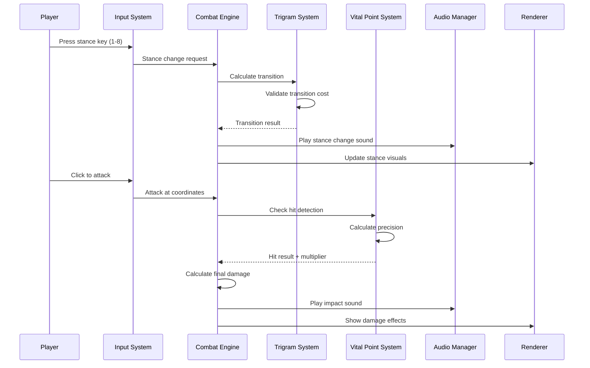
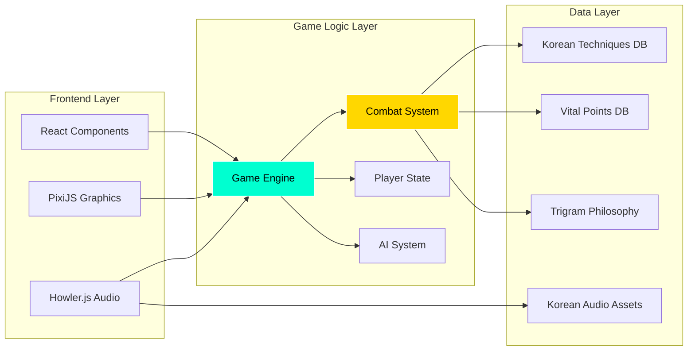
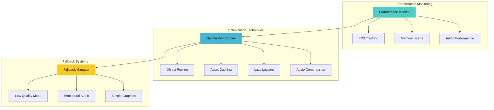

# Black Trigram (흑괘) - Technical Architecture

## 🏗️ System Architecture Overview

### Cyberpunk Tech Stack

- **Frontend**: React 18 + TypeScript + Vite
- **Graphics Engine**: PixiJS 8 with @pixi/react
- **Audio Engine**: Howler.js with Web Audio API
- **State Management**: Zustand + React Context
- **Testing**: Vitest + React Testing Library + Cypress
- **Build Tools**: Vite + ESBuild for optimal performance

## 🎯 SWOT Analysis

### 💪 Strengths

#### Technical Strengths

- **Modern TypeScript Stack**: Type-safe development with excellent developer experience
- **High-Performance Graphics**: PixiJS WebGL rendering for 60+ FPS gameplay
- **Cross-Platform Compatibility**: Web-based deployment across all devices
- **Modular Architecture**: Clean separation of concerns with reusable components
- **Comprehensive Testing**: Unit, integration, and E2E test coverage
- **Korean Cultural Authenticity**: Proper language support and cultural representation

#### Gameplay Strengths

- **Unique Combat System**: Anatomically accurate vital point targeting
- **Educational Value**: Real Korean martial arts and I Ching philosophy
- **Precision-Based Skill**: Rewards accuracy and knowledge over button mashing
- **Progressive Learning**: Structured advancement through traditional martial arts

#### Market Strengths

- **Niche Market Leadership**: No direct competitors in cyberpunk Korean martial arts
- **Accessibility**: Free-to-play web game with no installation barriers
- **Cultural Bridge**: Introduces Korean culture to global gaming audience
- **Educational Tie-ins**: Potential partnerships with martial arts schools

### ⚠️ Weaknesses

#### Technical Weaknesses

- **Browser Dependency**: Performance limited by browser capabilities
- **Audio File Size**: High-quality Korean audio assets increase load times
- **WebGL Requirements**: Excludes older devices without hardware acceleration
- **Single Platform**: Web-only limits monetization opportunities

#### Gameplay Weaknesses

- **Learning Curve**: Complex vital point system may intimidate casual players
- **Cultural Barrier**: Korean terminology may confuse non-Korean speakers
- **Limited Content**: Focused scope may reduce replay value
- **Niche Appeal**: Martial arts theme limits broad market appeal

#### Development Weaknesses

- **Small Team**: Limited resources for content creation and marketing
- **Cultural Sensitivity**: Risk of misrepresenting Korean culture
- **Asset Dependency**: Requires high-quality Korean audio and visual assets
- **Localization Complexity**: Proper Korean-English translation challenges

### 🌟 Opportunities

#### Market Opportunities

- **Growing Interest in Korean Culture**: K-pop, K-dramas driving cultural curiosity
- **Educational Gaming Trend**: Increased demand for learning-based games
- **Martial Arts Popularity**: Growing interest in traditional fighting arts
- **Cyberpunk Renaissance**: Renewed interest in cyberpunk aesthetics
- **Mobile Gaming Growth**: Potential for mobile-optimized versions

#### Technical Opportunities

- **PWA Capabilities**: Progressive web app for native-like mobile experience
- **VR/AR Integration**: Future expansion into immersive technologies
- **AI Enhancement**: Machine learning for adaptive difficulty and training
- **Blockchain Integration**: NFT achievements and competitive tournaments
- **Cross-Platform Expansion**: Native mobile and desktop versions

#### Content Opportunities

- **Community-Generated Content**: User-created training scenarios
- **Educational Partnerships**: Collaboration with martial arts institutions
- **Cultural Expansion**: Other Asian martial arts traditions
- **Competitive Scene**: Online tournaments and ranking systems
- **Streaming Integration**: Twitch/YouTube content creation features

### ⚡ Threats

#### Market Threats

- **AAA Competition**: Large studios creating competing martial arts games
- **Cultural Appropriation Concerns**: Criticism for non-Korean team developing Korean game
- **Platform Changes**: Browser security updates breaking game functionality
- **Mobile Shift**: Continued move away from web gaming to mobile apps

#### Technical Threats

- **Browser Fragmentation**: Different performance across browsers
- **Web Standards Changes**: Breaking changes in WebGL or Audio APIs
- **Performance Expectations**: Rising user expectations for mobile-like performance
- **Ad Blocker Impact**: Potential revenue model disruption

#### Business Threats

- **Monetization Challenges**: Difficulty generating revenue from web games
- **Copyright Issues**: Potential claims over traditional Korean martial arts representation
- **Team Scaling**: Challenges hiring developers with Korean cultural knowledge
- **Market Saturation**: Oversupply of indie fighting games

## 🎮 Enhanced Combat System Architecture

```mermaid
graph TB
    subgraph "Combat Engine Core"
        CE[Combat Engine] --> TCS[Trigram Combat System]
        CE --> VPS[Vital Point System]
        CE --> DCS[Damage Calculation System]
        CE --> AIS[AI System]
    end

    subgraph "Trigram System"
        TCS --> SM[Stance Manager]
        TCS --> TC[Transition Calculator]
        TCS --> KC[Korean Culture Integration]

        SM --> S1[건 Heaven]
        SM --> S2[곤 Earth]
        SM --> S3[진 Thunder]
        SM --> S4[손 Wind]
        SM --> S5[감 Water]
        SM --> S6[리 Fire]
        SM --> S7[간 Mountain]
        SM --> S8[태 Lake]
    end

    subgraph "Vital Point Targeting"
        VPS --> AR[Anatomical Regions]
        VPS --> HD[Hit Detection]
        VPS --> DC[Damage Calculator]

        AR --> VP1[Critical Points - 2.5x]
        AR --> VP2[Secondary Points - 1.8x]
        AR --> VP3[Standard Points - 1.2x]
    end

    subgraph "Audio-Visual Feedback"
        CE --> AM[Audio Manager]
        CE --> VFX[Visual Effects]

        AM --> SFX[Korean SFX]
        AM --> Music[Traditional Music]

        VFX --> Particles[Energy Particles]
        VFX --> UI[Cyberpunk UI]
    end

    subgraph "Player Input"
        PI[Player Input] --> KM[Keyboard/Mouse]
        PI --> Touch[Touch Controls]
        PI --> Gamepad[Controller Support]

        KM --> Movement[WASD Movement]
        KM --> Stances[1-8 Stance Keys]
        KM --> Target[Mouse Targeting]
    end

    PI --> CE
    CE --> Renderer[PixiJS Renderer]

    style CE fill:#00ffd0,stroke:#fff,color:#000
    style TCS fill:#ffd700,stroke:#fff,color:#000
    style VPS fill:#ff6b6b,stroke:#fff,color:#000
```

### Combat Flow Architecture

### System Integration Architecture

## 🛡️ Security & Performance Architecture

### Performance Optimization Strategy

## 📊 Development Roadmap

### Phase 1: Foundation (MVP)

- [ ] Core combat system with 8 trigram stances
- [ ] Basic vital point targeting (20 points)
- [ ] Korean audio integration
- [ ] Training mode with tutorials
- [ ] Cyberpunk visual theme implementation

### Phase 2: Enhancement

- [ ] Full vital point system (70 points)
- [ ] Advanced AI opponents
- [ ] Cultural philosophy integration
- [ ] Performance optimization
- [ ] Mobile responsiveness

### Phase 3: Expansion

- [ ] Multiplayer capabilities
- [ ] Tournament system
- [ ] Community features
- [ ] Advanced graphics effects
- [ ] VR compatibility preparation

### Phase 4: Platform Growth

- [ ] Progressive Web App deployment
- [ ] Mobile app versions
- [ ] Educational partnerships
- [ ] Competitive gaming integration
- [ ] Content creator tools

## 🎯 Success Metrics & KPIs

### Technical Metrics

- **Performance**: 60+ FPS on 90% of target devices
- **Load Time**: <3 seconds initial load
- **Crash Rate**: <1% of all sessions
- **Browser Compatibility**: 95% of modern browsers

### User Engagement Metrics

- **Session Duration**: 15+ minutes average
- **Return Rate**: 60% within 7 days
- **Tutorial Completion**: 70% finish basic training
- **Cultural Learning**: 25% engage with philosophy content

### Business Metrics

- **User Acquisition**: 10,000 monthly active users in Year 1
- **Conversion Rate**: 5% to premium features
- **Community Growth**: 1,000 active community members
- **Educational Partnerships**: 5 martial arts institutions

---

## 🏛️ Traditional Architecture (Reference)

_Original architecture approach focusing on traditional martial arts simulation without cyberpunk enhancements._

### Classic System Design

- Pure martial arts focus without cyberpunk elements
- Traditional UI with earth tones and classical typography
- Historically accurate Korean martial arts representation
- Educational emphasis over entertainment value
- Simple, clean architecture prioritizing cultural authenticity
