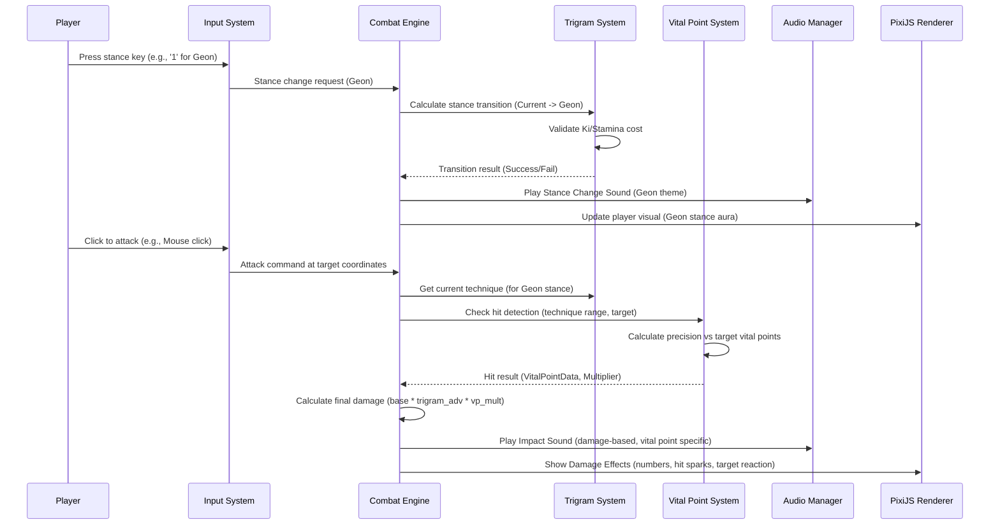

# Black Trigram (흑괘) - Technical Architecture

## 🏗️ System Architecture Overview

### Cyberpunk Tech Stack

- **Frontend**: React 18 (targeting React 19 features) + TypeScript + Vite
- **Graphics Engine**: PixiJS 8 with @pixi/react
- **Audio Engine**: Howler.js with Web Audio API (Current implementation uses custom Web Audio API logic)
- **State Management**: Zustand + React Context (or other suitable lightweight manager)
- **Testing**: Vitest + React Testing Library + Cypress
- **Build Tools**: Vite + ESBuild for optimal performance

## 🎯 SWOT Analysis

### 💪 Strengths (Green)

#### Technical Strengths

- ✅ **Modern TypeScript Stack**: Type-safe development with excellent developer experience.
- ✅ **High-Performance Graphics**: PixiJS WebGL rendering planned for 60+ FPS gameplay.
- ✅ **Cross-Platform Compatibility**: Web-based deployment targets all modern devices.
- ✅ **Modular Architecture**: Clean separation of concerns with reusable components planned.
- ✅ **Comprehensive Testing Planned**: Unit, integration, and E2E test coverage strategy.
- ✅ **Korean Cultural Authenticity**: Strong focus on proper language support and cultural representation.
- ✅ **Advanced Audio System**: Well-designed audio engine with dynamic capabilities.

#### Gameplay Strengths (Planned)

- ✨ **Unique Combat System**: Anatomically accurate vital point targeting.
- ✨ **Educational Value**: Real Korean martial arts and I Ching philosophy.
- ✨ **Precision-Based Skill**: Rewards accuracy and knowledge over button mashing.
- ✨ **Progressive Learning**: Structured advancement through traditional martial arts.

#### Market Strengths (Potential)

- 틈새 **Niche Market Leadership**: Potential if no direct competitors in cyberpunk Korean martial arts.
- 🌐 **Accessibility**: Free-to-play web game with no installation barriers.
- 🤝 **Cultural Bridge**: Introduces Korean culture to global gaming audience.
- 🎓 **Educational Tie-ins**: Potential partnerships with martial arts schools.

### ⚠️ Weaknesses (Orange/Red)

#### Technical Weaknesses

- 📉 **Browser Dependency**: Performance limited by browser capabilities.
- 📉 **Audio File Size**: High-quality Korean audio assets (when created) could increase load times.
- 📉 **WebGL Requirements**: May exclude older devices without hardware acceleration.
- 📉 **Single Platform Focus (Currently)**: Web-only limits monetization opportunities without further development.
- 📉 **Incomplete Implementation**: Majority of components and systems are placeholders.

#### Gameplay Weaknesses (Potential)

- 🚧 **Learning Curve**: Complex vital point system may intimidate casual players.
- 🚧 **Cultural Barrier**: Korean terminology may confuse non-Korean speakers if not well-explained.
- 🚧 **Limited Content (Initially)**: Focused scope may reduce replay value if not expanded.
- 🚧 **Niche Appeal**: Martial arts theme might limit broad market appeal.

#### Development Weaknesses

- 🧑‍💻 **Small Team (Assumed)**: Limited resources for content creation and marketing.
- 🌍 **Cultural Sensitivity**: Ongoing effort required to ensure accurate and respectful representation of Korean culture.
- 🖼️ **Asset Dependency**: Requires high-quality Korean audio and visual assets (currently placeholders or missing).
- 🗣️ **Localization Complexity**: Proper Korean-English translation and UI adaptation challenges.

### 🌟 Opportunities (Blue/Gold)

#### Market Opportunities

- 📈 **Growing Interest in Korean Culture**: K-pop, K-dramas driving cultural curiosity.
- 📈 **Educational Gaming Trend**: Increased demand for learning-based games.
- 📈 **Martial Arts Popularity**: Growing interest in traditional fighting arts.
- 📈 **Cyberpunk Renaissance**: Renewed interest in cyberpunk aesthetics.
- 📱 **Mobile Gaming Growth**: Potential for mobile-optimized PWA or native versions.

#### Technical Opportunities

- 🚀 **PWA Capabilities**: Progressive web app for native-like mobile experience.
- 🚀 **VR/AR Integration**: Future expansion into immersive technologies.
- 🚀 **AI Enhancement**: Machine learning for adaptive difficulty and training.
- 🚀 **Blockchain Integration (Optional)**: NFT achievements and competitive tournaments.
- 🚀 **Cross-Platform Expansion**: Native mobile and desktop versions with tools like Electron or Tauri.

#### Content Opportunities

- 👥 **Community-Generated Content**: User-created training scenarios or challenges.
- 🎓 **Educational Partnerships**: Collaboration with martial arts institutions.
- 🌏 **Cultural Expansion**: Other Asian martial arts traditions (long-term).
- 🏆 **Competitive Scene**: Online tournaments and ranking systems.
- 🎬 **Streaming Integration**: Twitch/YouTube content creation features.

### ⚡ Threats (Yellow/Red)

#### Market Threats

- 🆚 **AAA Competition**: Large studios creating competing martial arts games.
- 🤔 **Cultural Appropriation Concerns**: Criticism if not handled with utmost care and consultation.
- 🔧 **Platform Changes**: Browser security updates or API deprecations breaking game functionality.
- 🔄 **Mobile Shift**: Continued move away from web gaming to mobile apps for certain demographics.

#### Technical Threats

- 🌐 **Browser Fragmentation**: Different performance or feature support across browsers.
- ⚙️ **Web Standards Changes**: Breaking changes in WebGL or Audio APIs.
- 📈 **Performance Expectations**: Rising user expectations for mobile-like performance on the web.
- 🚫 **Ad Blocker Impact**: Potential revenue model disruption if ads are considered.

#### Business Threats

- 💰 **Monetization Challenges**: Difficulty generating revenue from web games without a clear strategy.
- 📜 **Copyright Issues**: Potential claims over traditional Korean martial arts representation (mitigate with research and respect).
- 🧩 **Team Scaling**: Challenges hiring developers with specific cultural knowledge or niche skills.
- 📉 **Market Saturation**: Oversupply of indie fighting games; differentiation is key.

## 🎮 Enhanced Combat System Architecture

```mermaid
graph TB
    subgraph "Combat Engine Core"
        CE[Combat Engine] --> TCS[Trigram Combat System]
        CE --> VPS[Vital Point System]
        CE --> DCS[Damage Calculation System]
        CE --> AIS[AI System]
    end

    subgraph "Trigram System (팔괘)"
        TCS --> SM[Stance Manager]
        TCS --> TC[Transition Calculator]
        TCS --> KC[Korean Culture Integration]

        SM --> S1[건 Geon (Heaven)]
        SM --> S2[곤 Gon (Earth)]
        SM --> S3[진 Jin (Thunder)]
        SM --> S4[손 Son (Wind)]
        SM --> S5[감 Gam (Water)]
        SM --> S6[리 Li (Fire)]
        SM --> S7[간 Gan (Mountain)]
        SM --> S8[태 Tae (Lake)]
    end

    subgraph "Vital Point Targeting (급소)"
        VPS --> AR[Anatomical Regions]
        VPS --> HD[Hit Detection]
        VPS --> DC_VPS[Damage Calculator - Vital Points]

        AR --> VP_Crit[Critical Points - e.g., 2.5x]
        AR --> VP_Sec[Secondary Points - e.g., 1.8x]
        AR --> VP_Std[Standard Points - e.g., 1.2x]
    end

    subgraph "Audio-Visual Feedback"
        CE --> AM[Audio Manager]
        CE --> VFX[Visual Effects]

        AM --> SFX[Korean SFX Engine]
        AM --> Music[Traditional Music Engine]

        VFX --> Particles[Ki Energy Particles]
        VFX --> UI_Effects[Cyberpunk UI Effects]
        VFX --> HitSparks[Hit Sparks & Blood (Optional)]
    end

    subgraph "Player Input"
        PI[Player Input Manager] --> KM[Keyboard/Mouse]
        PI --> Touch[Touch Controls (Mobile)]
        PI --> Gamepad[Controller Support]

        KM --> Movement[WASD/Arrow Movement]
        KM --> Stances[1-8 Stance Keys]
        KM --> Target[Mouse Aiming/Attack]
    end

    PI --> CE
    CE --> Renderer[PixiJS Renderer]

    style CE fill:#00ffd0,stroke:#333,color:#000
    style TCS fill:#ffd700,stroke:#333,color:#000
    style VPS fill:#ff6b6b,stroke:#333,color:#000
    style PI fill:#87CEFA,stroke:#333,color:#000
    style Renderer fill:#lightgrey,stroke:#333,color:#000
```

### Combat Flow Architecture



### System Integration Architecture

```mermaid
graph LR
    subgraph "Frontend Layer (React + PixiJS)"
        App[App.tsx] --> StagePixi[Pixi Stage (@pixi/react)]
        StagePixi --> GameComponents[Game Components (Player, UI, etc.)]
        GameComponents --> PixiPrimitives[Pixi Primitives (Sprite, Graphics, Text)]
        ReactContext[React Context/Zustand (State)]
    end

    subgraph "Game Logic Layer (TypeScript Modules)"
        GameEngine[GameEngine.ts]
        CombatSystem[systems/CombatSystem.ts]
        PlayerState[types/index.ts - PlayerState]
        AISystem[systems/AISystem.ts (Planned)]
        TrigramLogic[systems/trigram/*]
        VitalPointLogic[systems/vitalpoint/*]
    end

    subgraph "Data Layer (TypeScript Consts / JSON)"
        KoreanTechniquesDB[types/index.ts - TRIGRAM_DATA]
        VitalPointsDB[types/index.ts - VitalPoint definitions (Planned)]
        TrigramDataPhilosophy[types/index.ts - TRIGRAM_DATA]
        AudioAssetsConfig[audio/AudioManager.ts - Sound mappings]
    end

    ReactContext --> GameEngine
    App --> GameEngine

    GameEngine --> CombatSystem
    GameEngine --> PlayerState
    GameEngine --> AISystem
    GameEngine --> TrigramLogic
    GameEngine --> VitalPointLogic

    CombatSystem --> KoreanTechniquesDB
    CombatSystem --> VitalPointsDB
    CombatSystem --> TrigramDataPhilosophy

    GameComponents --> GameEngine # For actions
    GameEngine --> GameComponents # For rendering updates

    style GameEngine fill:#00ffd0,stroke:#333,color:#000
    style CombatSystem fill:#ffd700,stroke:#333,color:#000
    style React fill:#61DAFB,stroke:#333,color:#000
```

## 🛡️ Security & Performance Architecture

### Performance Optimization Strategy

```mermaid
graph TD
    subgraph "Performance Monitoring & Profiling"
        PM[Performance Monitor] --> FPS[FPS Tracking (Stats.js/Custom)]
        PM --> Memory[Memory Usage (Browser DevTools)]
        PM --> AudioPerf[Audio Performance (Web Audio API metrics)]
        PM --> Network[Asset Loading Times]
    end

    subgraph "Optimization Techniques"
        OT[Optimization Engine] --> Batching[PixiJS SpriteBatch/BatchRenderer]
        OT --> TextureAtlases[Texture Atlases]
        OT --> ObjectPooling[Object Pooling (Projectiles, Effects)]
        OT --> AssetCaching[Asset Caching (useTexture hook)]
        OT --> LazyLoading[Lazy Loading (Code Splitting for modes)]
        OT --> AudioOpt[Audio Compression & Streaming]
        OT --> Debounce[Debounce/Throttle Inputs & Updates]
        OT --> Memoization[React.memo / useMemo / useCallback]
    end

    subgraph "Fallback Systems (Graceful Degradation)"
        FS[Fallback Manager] --> LowQualityMode[Low Quality Graphics Mode]
        FS --> SimplerAudio[Simplified/Procedural Audio Fallback]
        FS --> ReducedEffects[Reduced Particle Effects]
    end

    PM -.-> OT # Profiling informs optimization
    OT -.-> FS # Optimized assets might still need fallbacks

    style PM fill:#4ecdc4,stroke:#333,color:#000
    style OT fill:#45b7d1,stroke:#333,color:#000
    style FS fill:#f9ca24,stroke:#333,color:#000
```

## 📊 Development Roadmap (Conceptual)

### Phase 1: Foundation (MVP) - Playable Core Loop

- [ ] **Core Combat**: Implement 1-2 Trigram stances with unique techniques.
- [ ] **Basic Vital Points**: Target a few critical vital points.
- [ ] **Player Control**: Basic movement and attack.
- [ ] **Simple Enemy AI**: Basic attack/defense patterns.
- [ ] **Core UI**: Health bars, stance indicator.
- [ ] **Korean Audio**: Basic sound effects for implemented actions.
- [ ] **Visuals**: Basic character and dojang rendering.

### Phase 2: Enhancement - Content & Systems Expansion

- [ ] **Full Trigram System**: All 8 stances and multiple techniques per stance.
- [ ] **Complete Vital Point System**: Detailed anatomical regions and effects.
- [ ] **Advanced AI**: More challenging opponents with varied styles.
- [ ] **Training Mode**: Interactive tutorials for stances and techniques.
- [ ] **Cultural Philosophy**: Integrate I Ching trigram meanings into gameplay/UI.
- [ ] **Performance Optimization**: Ensure smooth 60 FPS.
- [ ] **Mobile Responsiveness**: Basic touch controls and layout adjustments.

### Phase 3: Expansion - Polish & Feature Richness

- [ ] **Story/Intro Mode**: Introduce the world and Korean martial arts philosophy.
- [ ] **Advanced Graphics**: Ki energy effects, detailed animations, dynamic environments.
- [ ] **Full Audio Design**: Comprehensive soundscape with traditional Korean music.
- [ ] **Settings/Customization**: Graphics, audio, controls options.
- [ ] **Progression System**: Player skill development, unlocking techniques/lore.

### Phase 4: Platform Growth & Community (Post-Launch)

- [ ] **PWA Deployment**: Enhanced mobile web experience.
- [ ] **Community Features**: Leaderboards, challenges.
- [ ] **Educational Partnerships**: Collaborate with martial arts schools.
- [ ] **Content Updates**: New techniques, enemies, game modes.
- [ ] **Consider Native Builds**: Explore mobile app versions if demand exists.

## 🎯 Success Metrics & KPIs

### Technical Metrics

- **Performance**: Consistent 60 FPS on target mid-range devices.
- **Load Time**: <5 seconds initial load for core assets.
- **Crash Rate**: <0.5% of all sessions.
- **Browser Compatibility**: Flawless on latest 2 versions of major browsers (Chrome, Firefox, Safari, Edge).

### User Engagement Metrics

- **Session Duration**: Average 10-15+ minutes for engaged users.
- **Retention Rate**: Day 1: 30%, Day 7: 15%.
- **Tutorial Completion**: 60% complete basic training.
- **Feature Adoption**: % of players using advanced techniques or exploring philosophy content.

### Business Metrics (If Applicable)

- **User Acquisition**: Target X monthly active users (MAU) post-launch.
- **Conversion Rate (If premium features/cosmetics are added)**: Target Y%.
- **Community Growth**: Active members on Discord/forums.
- **Educational Impact**: Positive feedback from learners/educators.

---

## 🏛️ Traditional Architecture (Reference)

_Original architecture approach focusing on traditional martial arts simulation without cyberpunk enhancements._

### Classic System Design

- Pure martial arts focus without cyberpunk elements.
- Traditional UI with earth tones and classical typography.
- Historically accurate Korean martial arts representation.
- Educational emphasis over entertainment value.
- Simple, clean architecture prioritizing cultural authenticity.
  (This section remains as a conceptual reference.)
