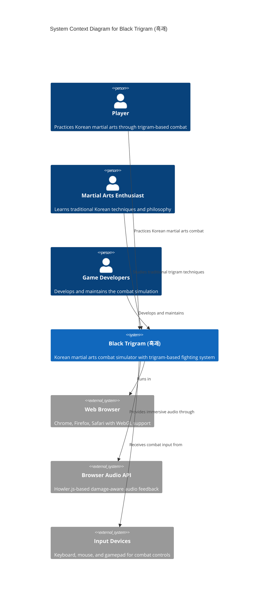
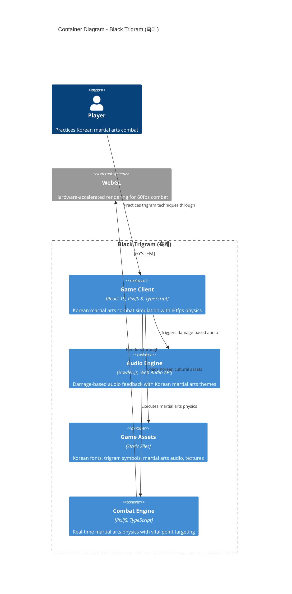
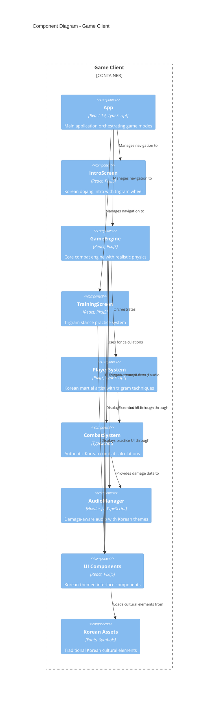
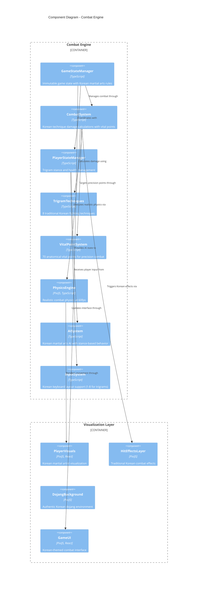
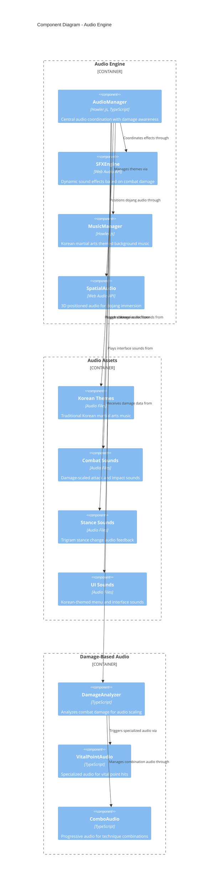
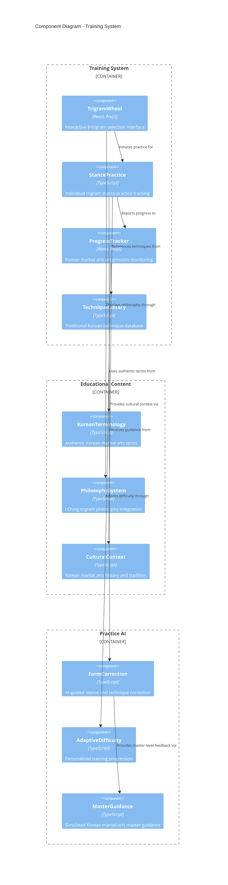
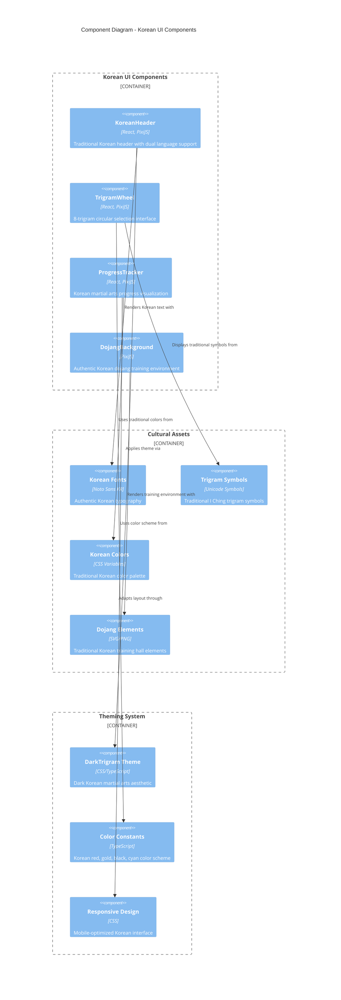
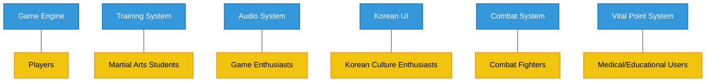
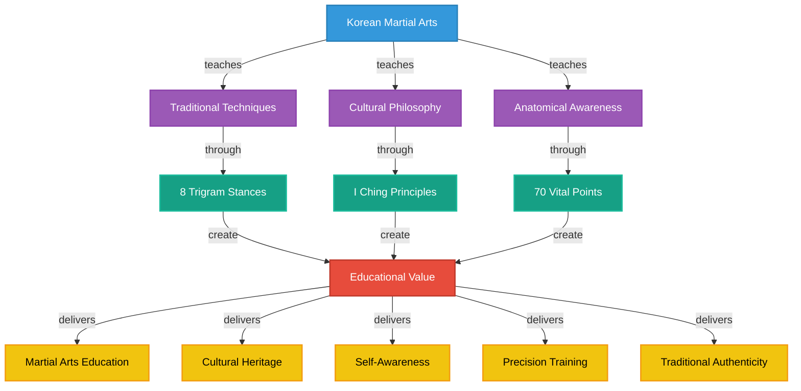

# 🏗️ Black Trigram (흑괘) Architecture

This document provides a comprehensive view of the Black Trigram Korean Martial Arts game architecture using the C4 model, illustrating how components interact to deliver an authentic combat simulation experience.

## 📚 Complete Architecture Documentation Map

### Current Architecture

| Document                                          | Focus           | Description                               |
| ------------------------------------------------- | --------------- | ----------------------------------------- |
| **Architecture**               | 🏗️ C4 Model     | C4 model showing system structure          |
| **[Game Design](game-design.md)**                 | 🎮 Design       | Korean martial arts game mechanics        |
| **README**                          | 📖 Overview     | Project overview and setup guide         |

### Technical Components

| Document                                       | Focus           | Description                               |
| ---------------------------------------------- | --------------- | ----------------------------------------- |
| **[Audio System](src/audio/)**                | 🔊 Audio        | Damage-based audio feedback system        |
| **[Game Engine](src/components/game/)**       | ⚙️ Engine       | Core combat physics and game loop        |
| **[UI Components](src/components/ui/)**       | 🎨 Interface    | Korean-themed UI components               |
| **[Training Mode](src/components/training/)** | 🥋 Training     | Trigram stance practice system            |

### Testing & Quality

| Document                                       | Focus           | Description                               |
| ---------------------------------------------- | --------------- | ----------------------------------------- |
| **[Testing Strategy](cypress/)**              | 🧪 Testing      | E2E and component testing                 |
| **Performance**                  | ⚡ Performance  | 60fps optimization and monitoring        |
| **[Code Quality](src/types/)**                | 📝 Types        | TypeScript strict typing                  |

## 🌐 System Context

Black Trigram operates as a web-based Korean martial arts combat simulator, emphasizing authentic traditional techniques and cultural authenticity.

## 🏢 Container View

Black Trigram consists of several specialized containers delivering authentic Korean martial arts combat simulation.

## 🧩 Component View - Game Client

The game client orchestrates Korean martial arts combat through specialized React components integrated with PixiJS.

## ⚔️ Combat System Component Details

This diagram shows the detailed structure of the Korean martial arts combat system:

## 🎵 Audio System Architecture

This diagram illustrates the damage-based audio system with Korean martial arts themes:

## 🥋 Training System Architecture

This diagram shows the Korean martial arts training and education system:

## 🎨 Korean UI Component System

This diagram illustrates the Korean-themed user interface components:

## 📊 Key Architecture Decisions

### Architecture Decision Records

| ID | Decision | Rationale |
|----|----------|-----------|
| ADR-001 | PixiJS + React Integration | Enables 60fps WebGL-accelerated combat with React component architecture |
| ADR-002 | Korean Cultural Authenticity | Ensures genuine Korean martial arts representation with proper terminology |
| ADR-003 | Damage-Based Audio System | Provides immersive combat feedback scaled to actual damage calculations |
| ADR-004 | 8-Trigram Fighting System | Authentic I Ching-based martial arts with traditional Korean techniques |
| ADR-005 | Vital Point Targeting | Realistic anatomical precision combat with 70 documented vital points |
| ADR-006 | Strict TypeScript + Vitest | Ensures code quality and reliable combat physics calculations |
| ADR-007 | Mobile-First Responsive | Korean martial arts accessible on all devices with touch controls |

### Key Quality Attributes

| Quality Attribute | Support in Current Architecture |
|-------------------|--------------------------------|
| Performance | 60fps guaranteed through PixiJS WebGL acceleration and optimized game loop |
| Cultural Authenticity | Korean fonts, terminology, colors, and traditional martial arts techniques |
| Immersion | Damage-based audio, realistic physics, and authentic Korean dojang environment |
| Accessibility | Responsive design, keyboard navigation, and dual-language support |
| Maintainability | Strict TypeScript, component architecture, and comprehensive testing |
| Extensibility | Modular combat system allowing additional techniques and training modes |

## 🔍 Business View of Architecture

### Stakeholder Alignment

### Educational Value Map

## Current Architecture Constraints

1. **Client-Side Only**: No server-side multiplayer or cloud save functionality
2. **Static Korean Content**: Pre-defined techniques without custom martial arts style creation
3. **WebGL Requirement**: Requires modern browser with WebGL support for optimal performance
4. **Single Player Focus**: No multi-player sparring or collaborative training features
5. **Fixed Technique Set**: 8 traditional trigram techniques without expansion capabilities
6. **Browser Audio Limitations**: Audio feedback limited by Web Audio API capabilities

## Performance Targets

| Metric | Target | Current Architecture Support |
|--------|--------|------------------------------|
| Frame Rate | 60fps steady | PixiJS WebGL acceleration |
| Load Time | <3 seconds | Asset preloading and optimization |
| Memory Usage | <100MB | Efficient PixiJS resource management |
| Audio Latency | <20ms | Howler.js with Web Audio API |
| Input Response | <16ms | Direct keyboard/mouse handling |
| Mobile Performance | 30fps minimum | Responsive design with performance scaling |

## Cultural Authenticity Requirements

| Aspect | Implementation | Verification |
|--------|---------------|--------------|
| Korean Language | Noto Sans KR fonts, authentic terminology | Native speaker review |
| Trigram Philosophy | Authentic I Ching trigram meanings | Traditional martial arts consultation |
| Combat Techniques | Based on traditional Korean martial arts | Historical accuracy verification |
| Visual Design | Traditional Korean dojang aesthetics | Cultural design review |
| Audio Themes | Korean martial arts music and sound design | Cultural audio authenticity |
