# 🎮 Black Trigram (흑괘) – Technical Architecture

---

## 📚 Architecture Documentation Map

| Document                      | Focus            | Description                                                                                                |
| ----------------------------- | ---------------- | ---------------------------------------------------------------------------------------------------------- |
| **🌐 System Context**         | C4 Model         | High-level view showing actors (Player, CDNs) and the entirely front-end application                       |
| **🏢 Container View**         | C4 Model         | Frontend-only architecture: UI Layer, Game Logic, Asset Loader, Renderer, and State Management             |
| **🧩 Component View**         | C4 Model         | Detailed breakdown of all key modules: Combat System, Trigram System, Vital Point System, Audio, UI        |
| **🔄 Combat Flow Sequence**   | Sequence Diagram | How input flows through logic to rendering and feedback in real time                                       |
| **⚡ Security & Performance** | Performance      | Client-side performance profiling, optimization techniques, and graceful degradation strategies            |
| **📊 SWOT Analysis**          | Strategy         | Strengths, Weaknesses, Opportunities, Threats for a 100% frontend, no-persistence “Black Trigram” web game |
| **🧠 Concept Mindmaps**       | Concept          | Mindmaps showing primary game concepts (combat, stances, archetypes), architectural ideas, and UX flows    |

---

## 🌐 System Context

```mermaid
C4Context
  title 🌐 System Context Diagram – Black Trigram (흑괘)

  Person(player, "🧑‍🤝‍🧑 Player", "Controls an archetype in realistic 2D combat via browser")
  System(browserGame, "🌐 Black Trigram Web App", "Runs entirely in-browser (React + PixiJS) on modern browsers")
  System_Ext(audioCDN, "🎵 Audio CDN", "Hosts Korean martial arts SFX & music assets")
  System_Ext(artCDN, "🖼️ Art CDN", "Hosts graphical sprites, backgrounds, and particle textures")

  Rel(player, browserGame, "Plays via keyboard/mouse/touch")
  Rel(browserGame, audioCDN, "Fetches Korean SFX & Music from")
  Rel(browserGame, artCDN, "Fetches graphical assets from")

  UpdateLayoutConfig($c4ShapeInRow="2", $c4BoundaryInRow="1")

  %% Styling
  style player      fill:#A0D6B4,stroke:#333,stroke-width:2px,color:#000
  style browserGame fill:#FFD700,stroke:#333,stroke-width:2px,color:#000
  style audioCDN    fill:#87CEFA,stroke:#333,stroke-width:2px,color:#000
  style artCDN      fill:#FF6B6B,stroke:#333,stroke-width:2px,color:#000
```

> **Legend**
>
> - 🧑‍🤝‍🧑 **Player**: End-user interacting with Black Trigram through desktop or mobile browser.
> - 🌐 **Black Trigram Web App**: Entirely front-end, built with React + PixiJS (TypeScript). All game logic, state, & rendering occur in-browser—no backend.
> - 🎵 **Audio CDN**: Serves SFX (bone cracks, impacts, ambient kyūdō sounds) and traditional Korean background music.
> - 🖼️ **Art CDN**: Serves character sprites, particle bitmaps (ki energy, blood splatter), UI icons, fonts (including Korean text), and other graphical assets.

---

## 🏢 Container View

```mermaid
C4Container
    title 🏢 Container Diagram – Black Trigram (Frontend-Only)

    Person(player, "🧑‍🤝‍🧑 Player", "Controls an archetype in realistic 2D combat")

    System_Boundary(browserGame, "🌐 Black Trigram Web App") {
        Container(UI, "🖥️ UI Layer", "React Components (TypeScript)", "Manages screens, HUD, menus, Korean text, and styling")
        Container(gameLogic, "⚙️ Game Logic Layer", "TypeScript Modules", "Handles combat, trigram, vital-point calculations, and state")
        Container(assetLoader, "📦 Asset Loader", "TypeScript (PixiJS Loader & Hooks)", "Dynamically loads images, audio, JSON from CDNs")
        Container(renderer, "🎨 Rendering Engine", "PixiJS (TypeScript)", "Renders sprites, animations, particles, UI overlays")
        Container(stateMgmt, "🗄️ State Management", "Zustand / React Context", "In-memory state: player, enemy, UI flags; no persistence")
    }

    Rel(player, UI, "Interacts with UI via mouse/keyboard/touch")
    Rel(UI, gameLogic, "Dispatches player actions & reads game state")
    Rel(gameLogic, assetLoader, "Requests asset URLs & metadata")
    Rel(gameLogic, stateMgmt, "Reads/Writes combat & training state")
    Rel(assetLoader, renderer, "Supplies textures & audio buffers")
    Rel(stateMgmt, UI, "Provides state (health, stance, UI flags)")
    Rel(UI, renderer, "Instructs rendering via PixiJS")

    UpdateLayoutConfig($c4ShapeInRow="2", $c4BoundaryInRow="1")

    %% Styling
    style UI          fill:#A5D6A7,stroke:#333,stroke-width:2px,color:#000
    style gameLogic   fill:#00FFD0,stroke:#333,stroke-width:2px,color:#000
    style assetLoader fill:#87CEFA,stroke:#333,stroke-width:2px,color:#000
    style renderer    fill:#B0BEC5,stroke:#333,stroke-width:2px,color:#000
    style stateMgmt   fill:#FFDAB9,stroke:#333,stroke-width:2px,color:#000
```

> **Containers Overview**
>
> - **🖥️ UI Layer**:
>
>   - React + TypeScript functional components.
>   - Screens: `CombatScreen`, `TrainingScreen`, `IntroScreen`.
>   - Common UI: `CombatHUD`, `TrigramWheel`, `ProgressTracker`, etc.
>   - Base modules in `src/components/ui/base`: `BaseButton`, `KoreanText`, `BackgroundGrid`, etc.
>   - CSS: `src/App.css`, `src/CombatScreen.css`, etc.

> - **⚙️ Game Logic Layer**:
>
>   - Under `src/systems/*`, `src/types/*`.
>   - **CombatSystem (src/systems/CombatSystem.ts)**: Orchestrates input → trigram → vital-point → damage → audio/visual.
>   - **TrigramSystem (src/systems/trigram/**)\*\*:
>
>     - `StanceManager.ts`: Tracks current stance, validates Ki/Stamina, handles transition cost.
>     - `TransitionCalculator.ts`: Computes validity of stance switches.
>     - `TrigramCalculator.ts`: Provides technique data & advantage multipliers.
>     - `KoreanCulture.ts`: Supplies I Ching lore, Korean labels/descriptions.
>
>   - **VitalPointSystem (src/systems/vitalpoint/**)\*\*:
>
>     - `KoreanAnatomy.ts` & `KoreanVitalPoints.ts`: Defines all 70 vital points (critical, secondary, standard) and multipliers.
>     - `HitDetection.ts`: Checks collisions between attack hitboxes & character bounding boxes.
>     - `DamageCalculator.ts`: Applies base damage × trigram advantage × vital-point multiplier.
>
>   - **AudioManager (src/audio/**)\*\*:
>
>     - `AudioAssetRegistry.ts`, `AudioManager.ts`, `AudioUtils.ts`, `DefaultSoundGenerator.ts`, `VariantSelector.ts`: Load & play SFX/music via Web Audio API.
>
>   - **Physics & AI** (planned under `src/systems/AISystem.ts`): Minimal NPC behaviors.

> - **📦 Asset Loader**:
>
>   - PixiJS `Loader` (`@pixi/loaders`) and custom hooks (`useTexture.ts`) for textures & JSON data.
>   - Helpers in `src/utils/playerUtils.ts`, `colorUtils.ts` map asset keys to URLs.
>   - Dynamically import large JSON (e.g., `src/types/constants/trigram.ts`) at runtime.

> - **🎨 Rendering Engine**:
>
>   - PixiJS (wrapped by `@pixi/react`) via `src/components/game/GameEngine.tsx`.
>   - Manages a single PixiJS `Application` (Canvas/WebGL).
>   - Renders: Character sprites (`PlayerVisuals.tsx`, `EnemyVisuals.tsx`), background (`DojangBackground.tsx`), particles (`HitEffectsLayer.tsx`).
>   - Draws UI overlays (health, Ki, stance auras) via Pixi primitives (`Graphics`, `Text`).

> - **🗄️ State Management**:
>
>   - In-browser only (no backend). Uses **Zustand** (or React Context fallback) under `src/hooks/`.
>   - `useGameState.ts`, `useUIState.ts`, `useEnemyState.ts` store: health, stamina, Ki, current stance, enemy state, UI flags.
>   - **No Persistence**: Refresh resets all state / progress.

---

## 🧩 Component View

```mermaid
C4Component
    title 🧩 Component Diagram – Black Trigram (Component-Level)

    Container_Boundary(UI, "🖥️ UI Layer") {
        Component(App, "App.tsx", "React", "Root component; sets up routes & context providers")
        Component(IntroScreen, "IntroScreen.tsx", "React", "Title, menu, philosophy, controls overview")
        Component(CombatScreen, "CombatScreen.tsx", "React", "Hosts PixiJS canvas, HUD, stance wheel, controls")
        Component(TrainingScreen, "TrainingScreen.tsx", "React", "Vital-point targeting practice, archetype drills")
        Component(GameUI, "GameUI.tsx", "React", "Common UI: health bar, stamina bar, tooltips")
        Component(CombatHUD, "CombatHUD.tsx", "React", "Displays health, Ki, stamina, stance indicator")
        Component(TrigramWheel, "TrigramWheel.tsx", "React", "Circular selector of 8 stances")
        Component(EndScreen, "EndScreen.tsx", "React", "Post-combat summary and results")
        Component(BaseButton, "BaseButton.tsx", "React", "Reusable styled button")
        Component(KoreanText, "KoreanText.tsx", "React", "Stylized Korean fonts & kerning")
        Component(BackgroundGrid, "BackgroundGrid.tsx", "React", "Grid overlay for training mode")
    }

    Container_Boundary(gameLogic, "⚙️ Game Logic Layer") {
        Component(CombatSystem, "CombatSystem.ts", "TypeScript", "Orchestrates combat step-by-step")
        Component(TrigramSystem, "TrigramSystem.ts", "TypeScript", "Facade over stance, transition, technique modules")
        Component(StanceManager, "StanceManager.ts", "TypeScript", "Maintains current stance state, Ki/Stamina deduction")
        Component(TransitionCalculator, "TransitionCalculator.ts", "TypeScript", "Calculates cost of switching stances")
        Component(TrigramCalculator, "TrigramCalculator.ts", "TypeScript", "Selects technique data, advantage multipliers")
        Component(KoreanCulture, "KoreanCulture.ts", "TypeScript", "Provides I Ching lore, Korean labels & descriptions")
        Component(VitalPointSystem, "VitalPointSystem.ts", "TypeScript", "Facade over hit detection & damage calculation")
        Component(AnatomicalRegions, "AnatomicalRegions.ts", "TypeScript", "Defines critical/secondary/standard regions")
        Component(HitDetection, "HitDetection.ts", "TypeScript", "Checks bounding-box intersection between attacks & targets")
        Component(DamageCalculatorVP, "DamageCalculator.ts", "TypeScript", "Applies vital-point multipliers to base damage")
        Component(AudioManager, "AudioManager.ts", "TypeScript", "Interfaces with Web Audio API to play SFX/music")
        Component(DefaultSoundGenerator, "DefaultSoundGenerator.ts", "TypeScript", "Generates procedural fallback sounds")
        Component(VariantSelector, "VariantSelector.ts", "TypeScript", "Randomizes audio variants for variety")
    }

    Container_Boundary(assetLoader, "📦 Asset Loader") {
        Component(PixiLoader, "Pixi Loader (via useTexture)", "TypeScript", "Loads textures (sprites, particles) from Art CDN")
        Component(AudioLoader, "AudioLoader.ts", "TypeScript", "Fetches audio buffers from Audio CDN, decodes via Web Audio API")
        Component(TrigramDataLoader, "TrigramData.ts / JSON", "TypeScript", "Loads JSON for stances & techniques at runtime")
        Component(VitalPointsDataLoader, "VitalPointsData.ts / JSON", "TypeScript", "Loads JSON for 70 vital points & anatomical data")
    }

    Container_Boundary(stateMgmt, "🗄️ State Management") {
        Component(useGameState, "useGameState.ts (Zustand)", "TypeScript", "Global game state: health, stamina, Ki, scores")
        Component(useUIState, "useUIState.ts (Zustand)", "TypeScript", "UI toggles: menu, training mode, debug overlays")
        Component(useEnemyState, "useEnemyState.ts (Zustand)", "TypeScript", "Current enemy health, stance, AI flags")
    }

    Container_Boundary(renderer, "🎨 Rendering Engine") {
        Component(PixiStage, "StagePixi.tsx", "React + @pixi/react", "Creates & manages PIXI.Application instance")
        Component(PlayerVisuals, "PlayerVisuals.tsx", "React + PixiJS", "Draws player sprite, stance aura, animations")
        Component(EnemyVisuals, "EnemyVisuals.tsx", "React + PixiJS", "Draws enemy sprite, hit reactions, health bar")
        Component(ParticlesLayer, "HitEffectsLayer.tsx", "React + PixiJS", "Renders ki energy particles, hit sparks, blood effects")
        Component(BackgroundRenderer, "DojangBackground.tsx", "React + PixiJS", "Draws dojo floor, background grid, environment")
    }

    Rel(App, IntroScreen, "🚦 Routes to")
    Rel(App, CombatScreen, "🚦 Routes to")
    Rel(App, TrainingScreen, "🚦 Routes to")

    Rel(CombatScreen, CombatSystem, "⚔️ Dispatches player inputs to")
    Rel(CombatSystem, StanceManager, "🥋 Updates stance")
    Rel(CombatSystem, TransitionCalculator, "🔁 Validates stance transitions")
    Rel(CombatSystem, TrigramCalculator, "💡 Fetches technique data")
    Rel(CombatSystem, VitalPointSystem, "🎯 Checks hits & calculates damage")
    Rel(CombatSystem, AudioManager, "🔊 Plays SFX/music")
    Rel(CombatSystem, stateMgmt, "🗄️ Reads/Writes game state")
    Rel(CombatScreen, PixiStage, "📡 Sends rendering commands to")
    Rel(PixiStage, PlayerVisuals, "👤 Draws player textures from PixiLoader")
    Rel(PixiStage, EnemyVisuals, "👺 Draws enemy textures from PixiLoader")
    Rel(PixiStage, ParticlesLayer, "💥 Renders hit & ki energy effects")
    Rel(PixiStage, BackgroundRenderer, "🌳 Draws dojo environment")
    Rel(CombatSystem, AudioLoader, "🎵 Requests audio assets from")
    Rel(StanceManager, TrigramDataLoader, "📥 Loads stance/technique JSON from")
    Rel(VitalPointSystem, VitalPointsDataLoader, "📥 Loads vital points JSON from")
    Rel(PixiLoader, renderer, "🖼️ Supplies textures to")
    Rel(AudioLoader, AudioManager, "🔊 Supplies decoded buffers to")
    Rel(stateMgmt, UI, "📦 Provides reactive state to")

    %% Styling
    style UI                      fill:#A5D6A7,stroke:#333,stroke-width:2px,color:#000
    style gameLogic               fill:#00FFD0,stroke:#333,stroke-width:2px,color:#000
    style assetLoader             fill:#87CEFA,stroke:#333,stroke-width:2px,color:#000
    style stateMgmt               fill:#FFDAB9,stroke:#333,stroke-width:2px,color:#000
    style renderer                fill:#B0BEC5,stroke:#333,stroke-width:2px,color:#000
    style CombatSystem            fill:#00ffd0,stroke:#333,stroke-width:2px,color:#000
    style TrigramSystem           fill:#ffd700,stroke:#333,stroke-width:2px,color:#000
    style VitalPointSystem        fill:#ff6b6b,stroke:#333,stroke-width:2px,color:#000
    style AudioManager            fill:#87CEFA,stroke:#333,stroke-width:2px,color:#000
    style PixiLoader              fill:#d3d3d3,stroke:#333,stroke-width:2px,color:#000
    style useGameState            fill:#a5d6a7,stroke:#333,stroke-width:2px,color:#000
    style PixiStage               fill:#b0bec5,stroke:#333,stroke-width:2px,color:#000
```

---

## 🔧 File Structure Highlights

- **src/components/ui/base**

  - `BaseButton.tsx`, `BackgroundGrid.tsx`, `KoreanText.tsx`, `KoreanHeader.tsx`, `PixiComponents.tsx`: Reusable UI primitives and Korean font utilities.

- **src/components/combat**

  - `CombatScreen.tsx`, `CombatArena.tsx`, `CombatControls.tsx`, `CombatHUD.tsx`: All UI & logic for real-time combat.

- **src/components/training**

  - `TrainingScreen.tsx`, `TrainingControlsPanel.tsx`, `VitalPointTrainingPanel.tsx`: Components for practicing vital-point targeting.

- **src/hooks**

  - `useTexture.ts`: Custom hook wrapping PixiJS loader for image caching.
  - `useGameState.ts`, `useUIState.ts`, `useEnemyState.ts`: Zustand stores for global state.

- **src/systems/trigram**

  - `KoreanCulture.ts`, `StanceManager.ts`, `TransitionCalculator.ts`, `TrigramCalculator.ts`: Trigram mechanics and data access.

- **src/systems/vitalpoint**

  - `AnatomicalRegions.ts`, `HitDetection.ts`, `DamageCalculator.ts`, `KoreanVitalPoints.ts`: Vital-point definitions, detection, and damage logic.

- **src/audio**

  - `AudioAssetRegistry.ts`, `AudioManager.ts`, `AudioUtils.ts`, `DefaultSoundGenerator.ts`, `VariantSelector.ts`: All sound loading and playback.

- **src/utils**

  - `playerUtils.ts`, `colorUtils.ts`: Helper functions for mapping archetype data and color schemes.

---

## 🔄 Combat Flow Sequence

```mermaid
sequenceDiagram
    title 🔄 Combat Flow – Fully Frontend (Black Trigram)

    participant Player                                           as "🧑‍🤝‍🧑 Player"
    participant InputSystem        as "🎮 InputSystem"
    participant CombatEngine       as "⚔️ Combat Engine"
    participant TrigramSystem      as "🔶 Trigram System"
    participant VitalPointSystem   as "🎯 VitalPoint System"
    participant AudioManager       as "🎵 Audio Manager"
    participant StateStore         as "🗄️ Zustand Store"
    participant PixiStage          as "🎨 PixiJS Renderer"

    classDef playerClass            fill:#A0D6B4,stroke:#333,stroke-width:2px,color:#000
    classDef inputClass             fill:#87CEFA,stroke:#333,stroke-width:2px,color:#000
    classDef combatClass            fill:#00FFD0,stroke:#333,stroke-width:2px,color:#000
    classDef trigramClass           fill:#FFD700,stroke:#333,stroke-width:2px,color:#000
    classDef vitalClass             fill:#FF6B6B,stroke:#333,stroke-width:2px,color:#000
    classDef audioClass             fill:#9C27B0,stroke:#333,stroke-width:2px,color:#FFF
    classDef stateClass             fill:#F8BBD0,stroke:#333,stroke-width:2px,color:#000
    classDef rendererClass          fill:#B0BEC5,stroke:#333,stroke-width:2px,color:#000

    class Player           playerClass
    class InputSystem      inputClass
    class CombatEngine     combatClass
    class TrigramSystem    trigramClass
    class VitalPointSystem vitalClass
    class AudioManager     audioClass
    class StateStore       stateClass
    class PixiStage        rendererClass

    Note over Player,PixiStage: 🥋 Korean Martial Arts Real-Time Combat

    Player->>InputSystem: 🥋 Press stance key (e.g., '1' for 건/Geon)
    InputSystem->>CombatEngine: 🔃 Stance change request
    CombatEngine->>TrigramSystem: 🔁 Calculate transition (Current → Geon)
    TrigramSystem->>StateStore: ➖ Deduct Ki/Stamina
    TrigramSystem-->>CombatEngine: ✅ Transition result (Success/Fail)
    CombatEngine->>AudioManager: 🔊 Play stance change SFX
    CombatEngine->>PixiStage: ✨ Update player aura visuals (PlayerVisuals)

    Player->>InputSystem: ⚔️ Click to attack (Mouse click)
    InputSystem->>CombatEngine: 🎯 Attack command with screen coords
    CombatEngine->>TrigramSystem: 💡 Get current technique parameters
    CombatEngine->>VitalPointSystem: 🔍 Hit detection (range & bounding boxes)
    VitalPointSystem-->VitalPointSystem: 🎯 Compute precision vs 70 vital points
    VitalPointSystem-->>CombatEngine: ✅ Hit result (VitalPointData, Multiplier)
    CombatEngine->>CombatEngine: 🧮 Compute final damage (base × trigram_adv × vp_mult)
    CombatEngine->>StateStore: 🩸 Reduce enemy health
    CombatEngine->>AudioManager: 🔊 Play impact SFX (bone crack / muscle thud)
    CombatEngine->>PixiStage: 💥 Render hit sparks, blood, damage numbers (ParticlesLayer)
    CombatEngine->>StateStore: ⚡ Update visual state (enemy hit flag, UI flags)
    CombatEngine-->>PixiStage: 👺 Trigger enemy reaction animation (EnemyVisuals)
```

> **Note**
>
> - **InputSystem**: Lives in React (e.g., `CombatControls.tsx`), dispatching events to `CombatEngine`.
> - **CombatEngine**: Aggregates all combat logic in `CombatSystem.ts`.
> - **TrigramSystem**: Handles stance logic, technique lookup, state updates (Zustand).
> - **VitalPointSystem**: Performs in-memory geometry collision detection & returns multipliers.
> - **AudioManager**: Web Audio API plays sound buffers loaded at runtime from the Audio CDN.
> - **PixiStage**: Via `@pixi/react` (`StagePixi.tsx`), renders player, enemy, UI overlays, particles.
> - **Zustand Store**: All shared state (player health, Ki, stance) resides in memory; React components subscribe.

---

## ⚡ Security & Performance Architecture

```mermaid
graph TD
    subgraph "🔍 Performance Monitoring & Profiling"
      PM[📈 Performance Monitor] --> FPS[FPS Tracking (Stats.js)]
      PM --> Memory[💾 Memory Usage (Chrome DevTools)]
      PM --> GC[🗑️ GC Observations]
      PM --> AssetTiming[⏱️ Asset Load Times (Network Tab)]
    end

    subgraph "🚀 Optimization Techniques"
      OT[⚙️ Optimization Engine] --> SpriteBatch[📦 PixiJS Sprite Batching]
      OT --> AtlasTextures[🎨 Texture Atlases (Spritesheet)]
      OT --> ObjectPooling[🔄 Object Pooling (Particles & Effects)]
      OT --> AssetCaching[🔒 useTexture & React.lazy]
      OT --> CodeSplitting[📂 Dynamic `import()`]
      OT --> AudioCompression[🎵 OGG/MP3 Streaming]
      OT --> Debounce[⏳ Debounce/Throttle Inputs & Animations]
      OT --> Memoization[🧠 React.memo / useMemo / useCallback]
      OT --> WebGLExtensions[🖥️ Enable EXT_disjoint_timer_query]
    end

    subgraph "🛡️ Fallback Systems (Graceful Degradation)"
      FS[⚠️ Fallback Manager] --> LowQualityMode[📉 Low Quality Graphics on Low-end GPUs]
      FS --> ReducedEffects[❌ Disable Blood / High-poly Particles]
      FS --> ProceduralAudio[🎹 Procedural SFX fallback if CDN missing]
      FS --> Canvas2D[🖼️ Fallback to Canvas 2D if WebGL Unsupported]
    end

    PM -.-> OT
    OT -.-> FS

    %% Styling
    classDef perfMon fill:#4ecdc4,stroke:#333,stroke-width:2px,color:#000
    classDef optTech fill:#45b7d1,stroke:#333,stroke-width:2px,color:#000
    classDef fallback fill:#f9ca24,stroke:#333,stroke-width:2px,color:#000

    class PM, FPS, Memory, GC, AssetTiming perfMon
    class OT, SpriteBatch, AtlasTextures, ObjectPooling, AssetCaching, CodeSplitting, AudioCompression, Debounce, Memoization, WebGLExtensions optTech
    class FS, LowQualityMode, ReducedEffects, ProceduralAudio, Canvas2D fallback
```

### **Performance Monitoring**

- **📈 FPS Tracking**: Integrate [Stats.js](https://github.com/mrdoob/stats.js/) to measure and display real-time framerate.
- **💾 Memory Usage**: Use Chrome DevTools to inspect memory footprint; watch for leaks when large particle sets spawn.
- **🗑️ GC Observations**: Monitor GC pauses when many objects (particles, temporary data) are created/destroyed; mitigate via object pooling.
- **⏱️ Asset Timing**: Leverage Network panel or custom timing code to measure JSON, texture, and audio load times from CDNs.

### **Optimization Techniques**

1. **📦 PixiJS Sprite Batching**

   - Group sprites sharing textures into batch draw calls (e.g., `ParticleContainer` for hit effects).
   - Use Pixi’s `ParticleContainer` or `SpriteBatch` for high particle counts (ki energy, blood).

2. **🎨 Texture Atlases**

   - Combine character frames, UI icons, and particle frames into single spritesheets (e.g., `characters.json`, `particles.json`).
   - Minimizes WebGL texture switches, increasing draw performance.

3. **🔄 Object Pooling**

   - Pre-allocate particle/effect objects (blood splatter, ki orbs) and recycle instead of allocating new instances.
   - Pool frequently used objects (damage-number labels, aura filters) to reduce GC pressure.

4. **🔒 Asset Caching**

   - Custom `useTexture` hook: ensures textures load once and reuse across components.
   - Leverage browser-level caching (Cache-Control headers on CDN) to avoid re-fetching.

5. **📂 Code Splitting**

   - Lazy-load heavy modules: `TrainingScreen`, concept art galleries, large JSON data (non-MVP features).
   - Use dynamic `import()` to download code only when needed.

6. **🎵 Audio Compression & Streaming**

   - Store audio on CDN as compressed OGG/MP3.
   - Stream large background tracks, pre-decode short SFX in memory for low-latency playback.

7. **⏳ Debounce / Throttle**

   - Prevent rapid-fire input (stance spamming) from overwhelming main loop.
   - Throttle UI updates (animation triggers, combo pop-ups) using `useThrottle`/`useDebounce`.

8. **🧠 Memoization**

   - Use `React.memo` for pure UI components (`TrigramWheel`, `CombatHUD`) so they only re-render on relevant prop changes.
   - Leverage `useMemo` / `useCallback` for expensive calculations inside React components.

9. **🖥️ WebGL Extensions**

   - Enable `EXT_disjoint_timer_query` in PixiJS to gather GPU timing metrics for deeper profiling.

### **Fallback Systems (Graceful Degradation)**

1. **📉 Low Quality Mode**

   - Detect GPU capabilities at startup. If low, reduce canvas resolution and disable sub-pixel effects.
   - Toggle via “Low Graphics” checkbox in settings (Zustand flag: `useUIState.isLowGraphicsMode`).

2. **❌ Reduced Effects**

   - On performance drop (FPS < 30), disable expensive particles: blood splatter, continuous ki swirl.
   - Use `useUIState.isLowPerfMode` to toggle off these render layers.

3. **🎹 Procedural Audio**

   - If Audio CDN fails (e.g., offline), fall back to simple beep-thump procedural sounds via `DefaultSoundGenerator.ts`.

4. **🖼️ Canvas2D Fallback**

   - If WebGL unavailable (older browsers), switch to Canvas 2D renderer for core gameplay (no advanced particles, simplified effects).

---

## 📊 SWOT Analysis

### Traditional SWOT Quadrant Chart

```mermaid
%%{init: {
  "theme": "neutral",
  "themeVariables": {
    "quadrant1Fill": "#2b83ba",
    "quadrant2Fill": "#1a9641",
    "quadrant3Fill": "#fdae61",
    "quadrant4Fill": "#d7191c",
    "quadrantTitleFill": "#ffffff",
    "quadrantPointFill": "#ffffff",
    "quadrantPointTextFill": "#000000",
    "quadrantXAxisTextFill": "#000000",
    "quadrantYAxisTextFill": "#000000"
  },
  "quadrantChart": {
    "chartWidth": 700,
    "chartHeight": 700,
    "pointLabelFontSize": 14,
    "titleFontSize": 24,
    "quadrantLabelFontSize": 18,
    "xAxisLabelFontSize": 16,
    "yAxisLabelFontSize": 16
  }
}}%%
quadrantChart
    title 📊 Black Trigram (흑괘) Frontend-Only SWOT Analysis
    x-axis Internal --> External
    y-axis Negative --> Positive
    quadrant-1 Opportunities
    quadrant-2 Strengths
    quadrant-3 Weaknesses
    quadrant-4 Threats

    "💡 PWA & Offline Caching":[0.8,0.9] radius:7 color:#a4c2f4 stroke-color:#3d64ba stroke-width:2px
    "📱 Mobile-First UX":[0.7,0.8] radius:7 color:#a4c2f4 stroke-color:#3d64ba stroke-width:2px
    "🎨 Community Modding":[0.85,0.75] radius:7 color:#a4c2f4 stroke-color:#3d64ba stroke-width:2px
    "🤖 AI-Driven Tutorials":[0.75,0.85] radius:7 color:#a4c2f4 stroke-color:#3d64ba stroke-width:2px
    "🌱 Ecosystem Partnerships":[0.65,0.7] radius:6 color:#a4c2f4 stroke-color:#3d64ba stroke-width:2px

    "🛠️ Zero-Install Web App":[0.2,0.8] radius:7 color:#a2d2a4 stroke-color:#2c882c stroke-width:2px
    "⏱ Fast Iteration":[0.25,0.75] radius:6 color:#a2d2a4 stroke-color:#2c882c stroke-width:2px
    "💸 Reduced Operational Costs":[0.15,0.85] radius:6 color:#a2d2a4 stroke-color:#2c882c stroke-width:2px
    "🚀 Immediate CDN Updates":[0.1,0.7] radius:7 color:#a2d2a4 stroke-color:#2c882c stroke-width:2px
    "🌍 Global Accessibility":[0.05,0.9] radius:6 color:#a2d2a4 stroke-color:#2c882c stroke-width:2px

    "🌀 No Persistence (Session-Only)":[0.2,0.25] radius:7 color:#f5a9a9 stroke-color:#aa3939 stroke-width:2px
    "🐢 Asset Load Latency":[0.3,0.2] radius:7 color:#f5a9a9 stroke-color:#aa3939 stroke-width:2px
    "📴 Limited Offline Play":[0.15,0.3] radius:6 color:#f5a9a9 stroke-color:#aa3939 stroke-width:2px
    "🌐 Browser Compatibility":[0.25,0.15] radius:7 color:#f5a9a9 stroke-color:#aa3939 stroke-width:2px
    "⚠️ Memory/GC Spikes":[0.35,0.1] radius:6 color:#f5a9a9 stroke-color:#aa3939 stroke-width:2px

    "🌩️ CDN Outages/Latency":[0.8,0.3] radius:7 color:#d5a6bd stroke-color:#9b568a stroke-width:2px
    "⚠️ WebGL Deprecation":[0.7,0.2] radius:7 color:#d5a6bd stroke-color:#9b568a stroke-width:2px
    "🏆 Competitive Mobile Games":[0.75,0.25] radius:7 color:#d5a6bd stroke-color:#9b568a stroke-width:2px
    "📉 Tech Debt (State Complexity)":[0.9,0.2] radius:6 color:#d5a6bd stroke-color:#9b568a stroke-width:2px
    "🔒 CDN Security Risks":[0.85,0.15] radius:6 color:#d5a6bd stroke-color:#9b568a stroke-width:2px
    "🌐 Browser Standards Changes":[0.65,0.25] radius:6 color:#d5a6bd stroke-color:#9b568a stroke-width:2px
```

> **Quadrant Legend**
>
> - 🟢 **Strengths** (Internal, Positive): Teal/Green points
> - 🟠 **Weaknesses** (Internal, Negative): Warm Orange points
> - 🔵 **Opportunities** (External, Positive): Cool Purple points
> - 🔴 **Threats** (External, Negative): Muted Red points

---

## Strengths

```mermaid
mindmap
  root((🟢 Strengths))
    id1(🛠️ Zero-Install Web App)
      id1.1[Play immediately—no download/sign-up]
      id1.2[Instant patching via static hosting]
      id1.3[High adoption barrier removed]
    id2(⏱ Fast Iteration)
      id2.1[Front-end only; no backend migrations]
      id2.2[Rapid prototyping & feature rollout]
      id2.3[Hot reloading in dev mode]
    id3(💸 Reduced Operational Costs)
      id3.1[No server infrastructure costs]
      id3.2[Leverage static CDNs (Cloudflare/AWS S3)]
      id3.3[Minimal DevOps overhead]
    id4(🚀 Immediate CDN Updates)
      id4.1[Push new animations & sounds instantly]
      id4.2[JSON/trigram data can update in real time]
      id4.3[Rapid asset iteration in production]
    id5(🌍 Global Accessibility)
      id5.1[Runs in any modern browser]
      id5.2[Cross-platform compatibility: desktop & mobile]
      id5.3[Low barrier to entry for users]
    id6(🔶 Authentic Korean Martial Arts Integration)
      id6.1[Deep I Ching (팔괘) philosophy]
      id6.2[70 traditional vital points]
      id6.3[Korean labels, audio, cultural immersion]
    id7(🎵 Rich Audio-Visual Experience)
      id7.1[Traditional Korean instruments & cyberpunk fusion]
      id7.2[Spectacular ki energy & blood particles]
      id7.3[Responsive, low-latency SFX]
    id8(⚙️ Modular Architecture)
      id8.1[Clear separation: Combat, Trigram, VitalPoint, Audio]
      id8.2[Reusable React + PixiJS components]
      id8.3[Zustand slices for isolated state]
    id9(🔑 Comprehensive Testing Framework)
      id9.1[Unit tests for combat & trigram logic]
      id9.2[Integration tests for full combat flow]
      id9.3[Performance tests (FPS, latency) with Stats.js]
```

> **Analysis**
>
> 1. **Zero-Install Web App**: Eliminates download friction; users can jump in instantly.
> 2. **Fast Iteration**: Frontend-only means no backend migrations—instant feature rollouts.
> 3. **Reduced Operational Costs**: Hosted statically; minimal DevOps.
> 4. **Immediate CDN Updates**: Assets (sprites, audio, JSON) update in real time.
> 5. **Global Accessibility**: Browser-based; cross-platform.
> 6. **Authentic Korean Martial Arts Integration**: Deep I Ching philosophy (팔괘), 70 vital points, Korean text/audio.
> 7. **Rich Audio-Visual Experience**: Traditional Korean instruments fused with cyberpunk aesthetics; immersive particles.
> 8. **Modular Architecture**: Well-separated subsystems (CombatSystem, TrigramSystem, VitalPointSystem, AudioManager, etc.).
> 9. **Comprehensive Testing Framework**: Unit, integration, and performance tests ensure reliability.

---

## Weaknesses

```mermaid
mindmap
  root((🟠 Weaknesses))
    id1(🌀 No Persistence (Session-Only))
      id1.1[All progress lost on refresh]
      id1.2[No saved unlocks or training logs]
      id1.3[Limited long-term engagement]
    id2(🐢 Asset Load Latency)
      id2.1[Large JSON/trigram data slows startup]
      id2.2[High-res textures cause delays]
      id2.3[Initial loading screen can be lengthy]
    id3(📴 Limited Offline Play)
      id3.1[Without service workers, no offline mode]
      id3.2[Users with spotty connectivity struggle]
      id3.3[No cached game state]
    id4(🌐 Browser Compatibility Challenges)
      id4.1[WebGL differences across browsers]
      id4.2[Web Audio API support varies]
      id4.3[Mobile browser quirks]
    id5(⚠️ Memory/GC Spikes)
      id5.1[Many particles cause GC pauses]
      id5.2[Object churn in combat heavy scenes]
      id5.3[Zustand state updates triggering re-renders]
    id6(⚙️ Complex State Management)
      id6.1[Multiple Zustand slices can desync]
      id6.2[No unified persistence layer]
      id6.3[Harder to trace bugs across stores]
    id7(❌ Incomplete Features)
      id7.1[Some techniques/stances lack polish]
      id7.2[Missing grappling (유술) & blocking (방어기) for certain stances]
      id7.3[Training mode limited in scope]
    id8(🔍 UX Learning Curve)
      id8.1[Complex trigram interactions require tutorials]
      id8.2[70 vital points may overwhelm new players]
      id8.3[Not immediately intuitive for casual users]
    id9(🛠️ Limited Analytics)
      id9.1[No built-in user metrics or telemetry]
      id9.2[Hard to measure player behavior/performance]
      id9.3[No A/B testing framework]
```

> **Analysis**
>
> 1. **No Persistence**: Refresh wipes all state; no saved progress or unlocks.
> 2. **Asset Load Latency**: Large JSON/trigram data and high-res textures slow initial load.
> 3. **Limited Offline Play**: Without PWA support, game unavailable offline.
> 4. **Browser Compatibility Challenges**: Variations in WebGL/Web Audio support; mobile quirks.
> 5. **Memory/GC Spikes**: Heavy particle scenes can cause GC pauses; frequent allocations.
> 6. **Complex State Management**: Multiple Zustand slices may desynchronize; no single persistence layer.
> 7. **Incomplete Features**: Some techniques/stances or training drills remain unpolished or missing.
> 8. **UX Learning Curve**: Deep trigram & vital-point systems require onboarding/tutorials; can overwhelm newcomers.
> 9. **Limited Analytics**: No built-in telemetry or analytics to track player behavior or performance.

---

## Opportunities

```mermaid
mindmap
  root((🔵 Opportunities))
    id1(💡 PWA & Offline Caching)
      id1.1[Implement service workers for asset caching]
      id1.2[Cache JSON & textures for offline play]
      id1.3[Persistence via IndexedDB/localStorage]
    id2(📱 Mobile-First UX)
      id2.1[Optimize controls for touch; swipe/drag]
      id2.2[Adaptive UI layouts for small screens]
      id2.3[Accelerometer-based stance changes]
    id3(🎨 Community Modding)
      id3.1[Allow custom skins via URL overlays]
      id3.2[Custom particle packs/community-created assets]
      id3.3[User-generated stances & techniques]
    id4(🤖 AI-Driven Tutorial Modules)
      id4.1[WebAssembly/TF.js for adaptive feedback]
      id4.2[Real-time guidance on vital-point targeting]
      id4.3[Progressive difficulty based on performance]
    id5(🌱 Ecosystem Partnerships)
      id5.1[Collaboration with martial arts schools]
      id5.2[Cultural institution sponsorships]
      id5.3[Cross-promotion with Korean cultural events]
    id6(🔧 Third-Party Integrations)
      id6.1[Discord & Twitch combat overlays]
      id6.2[Leaderboard integration via Firebase]
      id6.3[Social sharing (Twitter, Instagram) of combo replays]
    id7(⚙️ Advanced Analytics)
      id7.1[Track detailed player telemetry]
      id7.2[Heatmaps of vital-point targeting accuracy]
      id7.3[User segmentation & A/B tests for features]
    id8(📚 E-Learning Mode)
      id8.1[Structured courses on 팔괘 이론]
      id8.2[Guided practice sessions on vital points]
      id8.3[Certification badges for skill milestones]
    id9(🌐 Global Localization)
      id9.1[Support multiple languages (KR, EN, JP, CN)]
      id9.2[Localized UI/UX for regional audiences]
      id9.3[Region-specific AI tutor voice-overs]
```

> **Future Opportunities**
>
> 1. **PWA & Offline Caching**: Implement service workers + IndexedDB/localStorage to cache assets (JSON, textures), enabling offline play & state persistence.
> 2. **Mobile-First UX**: Optimize touch controls (swipe, drag), responsive layouts, and possibly accelerometer-based stance changes.
> 3. **Community Modding**: Allow players to load custom skins, particle packs, and even user-created stances & techniques via URL injection or JSON.
> 4. **AI-Driven Tutorial Modules**: Leverage WebAssembly/TF.js to give real-time adaptive feedback (vital-point accuracy, stance transitions) and progressive difficulty.
> 5. **Ecosystem Partnerships**: Partner with martial arts schools, Korean cultural institutions, and event organizers for sponsorships, cross-promotion, and authenticity.
> 6. **Third-Party Integrations**: Integrate with Discord & Twitch for live overlays, leaderboards via Firebase, and social sharing (combo replays).
> 7. **Advanced Analytics**: Build detailed telemetry (player heatmaps, vital-point accuracy), user segmentation, A/B testing for features.
> 8. **E-Learning Mode**: Structured courses on 팔괘 theory, guided practice sessions, certification badges for achievements.
> 9. **Global Localization**: Support multiple languages (KR, EN, JP, CN), localized UI/UX, region-specific voice-overs for AI tutor.

---

## Threats

```mermaid
mindmap
  root((🔴 Threats))
    id1(🌩️ CDN Outages / Latency)
      id1.1[Audio CDN or Art CDN downtime]
      id1.2[High global latency affects playability]
      id1.3[Single region CDN cold starts]
    id2(⚠️ WebGL / API Deprecation)
      id2.1[Future browser changes break PixiJS]
      id2.2[Web Audio API behavior shifts]
      id2.3[Mobile browser limitations]
    id3(🏆 Competitive Mobile Titles)
      id3.1[Native mobile games with deeper UX]
      id3.2[Lower-latency touch controls]
      id3.3[Larger marketing budgets]
    id4(📉 Technical Debt Accumulation)
      id4.1[Complex Zustand stores & no persistence]
      id4.2[Inconsistent data patterns]
      id4.3[Inefficient combat loops]
    id5(🔒 CDN Asset Security Risks)
      id5.1[MITM if CDN not HTTPS + SRI]
      id5.2[Compromised asset hosting]
      id5.3[Unverified third-party scripts]
    id6(📶 Browser Standards Evolution)
      id6.1[ECMAScript spec changes]
      id6.2[New WebGL/WebGPU shifts]
      id6.3[Web Audio API deprecations]
    id7(🌐 Platform Provider Lock-in)
      id7.1[Heavy reliance on GitHub for CI/CD & hosting]
      id7.2[Netlify/Vercel policy changes]
      id7.3[Sudden cost increases]
    id8(⚔️ Complex Security Landscape)
      id8.1[Evolving browser security sandboxes]
      id8.2[Cross-origin restrictions affecting CDNs]
      id8.3[CSP (Content Security Policy) changes]
    id9(💀 Monotony & Engagement Drop)
      id9.1[Learning curve too steep]
      id9.2[Lack of long-term progression without persistence]
      id9.3[Players switching to other genres]
```

> **Threats Analysis**
>
> 1. **CDN Outages / Latency**: If Audio CDN or Art CDN goes down or is slow, game becomes unplayable.
> 2. **WebGL / API Deprecation**: Browser changes (WebGL→WebGPU) or Web Audio API shifts could break PixiJS-based rendering or audio.
> 3. **Competitive Mobile Titles**: Native games offer deeper UX, lower-latency touch controls, and bigger marketing budgets.
> 4. **Technical Debt**: Accumulating complexity in Zustand stores, inconsistent data patterns, inefficient combat loops hinder future development.
> 5. **CDN Asset Security Risks**: MITM attacks if CDN assets not served over HTTPS with SRI; compromised asset hosting.
> 6. **Browser Standards Evolution**: JS spec changes, new WebGL/WebGPU paradigms, Web Audio deprecations require ongoing maintenance.
> 7. **Platform Provider Lock-in**: Dependence on GitHub for CI/CD, Netlify/Vercel for hosting; policy/cost changes could disrupt operations.
> 8. **Complex Security Landscape**: Evolving browser security sandboxes, cross-origin restrictions, CSP changes may inhibit asset loading.
> 9. **Monotony & Engagement Drop**: Steep learning curve (팔괘 + vital points), lack of saved progression, players might switch to other genres.

---

## 🧠 Concept Mindmaps

Below are fully **color-coded, grouped** mindmaps illustrating key contexts. Most Mermaid renderers will auto-assign distinct branch colors.

---

### 🎯 Core Game Concepts

```mermaid
mindmap
  root((🎯 Core Game Concepts))
    Player Archetypes 🧑‍🤝‍🧑
      무사 (Musa)
        Melee Focus
        High Stamina
        Armor Proficiency
      암살자 (Amsalja)
        Stealth / Speed
        Low Health, High Precision
        Critical Attacks
      해커 (Hacker)
        Cyber-infused Moves
        Tech-based Distractions
        EMP Stuns
      정보요원 (Jeongbo Yowon)
        Recon / Ranged Takedowns
        Enhanced Perception
        Marked Targets
      조직폭력배 (Jojik Pokryeokbae)
        Brutal Power Moves
        AoE Attacks
        Crowd Control

    Eight Trigram System 🔶
      ☰ 건 (Geon – Heaven)
        Bone Strikes
        Knockback
      ☱ 태 (Tae – Lake)
        Joint Manipulation
        Grapple Transitions
      ☲ 리 (Li – Fire)
        Nerve Strikes
        Precision Damage
      ☳ 진 (Jin – Thunder)
        Stunning Techniques
        AoE Shockwaves
      ☴ 손 (Son – Wind)
        Pressure Attacks
        Rapid-fire Assaults
      ☵ 감 (Gam – Water)
        Blood Flow Restriction
        Choke Holds
      ☶ 간 (Gan – Mountain)
        Defensive Counters
        Hard Blocks
      ☷ 곤 (Gon – Earth)
        Ground Techniques
        Sweep / Takedown

    Resources & Mechanics ⚙️
      Health / Pain / Consciousness
      Ki (Energy) / Stamina
      Balance / Weight
      Armor / Body Part Resistances
      70 Vital Points 🎯
        Head (18)
        Torso (32: Chest, Abdomen)
        Arms (14: Shoulder, Elbow, Wrist)
        Legs (20: Hip, Knee, Ankle)
        Neck / Groin (6)
```

---

### 🏗️ Architecture Concepts

```mermaid
mindmap
  root((🏗️ Architecture Concepts))
    UI Layer 🖥️
      React Components
        CombatScreen
        TrainingScreen
        IntroScreen
      UI Base Components
        BaseButton
        BackgroundGrid
        KoreanText Utilities
      Styling & Theming
        App.css
        CombatScreen.css
        UI Color Constants

    Game Logic Layer ⚙️
      CombatSystem
      TrigramSystem 🔶
        StanceManager
        TransitionCalculator
        TrigramCalculator
        KoreanCulture Data
      VitalPointSystem 🎯
        AnatomicalRegions
        HitDetection
        DamageCalculator
      Audio System 🎵
        AudioManager
        AudioAssetRegistry
        VariantSelector

    Asset Loader 📦
      PixiLoader (useTexture Hook)
      AudioLoader (Web Audio API)
      JSON Data Loaders
        TrigramData (stances/techniques)
        VitalPointsData (70 points)

    Rendering Engine 🎨
      Pixi Stage / Application
      PlayerVisuals
      EnemyVisuals
      ParticlesLayer
      BackgroundRenderer

    State Management 🗄️
      useGameState (Zustand)
      useUIState (Zustand)
      useEnemyState (Zustand)
      No Persistence (Memory Only)

    Performance & Security ⚡
      PerformanceMonitor (Stats.js)
      PixiJS Sprite Batching
      Texture Atlases
      Object Pooling
      Asset Caching (HTTP Cache / Service Worker)
      Code Splitting (Dynamic Imports)
      Graceful Degradation (Canvas2D, Low Quality Mode)
```



---

### 🔄 UX Flow & Menus

```mermaid
mindmap
  root((🔄 UX Flow))
    Intro Screen
      Title & Logo
      Menu: Play / Training / Settings / Info
      Philosophy Section (I Ching, Korean Culture)
      Controls Overview

    Combat Screen ⚔️
      HUD: Health / Ki / Stamina Bars
      Trigram Wheel (Stance Selector)
      Combo / Technique Panel
      Pause Menu: Resume / Settings / Quit

    Training Screen 🎯
      Select Archetype
      Vital-Point Practice Panel
      Timed Drills / Accuracy Scores
      Leaderboards / Personal Bests

    Settings ⚙️
      Graphics Quality (High / Medium / Low)
      Audio Volume: Music / SFX
      Control Remapping (Keys / Touch)
      Language Selection (KR / EN / Other)

    End Screen 🎉
      Post-Combat Summary: Damage, Vital Hit Count
      Rewards / Medals
      Retry / Main Menu Buttons
```



---

### 🖥️ Technical Stack & Data Flow


---

### 🔄 Combat Mechanics & Data Relationships

```mermaid
mindmap
  root((🔄 Combat Mechanics & Data Relationships))
    Input Handling 🎮
      • Keyboard / Mouse / Touch
      • Key Bindings: 1–8 (Stances), Hotkeys for Techniques
      • Input Buffer & Queue

    Stance & Trigram 🔶
      • StanceManager (Zustand slice)
      • TransitionCalculator (Ki/Stamina cost)
      • TrigramCalculator (Technique lookup & advantage multipliers)
      • KoreanCulture (I Ching lore, Korean labels)

    Vital Point System 🎯
      • AnatomicalRegions (70 points, defined in KoreanVitalPoints)
      • HitDetection (Bounding box vs attack hitbox)
      • DamageCalculator (BaseDamage × TrigramAdvantage × VP multiplier)
      • Medical Effects: Stun, Bleed, Knockback

    Audio & Visual Feedback 🎵✨
      • AudioManager (Plays SFX & music)
      • Particle Effects (Ki energy, blood, sparks)
      • UI Overlays: Critical Hit Marker, Damage Numbers (Korean/English)

    State Transitions 🗄️
      • CombatState (Idle, StanceChange, Executing, Recovery)
      • Recovery Phase (Cooldown timers, animation locks)
      • Health / Stamina / Ki updates (Zustand store)
```

---

## 📦 Supply Chain Security & Dependency Management


> **Current Controls** (Green)
>
> - **Dependency Review** → **Vulnerability Detection**
> - **SBOM Generation** → **License Checking**
> - **Build Attestations** → **Dependency Review**

> **Recommended Enhancements** (Yellow)
>
> - **Dependency Pinning** → **Dependency Sandboxing**
> - **Transitive Dependency Analysis** → **Multi-Source Verification**

---

## Path to v1.0 – Critical Focus Areas

Based on the SWOT analysis and architecture review, the following areas require immediate attention before v1.0:

1. **Complete Feature Implementation**

   - Finalize all combat techniques/stances: grappling (유술), blocking (방어기), combinations, animations.
   - Flesh out training mode: ensure all 70 vital points practice panels function.

2. **State & Persistence Enhancements**

   - Integrate PWA support (service worker + IndexedDB) to cache JSON & textures.
   - Implement localStorage/IndexedDB persistence for player progress, unlocked moves, high scores.

3. **Performance Optimization**

   - Add memoization (`useMemo`, `React.memo`) for calculation-heavy components (DamageCalculator, TrigramCalculator).
   - Optimize collision loops & particle pools to avoid GC spikes.
   - Introduce object pooling for particles and temporary objects.

4. **Error Handling & Resilience**

   - Standardize error boundaries across React components (`ErrorBoundary` wrapper).
   - Add fallback UIs/loading states for all data-fetching hooks.
   - Ensure combat state remains consistent on unexpected exceptions.

5. **UX Improvements & Onboarding**

   - Develop interactive tutorials for trigram philosophy (팔괘) and vital-point targeting.
   - Provide visual overlays/hints for stance advantages & counters.
   - Simplify UI for new players: hide advanced options until tutorial completed.

6. **Type Safety & Code Quality**

   - Remove all `as` type casts; replace with proper type guards and exhaustive type definitions.
   - Resolve all TypeScript warnings/errors; ensure 100% strict-mode compliance.
   - Consolidate data access patterns: prefer centralized service hooks (e.g., `useTrigramData`, `useVitalPointsData`).

7. **Security & CDN Hardening**

   - Enforce HTTPS + Subresource Integrity (SRI) on all CDN assets (textures, audio, JSON).
   - Regularly scan dependencies for vulnerabilities; pin direct dependencies in `package.json`.
   - Implement transitive dependency analysis using tools like `npm audit --registry`.

8. **Analytics & Telemetry**

   - Integrate lightweight analytics (e.g., Plausible, or self-hosted) to track player engagement, vital-point hit rates, popular techniques.
   - Build performance telemetry (FPS, memory usage) back to a monitoring dashboard for real-time insights.

9. **Documentation & Testing**

   - Complete documentation for all major modules: CombatSystem, TrigramSystem, VitalPointSystem, AudioManager.
   - Expand unit & integration test coverage to 95%.
   - Write end-to-end tests (Playwright) for full combat scenarios (stance → technique → hit → damage → feedback).

---

## Post-v1.0 Strategic Roadmap

Once v1.0 stability is achieved, explore these extended opportunities:

1. **Context-Aware Security & Compliance (PWA Enhancements)**

   - Fine-tune service worker caching strategies (stale-while-revalidate).
   - Introduce user account integration to sync saved state across devices.

2. **Evolving Combat Mechanics**

   - Add new archetypes: `심리전가 (Shimlijeonga)` – Psychological Warfare specialist.
   - Introduce single-player campaign with AI opponents using simple behavior trees.
   - Implement local multiplayer via WebRTC peer-to-peer connections.

3. **Expanded Community & Modding**

   - Provide a “Mod Pack” manager UI for community-created assets & JSON stances.
   - Host official asset marketplace for user submissions.

4. **Business Intelligence & Analytics 2.0**

   - Build a dashboard for community-wide aggregated data (avg stance usage, popular combos).
   - Offer developer API for external analytics tools (e.g., Grafana).

5. **Multi-Platform Deployment**

   - Package as Electron desktop app with native file system & gamepad support.
   - Export to mobile via React Native + PixiJS bridging.

6. **Machine Learning Integration**

   - Real-time AI opponents powered by lightweight WebAssembly inference.
   - Personalized suggestions: “You hit Gam vital points too late; try shifting stance to Li earlier.”

7. **Zero Trust & Security Hardening**

   - Introduce OAuth2 / OpenID Connect for social login & cloud sync.
   - Implement Zero Trust Architecture patterns: continuously validate assets, sandbox untrusted code (e.g., user mods).

8. **Global Expansion & Localization**

   - Fully localize UI/UX into KR, EN, JP, CN, ES, FR.
   - Record voiceovers for tutorial modules in multiple languages.

9. **Esports & Competitive Scene**

   - Provide spectator mode with real-time telemetry and HUD overlays.
   - Partner with fighting game communities for events/tournaments.

---

> **Color Legend for Diagrams**
>
> - **Green (#A0D6B4 / #c8e6c9)**: Strengths, Stability, Current Controls
> - **Yellow (#FFDAB9 / #fff2cc)**: State Management, Weaknesses, Recommended Supply Chain Enhancements
> - **Blue/Purple (#A5D6A7 / #a4c2f4 / #2b83ba / #d1c4e9)**: Opportunities, UI layers, Mindmap branches
> - **Red (#FF6B6B / #fdae61 / #d7191c / #f8cecc)**: Weaknesses, Threats, Errors / Critical Paths
> - **Teal/Cyan (#4ecdc4 / #00FFD0)**: System context, optimization, performance elements
> - **Grey (#B0BEC5 / #d3d3d3)**: Renderer, neutral nodes, fallback

---

# Black Trigram System Architecture

## 🏗️ Architecture Overview

Black Trigram is built as a modern web application using React 18, PixiJS 8, and TypeScript, designed for authentic Korean martial arts combat simulation with cyberpunk aesthetics.

### Core Technology Stack

- **Frontend**: React 18 with TypeScript (strict mode)
- **Graphics**: PixiJS 8 with @pixi/react integration
- **UI Framework**: @pixi/ui and @pixi/layout for responsive components
- **Audio**: Howler.js for authentic Korean martial arts soundscapes
- **Testing**: Vitest with comprehensive Korean cultural accuracy validation
- **Build System**: Vite for optimized development and production builds

## 📁 Project Structure
