# Black Trigram (흑괘) - Technical Architecture

## 📚 Architecture Documentation Map

| Document                   | Focus         | Description                                                                                         |
| -------------------------- | ------------- | --------------------------------------------------------------------------------------------------- |
| **System Context**         | 🌐 C4 Model   | High-level view showing actors (player, CDN) and the in-browser application                         |
| **Container View**         | 🏢 C4 Model   | Frontend-only architecture: UI Layer, Game Logic, Asset Loader, Renderer, and State Management      |
| **Component View**         | 🧩 C4 Model   | Detailed breakdown of all key modules: Combat System, Trigram System, Vital Point System, Audio, UI |
| **Combat Flow Sequence**   | 🔄 Sequence   | Sequence diagram illustrating how input travels through logic to rendering and feedback             |
| **Security & Performance** | ⚡ Performance | Client-side performance profiling, optimization techniques, and fallback strategies                 |
| **SWOT Analysis**          | 📊 Strategy   | Strengths, Weaknesses, Opportunities, Threats for a 100% frontend, no-persistence web game          |
| **Concept Mindmaps**       | 🧠 Concept    | Mindmaps showing primary game concepts (combat, stances, archetypes), architectural ideas, and UX   |

---

## 🌐 System Context


* **Player**: The end user interacting with Black Trigram through a browser (desktop or mobile).
* **Black Trigram Web App**: Entirely frontend, built with React and PixiJS (TypeScript). All game logic, state, and rendering occur in the browser’s memory—there is no backend or persistent storage.
* **Audio CDN**: Serves all sound effects (bones cracking, impacts, ambiance) and traditional Korean background music.
* **Art CDN**: Serves character sprites, particle bitmaps (ki energy, blood splatter), UI icons, fonts (including Korean text assets), and other graphical resources.

---

## 🏢 Container View


* **UI Layer**:

  * Built with React, using functional components in TypeScript.
  * Contains screens (CombatScreen, TrainingScreen, IntroScreen), common UI elements (CombatHUD, TrigramWheel, ProgressTracker).
  * Utilizes base UI modules under `src/components/ui/base` for reusable buttons, Korean text components, background grids.
  * Defines CSS under `src/App.css`, `src/CombatScreen.css`, etc., for layout and theming.

* **Game Logic Layer**:

  * All core mechanics live under `src/systems/*` and `src/types/*`.
  * **CombatSystem (src/systems/CombatSystem.ts)**: Coordinates input → trigram → vital point → damage → audio/visual feedback.
  * **TrigramSystem (src/systems/trigram/**)\*\*:

    * `StanceManager.ts`: Tracks current stance, validates Ki/Stamina, handles transition cost.
    * `TransitionCalculator.ts`: Computes whether stance switch is valid given resources.
    * `TrigramCalculator.ts`: Selects technique data, calculates advantages.
    * `KoreanCulture.ts`: Supplies I Ching philosophy, Korean labels, and lore.
  * **VitalPointSystem (src/systems/vitalpoint/**)\*\*:

    * `KoreanAnatomy.ts` & `KoreanVitalPoints.ts`: Defines 70 vital points with region (critical, secondary, standard) and multipliers.
    * `HitDetection.ts`: Checks collisions between attack hitboxes and Character bounding boxes.
    * `DamageCalculator.ts`: Applies base damage × trigram advantage × vital-point multiplier.
  * **AudioManager (src/audio/**)\*\*:

    * `AudioAssetRegistry.ts`, `AudioManager.ts`, `AudioUtils.ts`, `DefaultSoundGenerator.ts`, `VariantSelector.ts`: Load and play SFX & music via Web Audio API.
  * **Physics & AI** (planned under `src/systems/AISystem.ts`): Minimal NPC behaviors.

* **Asset Loader**:

  * Uses PixiJS’s built-in `Loader` (`@pixi/loaders`) and custom hooks (`useTexture.ts`) to fetch textures and JSON from external CDNs.
  * `src/utils/playerUtils.ts`, `src/utils/colorUtils.ts` help map asset keys to URLs.
  * Dynamically imports large JSON/trigram files (`src/types/constants/trigram.ts`) at runtime to minimize initial bundle size.

* **Rendering Engine**:

  * PixiJS-based. Wrapped by `@pixi/react` components in `src/components/game/GameEngine.tsx`.
  * Manages a single PixiJS `Application` instance (Canvas/WebGL).
  * Renders sprites: characters, backgrounds (`DojangBackground.tsx`), particle layers (`HitEffectsLayer.tsx`).
  * Draws UI overlays (health bars, stance auras) via Pixi primitives (Graphics, Text).

* **State Management**:

  * In-browser state only (no backend).
  * Utilizes **Zustand** (or React Context fallback) under `src/hooks/` for global state: `useGameState`, `usePlayerState`, `useUIState`.
  * Tracks dynamic values: player health, stamina, Ki, current stance, current enemy state, UI visibility flags.
  * No persistence: refreshing page resets all progress and state.

---

## 🧩 Component View

```mermaid
C4Component
    title Component Diagram - Black Trigram (Component-Level)

    Container_Boundary(UI, "UI Layer") {
        Component(App, "App.tsx", "React", "Root component; sets up routes and context providers")
        Component(IntroScreen, "IntroScreen.tsx", "React", "Displays title, menu, philosophy, controls overview")
        Component(CombatScreen, "CombatScreen.tsx", "React", "Hosts PixiJS canvas, HUD, stance wheel, controls")
        Component(TrainingScreen, "TrainingScreen.tsx", "React", "Vital-point targeting practice, archetype drills")
        Component(GameUI, "GameUI.tsx", "React", "Common UI elements: health bar, stamina bar, tooltips")
        Component(CombatHUD, "CombatHUD.tsx", "React", "Show health, Ki, stamina, stance indicator")
        Component(TrigramWheel, "TrigramWheel.tsx", "React", "Visual circular selector of 8 stances")
        Component(EndScreen, "EndScreen.tsx", "React", "Post-combat summary and results")
        Component(BaseButton, "BaseButton.tsx", "React", "Reusable styled button component")
        Component(KoreanText, "KoreanText.tsx", "React", "Renders stylized Korean characters (fonts, kerning)")
        Component(BackgroundGrid, "BackgroundGrid.tsx", "React", "Grid overlay for training mode")
    }

    Container_Boundary(gameLogic, "Game Logic Layer") {
        Component(CombatSystem, "CombatSystem.ts", "TypeScript", "Orchestrates combat step-by-step")
        Component(TrigramSystem, "TrigramSystem.ts", "TypeScript", "Facade over stance, transition, technique modules")
        Component(StanceManager, "StanceManager.ts", "TypeScript", "Maintains current stance state, Ki/Stamina deduction")
        Component(TransitionCalculator, "TransitionCalculator.ts", "TypeScript", "Calculates cost of switching stances")
        Component(TrigramCalculator, "TrigramCalculator.ts", "TypeScript", "Selects technique data, advantage multipliers")
        Component(KoreanCulture, "KoreanCulture.ts", "TypeScript", "Provides I Ching lore, Korean labels and descriptions")
        Component(VitalPointSystem, "VitalPointSystem.ts", "TypeScript", "Facade over hit detection & damage calculation")
        Component(AnatomicalRegions, "AnatomicalRegions.ts", "TypeScript", "Defines critical/secondary/standard regions")
        Component(HitDetection, "HitDetection.ts", "TypeScript", "Checks bounding-box intersection between attacks and targets")
        Component(DamageCalculatorVP, "DamageCalculator.ts", "TypeScript", "Applies vital-point multipliers to base damage")
        Component(AudioManager, "AudioManager.ts", "TypeScript", "Interfaces with Web Audio API to play SFX/Music")
        Component(DefaultSoundGenerator, "DefaultSoundGenerator.ts", "TypeScript", "Generates fallback procedural sounds if needed")
        Component(VariantSelector, "VariantSelector.ts", "TypeScript", "Randomizes audio variants for variety")
    }

    Container_Boundary(assetLoader, "Asset Loader") {
        Component(PixiLoader, "Pixi Loader (via useTexture)", "TypeScript", "Loads textures (sprites, particles) from Art CDN")
        Component(AudioLoader, "AudioLoader.ts", "TypeScript", "Fetches audio buffers from Audio CDN, decodes to Web Audio")
        Component(TrigramDataLoader, "TrigramData.ts / JSON", "TypeScript", "Loads JSON for stances/techniques at runtime")
        Component(VitalPointsDataLoader, "VitalPointsData.ts / JSON", "TypeScript", "Loads JSON for 70 vital points / anatomical data")
    }

    Container_Boundary(stateMgmt, "State Management") {
        Component(useGameState, "useGameState.ts (Zustand)", "TypeScript", "Global game state: health, stamina, Ki, scores")
        Component(useUIState, "useUIState.ts (Zustand)", "TypeScript", "UI toggles: menu open, training mode, debug overlays")
        Component(useEnemyState, "useEnemyState.ts (Zustand)", "TypeScript", "Current enemy health, stance, AI flags")
    }

    Container_Boundary(renderer, "Rendering Engine") {
        Component(PixiStage, "StagePixi.tsx", "React + @pixi/react", "Creates and manages PIXI.Application instance")
        Component(PlayerVisuals, "PlayerVisuals.tsx", "React + PixiJS", "Draws player sprite, stance aura, animations")
        Component(EnemyVisuals, "EnemyVisuals.tsx", "React + PixiJS", "Draws enemy sprite, hit reactions, health bar")
        Component(ParticlesLayer, "HitEffectsLayer.tsx", "React + PixiJS", "Renders ki energy particles, hit sparks, blood effects")
        Component(BackgroundRenderer, "DojangBackground.tsx", "React + PixiJS", "Draws dojo floor, background grid, environmental objects")
    }

    Rel(App, IntroScreen, "Routes to")
    Rel(App, CombatScreen, "Routes to")
    Rel(App, TrainingScreen, "Routes to")

    Rel(CombatScreen, CombatSystem, "Dispatches player inputs to")
    Rel(CombatSystem, StanceManager, "Updates stance")
    Rel(CombatSystem, TransitionCalculator, "Validates stance transitions")
    Rel(CombatSystem, TrigramCalculator, "Fetches technique data")
    Rel(CombatSystem, VitalPointSystem, "Checks hits and calculates damage")
    Rel(CombatSystem, AudioManager, "Tells to play SFX/Music")
    Rel(CombatSystem, stateMgmt, "Reads/Writes game state to")
    Rel(CombatScreen, PixiStage, "Passes down rendering commands to")
    Rel(PixiStage, PlayerVisuals, "Draws player using textures from PixiLoader")
    Rel(PixiStage, EnemyVisuals, "Draws enemy using textures from PixiLoader")
    Rel(PixiStage, ParticlesLayer, "Renders hit and ki energy effects")
    Rel(PixiStage, BackgroundRenderer, "Draws dojo environment")
    Rel(CombatSystem, AudioLoader, "Requests audio assets from")
    Rel(StanceManager, TrigramDataLoader, "Loads stance/technique JSON from")
    Rel(VitalPointSystem, VitalPointsDataLoader, "Loads vital points JSON from")
    Rel(PixiLoader, renderer, "Supplies textures to")
    Rel(AudioLoader, AudioManager, "Supplies decoded buffers to")
    Rel(stateMgmt, UI, "Provides reactive state to")

    style CombatSystem fill:#00ffd0,stroke:#333,color:#000
    style TrigramSystem fill:#ffd700,stroke:#333,color:#000
    style VitalPointSystem fill:#ff6b6b,stroke:#333,color:#000
    style AudioManager fill:#87CEFA,stroke:#333,color:#000
    style PixiLoader fill:#d3d3d3,stroke:#333,color:#000
    style useGameState fill:#a5d6a7,stroke:#333,color:#000
    style PixiStage fill:#b0bec5,stroke:#333,color:#000
```

### File Structure Highlights

* **src/components/ui/base**

  * `BaseButton.tsx`, `BackgroundGrid.tsx`, `KoreanText.tsx`, `KoreanHeader.tsx`, `PixiComponents.tsx`: Reusable UI primitives and Korean font utilities.

* **src/components/combat**

  * `CombatScreen.tsx`, `CombatArena.tsx`, `CombatControls.tsx`, `CombatHUD.tsx`: All UI and logic for real-time combat screen.

* **src/components/training**

  * `TrainingScreen.tsx`, `TrainingControlsPanel.tsx`, `VitalPointTrainingPanel.tsx`: Components for practicing vital-point targeting.

* **src/hooks**

  * `useTexture.ts`: Custom hook wrapping PixiJS loader for image caching.
  * `useGameState.ts`, `useUIState.ts`, `useEnemyState.ts`: Zustand stores for global state.

* **src/systems/trigram**

  * `KoreanCulture.ts`, `StanceManager.ts`, `TransitionCalculator.ts`, `TrigramCalculator.ts`: All trigram mechanics and data access.

* **src/systems/vitalpoint**

  * `AnatomicalRegions.ts`, `HitDetection.ts`, `DamageCalculator.ts`, `KoreanVitalPoints.ts`: Vital-point definitions, detection, and damage logic.

* **src/audio**

  * `AudioAssetRegistry.ts`, `AudioManager.ts`, `AudioUtils.ts`, `DefaultSoundGenerator.ts`, `VariantSelector.ts`: All sound loading and playback.

* **src/utils**

  * `playerUtils.ts`, `colorUtils.ts`: Helper functions for mapping archetype data, color schemes.

---

## 🔄 Combat Flow Sequence

```mermaid
sequenceDiagram
    title Combat Flow - Fully Frontend

    participant Player
    participant InputSystem as Input System
    participant CombatEngine as Combat Engine
    participant TrigramSystem as Trigram System
    participant VitalPointSystem as Vital Point System
    participant AudioManager as Audio Manager
    participant StateStore as Zustand Store
    participant PixiStage as PixiJS Renderer

    Player->>InputSystem: Press stance key (e.g., '1' for 건 (Geon))
    InputSystem->>CombatEngine: Stance change request
    CombatEngine->>TrigramSystem: Calculate transition (Current → Geon)
    TrigramSystem->>StateStore: Deduct Ki/Stamina in store
    TrigramSystem-->>CombatEngine: Transition result (Success/Fail)
    CombatEngine->>AudioManager: Play stance change SFX
    CombatEngine->>PixiStage: Instruct update to player aura visuals via PlayerVisuals

    Player->>InputSystem: Click to attack (Mouse click)
    InputSystem->>CombatEngine: Attack command with screen coords
    CombatEngine->>TrigramSystem: Get current technique parameters
    CombatEngine->>VitalPointSystem: Check hit detection (range & bounding boxes)
    VitalPointSystem->>VitalPointSystem: Compute precision vs 70 vital points
    VitalPointSystem-->>CombatEngine: Hit result (VitalPointData, Multiplier)
    CombatEngine->>CombatEngine: Compute final damage (base × trigram_adv × vp_mult)
    CombatEngine->>StateStore: Reduce enemy health in store
    CombatEngine->>AudioManager: Play impact SFX (bone crack/muscle thud)
    CombatEngine->>PixiStage: Render hit sparks, blood particles, damage numbers via ParticlesLayer
    CombatEngine->>StateStore: Update visual state (enemy hit flag, UI flags)
    CombatEngine-->>PixiStage: Instruct enemy reaction animation via EnemyVisuals
```



* **InputSystem** lives in React (e.g., `CombatControls.tsx`) and dispatches events to `CombatEngine`.
* **CombatEngine** aggregates all combat-related logic in `CombatSystem.ts`.
* **TrigramSystem** handles stance logic (state in Zustand store), technique lookup.
* **VitalPointSystem** does collision detection (in-memory, uses geometry) and returns multipliers.
* **AudioManager** (Web Audio API) plays sound buffers loaded at runtime from Audio CDN.
* **PixiStage** (via `@pixi/react` in `StagePixi.tsx`) renders all visuals: player, enemy, UI overlays, particles.
* **Zustand Store**: All shared state (player health, Ki, stance) lives in memory; React components subscribe to changes.

---

## ⚡ Security & Performance Architecture

```mermaid
graph TD
    subgraph "Performance Monitoring & Profiling"
        PM[Performance Monitor] --> FPS[FPS Tracking (Stats.js)]
        PM --> Memory[Memory Usage (Chrome DevTools)]
        PM --> GC[Garbage Collection Observations]
        PM --> AssetTiming[Asset Load Times (Network Tab)]
    end

    subgraph "Optimization Techniques"
        OT[Optimization Engine] --> SpriteBatch[PixiJS Sprite Batching]
        OT --> AtlasTextures[Texture Atlases (Spritesheet)]
        OT --> ObjectPooling[Object Pooling (Particles & Effects)]
        OT --> AssetCaching[useTexture & React.lazy]
        OT --> CodeSplitting[Dynamic `import()` for screens]
        OT --> AudioCompression[OGG/MP3 Streaming]
        OT --> Debounce[Debounce/Throttle Inputs & Animations]
        OT --> Memoization[React.memo / useMemo / useCallback]
        OT --> WebGLExtensions[Enable EXT_disjoint_timer_query]
    end

    subgraph "Fallback Systems (Graceful Degradation)"
        FS[Fallback Manager] --> LowQualityMode[Low Quality Graphics on Low-end GPUs]
        FS --> ReducedEffects[Disable Blood/High-poly Particles]
        FS --> ProceduralAudio[Fallback to Procedural SFX if CDN Missing]
        FS --> Canvas2D[Fallback to Canvas 2D if WebGL Unsupported]
    end

    PM -.-> OT 
    OT -.-> FS 

    style PM fill:#4ecdc4,stroke:#333,color:#000
    style OT fill:#45b7d1,stroke:#333,color:#000
    style FS fill:#f9ca24,stroke:#333,color:#000
```

### Performance Monitoring

* **FPS Tracking**: Integrate [Stats.js](https://github.com/mrdoob/stats.js/) to measure and display real-time framerate.
* **Memory Usage**: Use Chrome DevTools to track memory footprint, watch for leaks in large particle usage.
* **Garbage Collection**: Observe GC pauses when creating/destroying many objects; mitigate via object pooling.
* **Asset Timing**: Leverage Network panel or custom timing code to measure JSON, texture, and audio load times from CDNs.

### Optimization Techniques

1. **Sprite Batching**:

   * Group many sprites that share textures into batched draw calls (e.g., ParticleContainer for hit effects).
   * Use PixiJS’s `ParticleContainer` or `SpriteBatch` for massive particle counts (ki energy, blood).

2. **Texture Atlases**:

   * Bundle character frames, UI icons, and particle frames into a single spritesheet (e.g., `characters.json`, `particles.json`).
   * Reduce WebGL texture switches, minimizing draw overhead.

3. **Object Pooling**:

   * Pre-allocate particle/effect objects (e.g., blood splatter, ki orbs) and recycle them on each hit instead of new allocations.
   * Pool frequently used objects (like damage-number labels) to avoid churn.

4. **Asset Caching**:

   * Custom `useTexture` hook ensures each texture is only loaded once.
   * Use browser-level caching (Cache-Control headers on CDN) to avoid re-downloads.

5. **Code Splitting**:

   * Lazy-load heavy modules: training screens, concept art galleries, large JSON data for non-MVP features.
   * Use dynamic `import()` to only download code when needed.

6. **Audio Compression & Streaming**:

   * Store audio assets on CDN as compressed OGG/MP3.
   * Stream large background music; pre-decode short SFX in memory.

7. **Debounce / Throttle**:

   * Prevent rapid-fire input (stance spamming) from overwhelming logic loops.
   * Throttle certain UI state updates (e.g., animation triggers).

8. **Memoization**:

   * Use `React.memo` for pure functional UI components (TrigramWheel, CombatHUD) that redraw only when relevant props change.
   * Use `useMemo`/`useCallback` for expensive calculations in React components.

9. **WebGL Extensions**:

   * Enable `EXT_disjoint_timer_query` in PixiJS to gather GPU timing metrics for deeper profiling.

### Fallback Systems

1. **Low Quality Mode**:

   * Detect GPU capabilities at startup. If low, reduce resolution of canvas, disable sub-pixel effects.
   * Toggle via a “Low Graphics” checkbox in settings.

2. **Reduced Effects**:

   * On performance drop (FPS < 30), automatically disable expensive particles: blood splatter, continuous ki energy swirl.
   * Use a flag in Zustand store (`useUIState.isLowPerfMode`) to disable these render layers.

3. **Procedural Audio**:

   * If Audio CDN request fails (e.g., offline), generate simple beep-thump procedural sounds via `DefaultSoundGenerator.ts`.

4. **Canvas2D Fallback**:

   * If WebGL is not supported (older browsers), fallback to a limited Canvas 2D renderer path for essential gameplay (no advanced particles).

---

## 📊 SWOT Analysis


* **Strengths** (Internal-Positive, green):

  * **Zero-Install Web App**: Play immediately with no download or signup.
  * **Fast Iteration (No Backend)**: Release frequent updates to game logic/assets without server migrations.
  * **Reduced Operational Costs**: No server infrastructure—only static hosting + CDN.
  * **Immediate Asset Updates via CDN**: Push new animations, sounds, or JSON data instantly.

* **Weaknesses** (Internal-Negative, orange):

  * **No Persistence (Session-Only)**: Player progress, unlocks, or training logs are lost on refresh.
  * **Asset Load Latency**: Heavy JSON or large texture downloads can cause startup lags.
  * **Limited Offline Play**: Without service workers configured, users cannot play offline.
  * **Browser Compatibility Challenges**: Differences in WebGL or Web Audio API support across browsers.

* **Opportunities** (External-Positive, blue):

  * **PWA & Offline Caching**: Implement service workers to cache all assets, enabling offline play.
  * **Mobile-First UX**: Optimize controls and UI for touch input, gain mobile user base.
  * **Community Modding (Asset Overlays)**: Let players load custom skins/particle packs via URL injection.
  * **AI-Driven Tutorial Modules**: Use WebAssembly or TensorFlow\.js for adaptive training feedback.

* **Threats** (External-Negative, red):

  * **CDN Outages / Latency**: If CDN goes down or is slow, game becomes unplayable.
  * **Browser WebGL Deprecation**: Future browser changes could break PixiJS rendering.
  * **Competitive Mobile-Only Games**: Shift of player base to native mobile titles.
  * **Technical Debt (State Complexity)**: Without careful state isolation, in-memory stores can become inconsistent.
  * **Security of CDN Assets**: Man-in-the-middle risks if CDN assets are not served over HTTPS or subresource integrity isn’t enforced.

---

## 🧠 Concept Mindmaps

### 🎯 Core Game Concepts

```mermaid
mindmap
  root((Core Game Concepts))
    Player Archetypes
      무사 (Musa)
        Melee Focus
        High Stamina
      암살자 (Amsalja)
        Stealth / Speed
        Low Health, High Precision
      해커 (Hacker)
        Cyber-infused Moves
        Tech-based Distractions
      정보요원 (Jeongbo Yowon)
        Recon / Ranged Takedowns
        Enhanced Perception
      조직폭력배 (Jojik Pokryeokbae)
        Brutal Power Moves
        Area-of-Effect Attacks

    Eight Trigram Combat System
      ☰ 건 (Geon - Heaven)
        Bone Strikes
        High Knockback
      ☱ 태 (Tae - Lake)
        Joint Manipulation
        Grapple Transitions
      ☲ 리 (Li - Fire)
        Nerve Strikes
        Precision Damage
      ☳ 진 (Jin - Thunder)
        Stunning Techniques
        AoE Shockwaves
      ☴ 손 (Son - Wind)
        Continuous Pressure
        Rapid-fire Attacks
      ☵ 감 (Gam - Water)
        Blood Flow Restriction
        Choke Holds
      ☶ 간 (Gan - Mountain)
        Defensive Counters
        Hard Blocks
      ☷ 곤 (Gon - Earth)
        Ground Techniques
        Sweep / Takedown

    Resources & Mechanics
      Health / Pain / Consciousness
      Ki (Energy) / Stamina
      Balance / Weight
      Armor / Body Part Resistances
      70 Vital Points
        Head
        Torso (Chest, Abdomen)
        Arms (Shoulder, Elbow, Wrist)
        Legs (Hip, Knee, Ankle)
        Groin / Neck
```

### 🏗️ Architecture Concepts


