# Black Trigram (흑괘) - Combat System Architecture

## 🥋 Korean Martial Arts Combat Engine

```mermaid
graph TB
    subgraph "Combat System Core"
        CSC[Combat System Controller] --> TCS[Trigram Combat System (팔괘)]
        CSC --> VPS[Vital Point System (급소)]
        CSC --> KTS[Korean Technique System (기법)]
        CSC --> DCS[Damage Calculation Engine]
        CSC --> AFS[Audio Feedback System (청각 피드백)]
    end

    subgraph "Trigram Philosophy Integration (팔괘 원리 통합)"
        TCS --> TM[Trigram Manager]
        TCS --> SC[Stance & Advantage Calculator]
        TCS --> TC[Transition & Flow Controller]

        TM --> T1[건 Geon (Heaven ☰)]
        TM --> T2[곤 Gon (Earth ☷)]
        TM --> T3[진 Jin (Thunder ☳)]
        TM --> T4[손 Son (Wind ☴)]
        TM --> T5[감 Gam (Water ☵)]
        TM --> T6[리 Li (Fire ☲)]
        TM --> T7[간 Gan (Mountain ☶)]
        TM --> T8[태 Tae (Lake ☱)]
    end

    subgraph "Vital Point Targeting (급소 조준)"
        VPS --> AR[Anatomical Regions Database]
        VPS --> HD[Hit Detection Engine (타격 감지)]
        VPS --> PC[Precision & Damage Calculator]

        AR --> KVP[Korean Vital Points DB - ~70 Points]
        KVP --> HP[Head Points (머리 급소) - e.g., 18]
        KVP --> TP[Torso Points (몸통 급소) - e.g., 32]
        KVP --> LP[Limb Points (팔다리 급소) - e.g., 20]

        HD --> CM[Collision System]
        HD --> DM[Distance & Range Measurement]
        HD --> AM[Accuracy & Evasion Modifiers]
    end

    subgraph "Korean Techniques (한국 기법)"
        KTS --> TDB[Technique Database (from TRIGRAM_DATA)]
        KTS --> EM[Execution Manager (발동 관리)]
        KTS --> VM[Validation Manager (유효성 검증)]

        TDB --> ST[Striking Techniques (타격기)]
        TDB --> GT[Grappling Techniques (유술기) - Future Scope]
        TDB --> BT[Blocking Techniques (방어기)]
        TDB --> CT[Counter Techniques (반격기)]
    end

    subgraph "Combat Flow Controller (전투 흐름 제어)"
        CFC[Combat Flow Manager] --> IM[Input Manager (입력 관리)]
        CFC --> SM[State Manager (상태 관리)]
        CFC --> TM2[Timing & Cooldown Manager]

        IM --> KI[Keyboard Input]
        IM --> MI[Mouse Input]
        IM --> TouchI[Touch Input (Mobile)]

        SM --> AttackS[Attack State]
        SM --> DefendS[Defense State]
        SM --> NeutralS[Neutral State]
        SM --> RecoveryS[Recovery State]
    end

    CSC --> CFC
    style CSC fill:#00ffd0,stroke:#333,color:#000
    style TCS fill:#ffd700,stroke:#333,color:#000
    style VPS fill:#ff6b6b,stroke:#333,color:#000
    style KTS fill:#4caf50,stroke:#333,color:#000
    style CFC fill:#87CEFA,stroke:#333,color:#000
```

## 🎯 Combat Calculation Pipeline

```mermaid
sequenceDiagram
    participant Player
    participant InputSystem
    participant CombatController
    participant TrigramSystem
    participant TechniqueValidator
    participant VitalPointSystem
    participant DamageCalculator
    participant AudioManager
    participant VisualEffects

    Note over Player,VisualEffects: Korean Martial Arts Combat Sequence (한국 무술 전투 시퀀스)

    Player->>InputSystem: Stance Change (1-8 Keys for 팔괘)
    InputSystem->>CombatController: Validate Input
    CombatController->>TrigramSystem: Check Stance Transition Cost (Ki/Stamina)
    TrigramSystem->>TrigramSystem: Calculate Ki Flow (기 흐름) & Advantage
    TrigramSystem-->>CombatController: Stance Transition Result (Updated Stance)
    CombatController->>AudioManager: Play Stance Change Sound (e.g., 건 Geon sound)
    AudioManager->>Player: Traditional Korean Audio Cue

    Player->>InputSystem: Execute Technique (e.g., Mouse Click)
    InputSystem->>CombatController: Attack Command (with target info)
    CombatController->>TechniqueValidator: Validate Technique (current stance, cooldowns)
    TechniqueValidator->>TechniqueValidator: Check Stance Compatibility & Resource Cost
    TechniqueValidator-->>CombatController: Technique Approved / Denied

    alt Technique Approved
        CombatController->>VitalPointSystem: Calculate Hit Detection (technique range, accuracy)
        VitalPointSystem->>VitalPointSystem: Check Precision & Distance to Anatomical Regions
        VitalPointSystem->>VitalPointSystem: Identify Vital Point (급소) Hit & Category
        VitalPointSystem-->>CombatController: Hit Result (Hit/Miss, VitalPointData, Multiplier)

        alt Hit
            CombatController->>DamageCalculator: Calculate Final Damage
            DamageCalculator->>DamageCalculator: Apply Base Damage (from Technique)
            DamageCalculator->>DamageCalculator: Apply Trigram Modifiers (Elemental/Philosophical Advantage)
            DamageCalculator->>DamageCalculator: Apply Vital Point Bonuses (Damage Multiplier, Status Effects)
            DamageCalculator-->>CombatController: Final Damage Value & Effects
            CombatController->>AudioManager: Play Impact Sound (damage-based, material-specific)
            CombatController->>VisualEffects: Show Hit Effects (particles, damage numbers in Korean)
        else Miss
            CombatController->>AudioManager: Play Miss/Whiff Sound
            CombatController->>VisualEffects: Show Miss Effect
        end
    end

    Note over AudioManager: Sounds using Korean Traditional Instruments (국악기)
    Note over VisualEffects: Cyberpunk aesthetics blended with Korean traditional patterns/glyphs
```



## 🔧 Core Combat Components (Conceptual Interfaces)

### 1. CombatSystem.ts - Main Controller

```typescript
interface CombatSystemController {
  // Core Korean martial arts technique execution
  executeKoreanTechnique(
    attacker: PlayerState,
    techniqueName: string, // e.g., "천둥벽력"
    target?: PlayerState | Point // Target player or coordinate
  ): AttackResult;

  // Trigram philosophy integration for combat advantage
  calculateTrigramAdvantage(
    attackerStance: TrigramStance,
    defenderStance: TrigramStance
  ): number; // Returns a damage/accuracy multiplier

  // Process a hit, considering vital points
  processHit(
    target: PlayerState,
    baseDamage: number,
    hitPosition: Point, // Relative to target
    techniqueUsed: KoreanTechnique
  ): DamageResult;

  // Validate if a technique can be used
  canExecuteTechnique(player: PlayerState, techniqueName: string): boolean;

  // Update combat state per frame
  update(deltaTime: number, playerInputs: PlayerInput[]): GameState;
}
```

### 2. TrigramSystem.ts - Philosophy & Stance Engine

```typescript
interface TrigramSystemEngine {
  // Access to all Trigram data (philosophy, element, techniques)
  readonly trigramData: Record<TrigramStance, TrigramData>;

  // Change player stance, calculating costs and effects
  changeStance(
    player: PlayerState,
    newStance: TrigramStance
  ): { success: boolean; newState: PlayerState };

  // Get techniques available in a given stance
  getAvailableTechniques(stance: TrigramStance): KoreanTechnique[];

  // Calculate combat modifiers based on interacting stances/elements
  getStanceInteractionModifiers(
    attackerStance: TrigramStance,
    defenderStance: TrigramStance
  ): { damageFactor: number; accuracyFactor: number; defenseFactor: number };

  // Calculate Ki/Stamina costs for transitions or techniques
  calculateResourceCost(
    action: "stanceChange" | "technique",
    fromStance: TrigramStance,
    toStanceOrTechnique: TrigramStance | KoreanTechnique
  ): { kiCost: number; staminaCost: number };
}
```

### 3. VitalPointSystem.ts - Precision Targeting Engine

```typescript
interface VitalPointEngine {
  // Database of all vital points
  readonly vitalPoints: VitalPoint[]; // Defined in types/index.ts

  // Determine if a hit strikes a vital point
  checkVitalPointHit(
    targetRegion: AnatomicalRegion, // General area hit
    hitCoordinates: Position, // Precise point of impact on target
    targetDimensions: { width: number; height: number } // Target's size for relative coords
  ): VitalPointHitResult; // Includes specific vital point data if hit

  // Apply effects of a vital point strike
  applyVitalPointEffects(
    target: PlayerState,
    vitalPoint: VitalPoint,
    technique: KoreanTechnique
  ): { updatedTargetState: PlayerState; appliedEffects: StatusEffect[] };

  // Get targeting difficulty modifier for a specific vital point
  getVitalPointTargetingDifficulty(
    vitalPointId: string,
    attackerSkill: number // Player's precision skill
  ): number; // Returns a modifier for accuracy checks
}
```

## 🎼 Audio-Visual Integration Architecture

```mermaid
graph LR
    subgraph "Korean Audio System (한국 음향 시스템)"
        AS[Audio System Root] --> TM[Traditional Music Player (국악 배경음악)]
        AS --> KS[Korean SFX Engine (한국 효과음)]
        AS --> AMB[Ambient Sounds (환경음)]

        TM --> GT[Gayageum (가야금) Tones]
        TM --> JG[Janggu (장구) Rhythms]
        TM --> HG[Haegeum (해금) Melodies]
        TM --> Daegeum[Daegeum (대금) Flutes]

        KS --> CombatSfx[Combat Sounds (격투 효과음)]
        KS --> MovementSfx[Movement Sounds (동작 효과음)]
        KS --> ImpactSfx[Impact Sounds (타격 효과음)]
        KS --> UISfx[UI Sounds (UI 효과음)]
    end

    subgraph "Visual Effects System (시각 효과 시스템)"
        VFX[Visual Effects Root] --> KE[Ki Energy Effects (기 에너지 효과)]
        VFX --> HI[Hit Indicators (타격 표시)]
        VFX --> SE[Stance Effects (자세 효과)]
        VFX --> EnvEffects[Environment Effects (환경 효과)]

        KE --> EP[Energy Particles (에너지 입자)]
        KE --> AF[Aura Fields (오라 필드)]
        KE --> TG[Trigram Glyphs (팔괘 문자 시각화)]

        HI --> VPMarkers[Vital Point Markers (급소 표시)]
        HI --> DmgNumbers[Damage Numbers (피해량 숫자 - 한글/한자 가능)]
        HI --> CritEffects[Critical Hit Effects (치명타 효과)]
    end

    subgraph "Korean UI Elements (한국 UI 요소)"
        UI[User Interface Root] --> HH[Hangul Headers & Text (한글 제목/텍스트)]
        UI --> TSDisplay[Trigram Symbols Display (팔괘 기호 표시)]
        UI --> HPBars[Health/Ki/Stamina Bars (체력/기/스태미나 바)]
        UI --> Menus[Menus & Prompts (메뉴/안내창)]


        HH --> KFont[Korean Typography (Noto Sans KR)]
        HH --> CTerms[Cultural Terms Display (문화 용어 표시)]

        TSDisplay --> TWDisplay[Trigram Wheel Display (팔괘휠 표시)]
        TSDisplay --> SSIndicator[Stance Indicator (자세 표시기)]
    end

    CombatFeedback[Combat Event Feedback]

    AS --> CombatFeedback
    VFX --> CombatFeedback
    UI --> CombatFeedback # UI updates based on combat events

    style AS fill:#4caf50,stroke:#333,color:#000
    style VFX fill:#ff9800,stroke:#333,color:#000
    style UI fill:#9c27b0,stroke:#333,color:#000
```

## 🔄 Combat State Flow (Simplified High-Level)

```mermaid
stateDiagram-v2
    [*] --> Idle : Initialize Combat

    state Idle {
        description Player is waiting for input
        [*] --> Ready
        Ready --> StanceChange : Press Stance Key (1-8)
        Ready --> TechniqueAttempt : Input Attack Command (Mouse Click/Key)
    }

    state StanceChange {
        description Processing stance change
        [*] --> ValidatingStance : Check resources (Ki/Stamina)
        ValidatingStance --> TransitioningStance : Valid (Resources OK)
        ValidatingStance --> Idle : Invalid (Not enough resources)
        TransitioningStance --> Idle : Stance Change Complete (New Stance Active)
    }

    state TechniqueAttempt {
        description Player attempts a technique
        [*] --> ValidatingTechnique : Check resources, cooldowns, stance compatibility
        ValidatingTechnique --> ExecutingTechnique : Valid Technique
        ValidatingTechnique --> Idle : Invalid Technique (e.g., wrong stance, on cooldown)
    }

    state ExecutingTechnique {
        description Technique animation playing, hit detection occurs
        [*] --> HitDetectionPhase
        HitDetectionPhase --> DamageCalculationPhase : Hit Detected
        HitDetectionPhase --> RecoveryPhase : Missed
        DamageCalculationPhase --> ApplyResultsPhase : Damage & Effects Calculated
        ApplyResultsPhase --> RecoveryPhase : Results Applied (Health/Status changes)
    }

    state RecoveryPhase {
        description Player is in recovery frames after action
        [*] --> CooldownActive
        CooldownActive --> Idle : Recovery/Cooldown Complete
    }

    Idle --> CombatEnd : Match End Condition (e.g. Health depleted)
    CombatEnd --> [*]
```

## 🎯 Performance Optimization Considerations

### Real-Time Combat Requirements

```typescript
interface PerformanceTargets {
  // Target 60 FPS for smooth Korean martial arts animations
  readonly targetFrameRate: 60; // Frames per Second
  readonly maxFrameTimeBudget: 16.67; // Milliseconds per frame

  // Input responsiveness for precise vital point targeting & counters
  readonly maxInputProcessingLatency: 8; // Milliseconds from input to game reaction
  readonly hitDetectionPrecisionTime: 2; // Milliseconds for collision checks

  // Audio synchronization for impactful Korean traditional sounds
  readonly audioVisualSyncMaxOffset: 30; // Milliseconds
  readonly audioSFXBufferSize: 256; // Samples, for low latency playback

  // Memory optimization for combat assets (sprites, audio, particles)
  readonly maxConcurrentAudioSFX: 12;
  readonly textureAtlasSizeLimit: "2048x2048" | "4096x4096"; // Depending on target devices
  readonly particleSystemPoolSize: 200; // Max active particles
}
```

### Memory Management Strategy for Combat

```mermaid
graph TB
    subgraph "Asset Management & Pooling"
        AP[Asset Manager] --> TP[Texture Pooling (PixiJS Texture Cache)]
        AP --> SP[Sound Pooling (Howler.js/Web Audio API)]
        AP --> PP[Particle Effect Pooling]
        AP --> ObjP[Game Object Pooling (e.g., projectiles)]
    end

    subgraph "Combat Data Caching"
        CC[Combat Cache] --> TechC[Technique Data Cache]
        CC --> StanceC[Stance Info Cache]
        CC --> VPC[Vital Point Data Cache]
        CC --> AudioMetaC[Audio Metadata Cache]
    end

    subgraph "GC & Performance Optimization"
        GCO[GC Optimization Strategies] --> OPool[Object Pooling (Reduces new object creation)]
        GCO --> RS[Data Structures (Avoid frequent array/object mutations)]
        GCO --> LC[Component Lifecycle Management (React/PixiJS)]
        GCO --> Debounce[Debounce/Throttle Frequent Updates]
    end

    AP --> GamePerformance[Overall Game Performance]
    CC --> GamePerformance
    GCO --> GamePerformance

    style GamePerformance fill:#00ffd0,stroke:#333,color:#000
    style AP fill:#87CEFA,stroke:#333,color:#000
    style CC fill:#98FB98,stroke:#333,color:#000
    style GCO fill:#FFDAB9,stroke:#333,color:#000
```

## 📊 Korean Martial Arts Metrics (Conceptual for Gameplay Design)

### Combat Effectiveness & Player Skill Measurement

```typescript
interface KoreanMartialArtsPerformanceMetrics {
  // Traditional Korean martial arts skill indicators
  techniqueExecutionAccuracy: number; // % of attempted techniques that hit
  vitalPointStrikeRate: number; // % of hits that target vital points
  stanceTransitionFluidity: number; // Score based on timing and Ki efficiency
  kiManagementEfficiency: number; // Score based on Ki usage vs. damage output

  // Cultural authenticity and understanding indicators
  trigramPhilosophyAdherence: number; // Bonus for using advantageous stances/techniques
  combatRhythmAndFlow: number; // Score for combos, counters, and pacing
  knowledgeOfForms: number; // (If forms/poomsae were part of training)

  // Standard performance analytics
  averageReactionTimeMs: number; // For counters or responding to AI
  damagePerSecondOrMinute: number; // Overall combat output
  defensiveEffectiveness: number; // % damage blocked or evaded
}
```

## 🧪 Testing Strategy Highlights for Combat

### Unit Testing for Korean Combat Systems

```typescript
describe("Korean Martial Arts Combat Logic", () => {
  describe("Trigram System: Stance Advantages", () => {
    it("should calculate correct elemental/philosophical advantages", () => {
      // Example: Fire (Li ☲) vs. Wind (Son ☴)
      const advantage = TrigramSystem.calculateStanceAdvantage("li", "son");
      expect(advantage.damageMultiplier).toBeGreaterThan(1.0);
    });

    it("should apply Ki costs for stance transitions", () => {
      const player = createPlayerState({ ki: 50 });
      const cost = TrigramSystem.getStanceTransitionCost("geon", "tae");
      player.ki -= cost.ki;
      expect(player.ki).toBeLessThan(50);
    });
  });

  describe("VitalPointSystem: Hit Detection & Effects", () => {
    it("should accurately identify a hit on 'Injung' (인중) vital point", () => {
      const hitResult = VitalPointSystem.checkVitalPointHit(
        "head",
        { x: 0, y: -10 } /* relative coords */
      );
      expect(hitResult.vitalPoint?.korean).toBe("인중");
    });

    it("should apply appropriate status effect for a 'solar plexus' hit", () => {
      const effects = VitalPointSystem.getVitalPointEffects(
        "solar_plexus",
        "strong_punch"
      );
      expect(effects).toContainEqual(expect.objectContaining({ type: "stun" }));
    });
  });

  describe("KoreanTechniqueSystem: Validation & Execution", () => {
    it("should validate '천둥벽력' (Thunder Strike) from 'geon' (건) stance", () => {
      const canExecute = KoreanTechniqueSystem.canExecute(
        "천둥벽력",
        "geon",
        playerState
      );
      expect(canExecute).toBe(true);
    });

    it("should correctly calculate damage for '화염지창' (Flame Spear)", () => {
      const damage = KoreanTechniqueSystem.getTechniqueDamage(
        "화염지창",
        playerState
      );
      expect(damage).toBe(TRIGRAM_DATA.li.technique.damage);
    });
  });
});
```

### Integration Testing for Combat Flow

```typescript
describe("Full Combat Sequence Integration", () => {
  it("should correctly process a player attack: Stance -> Technique -> Hit -> Damage -> Effect", () => {
    // 1. Setup initial state (player, opponent)
    // 2. Simulate player changes stance (e.g., to 'li')
    // 3. Simulate player executes '화염지창'
    // 4. Verify hit detection on opponent
    // 5. Verify damage calculation (considering stance, vital points)
    // 6. Verify opponent's health reduction and status effects
    // 7. Verify audio and visual cues were triggered (via mocks)
    expect(opponent.health).toBeLessThan(initialOpponentHealth);
  });

  it("should maintain 60fps during intense combat simulation with multiple effects", async () => {
    // Simulate a short burst of rapid actions and effects
    // Monitor frame times or use a performance testing utility
    // Expect average frame rate to be close to 60 FPS
  });

  it("should synchronize Korean audio cues with visual combat events within acceptable latency", async () => {
    // Trigger a combat event (e.g., critical hit)
    // Check timestamps of visual effect rendering and audio playback start (using mocks)
    // Expect latency to be within PerformanceTargets.audioVisualSyncMaxOffset
  });
});
```

This architecture aims for an authentic representation of Korean martial arts, integrating traditional philosophy and medical knowledge with engaging combat mechanics, all while targeting high performance and providing a rich audio-visual experience.
