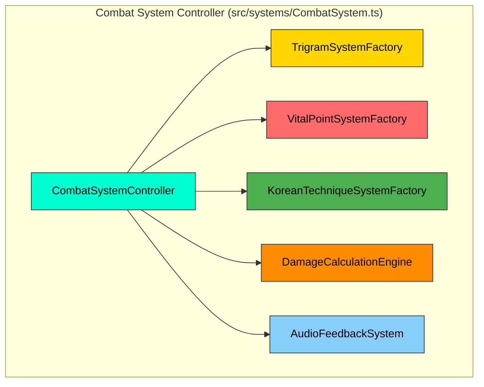

# Black Trigram (흑괘) – Combat System Architecture

> **Note:** This document focuses exclusively on the **Combat System**—its core components, data flows, and integrations—leveraging the existing project structure (all frontend, no backend). Color-coded mermaid diagrams illustrate subsystems and their interactions.

---

## 🥋 Overview

The **Black Trigram Combat System** implements an authentic Korean martial arts engine within a 2D precision combat simulator. All code runs in-browser (React + PixiJS + TypeScript), using Zustand (or React Context) for in-memory state. Assets (audio, sprites, JSON) load from CDNs; there is no persistence layer.

**Key Combat Concerns**:

* **Trigram Philosophy Integration** (팔괘): Eight stances influence technique choice and damage/accuracy modifiers.
* **Vital Point Targeting** (급소): 70 anatomical targets (head, torso, limbs) with precision-based multipliers.
* **Korean Techniques** (기법): Strikes, blocks, counters, and (future) grappling, validated by stance and player skill.
* **Real-Time Flow**: 60 FPS target, low-latency input → hit detection → damage calculation → audio/visual feedback.
* **Audio-Visual Feedback**: 국악 (traditional Korean instruments) blended with cyberpunk aesthetics for immersive combat cues.

Below, we define the Combat System’s architecture in detail.

---

## 🔧 Core Combat Components



* **CombatSystemController** (`src/systems/CombatSystem.ts`):

  * Acts as the central orchestrator for every combat frame.
  * Exposes methods:

    * `executeKoreanTechnique(attacker, techniqueName, target)`: Initiates a technique, routes through validators, hit detection, damage, and feedback.
    * `calculateTrigramAdvantage(attackerStance, defenderStance)`: Returns a multiplier based on I Ching relationships.
    * `processHit(targetState, baseDamage, hitPosition, technique)`: Determines vital point hit, applies multipliers/effects.
    * `canExecuteTechnique(playerState, techniqueName)`: Checks stance compatibility, cooldowns, Ki/Stamina availability.
    * `update(deltaTime, playerInputs)`: Advances combat state each tick (60 FPS budgeting).

* **TrigramSystemFactory** (`src/systems/trigram/TrigramSystem.ts`):

  * Provides access to:

    * `changeStance(player, newStance)`: Validates Ki/Stamina costs (`calculateResourceCost`), updates player state.
    * `getAvailableTechniques(stance)`: Returns technique list from `src/systems/trigram/KoreanTechniques.ts` and `src/types/constants/trigram.ts`.
    * `getStanceInteractionModifiers(attackerStance, defenderStance)`: Returns `{damageFactor, accuracyFactor, defenseFactor}`.
    * `calculateResourceCost(action, fromStance, toStanceOrTechnique)`: Returns `{kiCost, staminaCost}`.

* **VitalPointSystemFactory** (`src/systems/vitalpoint/VitalPointSystem.ts`):

  * Houses:

    * `vitalPoints` database (`KoreanVitalPoints.ts` and `KoreanAnatomy.ts`)—70 points categorized into head (18), neck (6), torso (32), limbs (14 arms + 20 legs).
    * `checkVitalPointHit(targetRegion, hitCoordinates, targetDimensions)`: Identifies specific vital point, returns `VitalPointHitResult` with `multiplier` (e.g., ×2.5 for critical).
    * `applyVitalPointEffects(targetState, vitalPoint, technique)`: Applies medical/traditional effects (e.g., stun from 인중 (Injung) strike).
    * `getVitalPointTargetingDifficulty(vitalPointId, attackerSkill)`: Uses `player.skill` to compute difficulty modifier.

* **KoreanTechniqueSystemFactory** (`src/systems/trigram/KoreanTechniques.ts` & `src/systems/trigram/KoreanCulture.ts`):

  * Contains:

    * **Technique Database**:

      * **Striking Techniques** (`types/constants/trigram.ts` → e.g. `정권지르기`, `천둥벽력`).
      * **Blocking/Counter Techniques** (partial implementation under `src/systems/trigram`).
      * **Grappling Techniques**: Planned for future phases.
    * **Execution Manager**: Validates resources (Ki/Stamina), technique cooldown, stance compatibility.
    * **Validation Manager**:

      * `validateTechniqueAuthenticity(techniqueName, stance, playerSkill)`: Returns cultural authenticity and validates if technique is available to that stance.

* **DamageCalculationEngine** (`src/systems/vitalpoint/DamageCalculator.ts`):

  * Combines:

    * **Base Damage** from technique data.
    * **Trigram Modifiers**: `damageFactor` from element relationships (e.g., Li ☲ > Son ☴).
    * **Vital Point Multipliers**: 2.5× for critical, 1.8× for secondary, 1.2× for standard.
    * **Player Stats**: Strength, skill, equipment modifiers (if any).

* **AudioFeedbackSystem** (`src/audio/AudioManager.ts`, `AudioAssetRegistry.ts`, `DefaultSoundGenerator.ts`, `VariantSelector.ts`):

  * Plays:

    * **Stance Change SFX**: Unique 국악 (Gayageum, Janggu) cue per stance.
    * **Technique Execution SFX**: Organize via `Technique → soundKey` mapping in `AudioAssetRegistry`.
    * **Impact SFX**: Depends on vital point’s category (e.g., bone crack, muscle thud).
    * **Miss/Whiff Sounds**: Subtle Korean percussive sounds.

---

## 🎯 Combat Calculation Pipeline

```mermaid
sequenceDiagram
    title Combat Calculation Pipeline – Korean Martial Arts Focus

    participant Player
    participant InputHandler
    participant CombatCtrl as CombatSystemController
    participant TrigramSys as TrigramSystemFactory
    participant TechniqueVal as KoreanTechniqueSystemFactory
    participant VitalSys as VitalPointSystemFactory
    participant DamageCalc as DamageCalculationEngine
    participant AudioEng as AudioFeedbackSystem
    participant VFX as VisualEffectsLayer

    Note over Player,VFX: 한글 패러다임 통합 (Korean Martial Arts Sequence)

    Player->>InputHandler: Press Stance Key (1–8)
    InputHandler->>CombatCtrl: requestChangeStance(playerId, newStance)
    CombatCtrl->>TrigramSys: changeStance(playerState, newStance)
    TrigramSys->>CombatCtrl: {success, updatedPlayerState}
    alt success
        CombatCtrl->>AudioEng: playStanceSFX(newStance)
        CombatCtrl->>VFX: emitStanceAura(newStance)
    else failure
        CombatCtrl->>AudioEng: playInvalidActionSFX()
    end

    Player->>InputHandler: Execute Technique (Click/Touch + TechniqueHotkey)
    InputHandler->>CombatCtrl: requestExecuteTechnique(playerId, techniqueName, targetCoords)
    CombatCtrl->>TechniqueVal: canExecuteTechnique(playerState, techniqueName)
    TechniqueVal-->>CombatCtrl: boolean ok
    alt ok
        CombatCtrl->>VitalSys: checkVitalPointHit(targetRegion, hitCoords, targetDimensions)
        VitalSys-->>CombatCtrl: {hit: true/false, vitalPointData}
        alt hit
            CombatCtrl->>DamageCalc: calculateDamage(
                baseDamage,
                TrigramSys.getStanceInteractionModifiers(attackerStance, defenderStance).damageFactor,
                vitalPointData.multiplier
            )
            DamageCalc-->>CombatCtrl: finalDamage
            CombatCtrl->>AudioEng: playImpactSFX(vitalPointData.category)
            CombatCtrl->>VFX: emitHitParticles(hitCoords, vitalPointData.category)
            CombatCtrl->>CombatCtrl: applyDamageToTarget(defenderId, finalDamage, vitalPointData.effect)
        else miss
            CombatCtrl->>AudioEng: playMissSFX()
            CombatCtrl->>VFX: emitMissIndicator(hitCoords)
        end
    else
        CombatCtrl->>AudioEng: playInvalidActionSFX()
    end

    Note over AudioEng: 국악기와 사이버펑크 융합 사운드  
    Note over VFX: 에너지 입자, 팔괘 문양, 혈흔 스플래시  
```

* **InputHandler** (`src/components/combat/CombatControls.tsx` + `useGameState`) captures keyboard, mouse, touch, and maps them to combat requests.
* **CombatCtrl** coordinates subsystem calls: stance changes, technique validation, vital-point detection, damage calculation, and invokes feedback layers.
* **TechniqueVal** validates technique name, stance compatibility, cooldowns, and resource availability.
* **VitalSys** performs collision checks (bounding box + distance) using `HitDetection.ts`, then identifies precise vital point via coordinate mapping (`KoreanVitalPoints.ts`).
* **DamageCalc** applies layering:

  1. Base Damage (from technique data).
  2. Trigram Damage Factor (elemental/philosophical).
  3. Vital Point Multiplier.
  4. Additional modifiers (player stats, status effects).
* **AudioEng** uses Web Audio API to mix 국악 samples (e.g., Gayageum pluck for stance, Janggu beat for hits).
* **VFX** (PixiJS layer in `src/components/game/HitEffectsLayer.tsx`) displays energy auras, critical-hit glyphs, and dynamic particles.

---

## 🔥 Subsystem Details

### 1. **TrigramSystemFactory** (`src/systems/trigram/TrigramSystem.ts`)

```typescript
interface TrigramSystemEngine {
  // Full trigram definitions (I Ching 팔괘)
  readonly trigramData: Record<TrigramStance, {
    symbol: string;        // e.g., "☰"
    element: string;       // e.g., "Heaven"
    philosophy: string;    // e.g., "CreativeForce"
    techniques: string[];  // List of technique keys
  }>;

  // Change player stance: deduct Ki/Stamina, update state
  changeStance(
    player: PlayerState,
    newStance: TrigramStance
  ): { success: boolean; updatedPlayerState: PlayerState };

  // Get available techniques for a given stance
  getAvailableTechniques(stance: TrigramStance): KoreanTechnique[];

  // Calculate interaction modifiers based on attacker/defender stances
  getStanceInteractionModifiers(
    attackerStance: TrigramStance,
    defenderStance: TrigramStance
  ): { damageFactor: number; accuracyFactor: number; defenseFactor: number };

  // Calculate Ki/Stamina costs for stance changes or techniques
  calculateResourceCost(
    action: "stanceChange" | "technique",
    fromStance: TrigramStance,
    toStanceOrTechnique: TrigramStance | KoreanTechnique
  ): { kiCost: number; staminaCost: number };
}
```

* **`trigramData`** references `src/types/constants/trigram.ts` (contains I Ching trigram definitions and metadata).
* **Ki Flow**: When changing stances, `calculateResourceCost("stanceChange", oldStance, newStance)` returns `{kiCost, staminaCost}`; `changeStance` deducts them.
* **Technique Lookup**: `getAvailableTechniques("건")` returns an array of `KoreanTechnique` objects (loaded from `src/systems/trigram/KoreanTechniques.ts`).
* **Elemental/Philosophical Advantage**:

  * Example: Li (Fire ☲) vs. Son (Wind ☴) → `damageFactor = 1.2`, `accuracyFactor = 1.1`.
  * Values defined in `src/systems/trigram/TransitionCalculator.ts`.

---

### 2. **VitalPointSystemFactory** (`src/systems/vitalpoint/VitalPointSystem.ts`)

```typescript
interface VitalPointEngine {
  // Master list of 70 Korean vital points across body regions
  readonly vitalPoints: VitalPoint[]; 
  // E.g. { id: "injung", koreanName: "인중", region: "head", x: 0, y: -10, category: "critical" }

  // Identify if a hit coordinate strikes a vital point on the target
  checkVitalPointHit(
    targetRegion: AnatomicalRegion,
    hitCoordinates: Point,
    targetDimensions: { width: number; height: number }
  ): VitalPointHitResult;
  // Returns { hit: boolean, vitalPoint?: VitalPoint, multiplier: number }

  // Apply traditional medical/physiological effects for the given vital point
  applyVitalPointEffects(
    target: PlayerState,
    vitalPoint: VitalPoint,
    technique: KoreanTechnique
  ): { 
    updatedTargetState: PlayerState; 
    appliedEffects: StatusEffect[]; 
  };

  // Compute difficulty mod for targeting a specific vital point
  getVitalPointTargetingDifficulty(
    vitalPointId: string,
    attackerSkill: number
  ): number; // Lower means easier; influences accuracy roll
}
```

* **`vitalPoints`** loaded from `src/systems/vitalpoint/KoreanVitalPoints.ts` and `src/systems/vitalpoint/KoreanAnatomy.ts`. Each point object includes:

  * `id`: unique string (e.g., `"injung"`).
  * `koreanName`: Hangul (e.g., `"인중"`).
  * `region`: `"head" | "neck" | "torso" | "arm" | "leg"`.
  * `x, y`: relative coordinates (–1.0 to +1.0 on target sprite).
  * `category`: `"critical" | "secondary" | "standard"`.

* **Hit Detection**:

  * Uses `HitDetection.ts` to determine if attack’s hitbox rectangle overlaps target’s sprite.
  * If overlapped, `checkVitalPointHit` maps `hitCoordinates` to normalized target space and finds the closest `vitalPoint`.
  * Returns `{ hit: true, vitalPoint, multiplier }`, where multiplier = 2.5 for critical, 1.8 for secondary, 1.2 for standard.

* **Effects Application**:

  * `applyVitalPointEffects` may apply:

    * **Stun**: e.g., 인중 (Injung) yields a short stun.
    * **Bleed/Bruise**: e.g., chest shot yields ongoing damage.
    * **Knockback/Knockdown**: based on point and technique force.
  * Effects are defined in `src/systems/vitalpoint/DamageCalculator.ts` or related effect modules.

* **Difficulty Modifier**:

  * Based on `vitalPointId` and `attackerSkill` (0–100).
  * Example: targeting `"solar_plexus"` = difficulty 1.3 – (skill × 0.005).
  * Combined with `distance` and technique base accuracy to compute final hit chance.

---

### 3. **KoreanTechniqueSystemFactory** (`src/systems/trigram/KoreanTechniques.ts`)

```typescript
interface KoreanTechniqueSystem {
  // Returns true if the technique exists and is permitted in the current stance
  canExecuteTechnique(
    techniqueName: string,
    stance: TrigramStance,
    playerSkill: number
  ): boolean;

  // Retrieves base damage, Ki/Stamina cost, animation key, and cultural notes
  getTechniqueData(techniqueName: string): KoreanTechnique;

  // Apply technique-specific cooldown and resource deductions
  consumeTechniqueResources(
    playerState: PlayerState,
    technique: KoreanTechnique
  ): PlayerState;

  // Validate cultural authenticity (e.g., correct Hangul, proper name)
  validateTechniqueAuthenticity(
    techniqueName: string
  ): { valid: boolean; error?: string };
}
```

* **Technique Database**:

  * Defined in `src/types/constants/trigram.ts` as `TRIGRAM_DATA[stance].techniques`.
  * Each `KoreanTechnique` includes:

    * `name`: Hangul string (e.g., `"천둥벽력"`).
    * `baseDamage`: numeric.
    * `kiCost`: numeric.
    * `staminaCost`: numeric.
    * `animationKey`: string referring to PixiJS spritesheet frame.
    * `soundKey`: string used by `AudioAssetRegistry` (e.g., `"thunder_strike"`).
    * `cooldown`: milliseconds.
    * `culturalNotes`: optional string describing technique origin.

* **Execution Manager**:

  1. `canExecuteTechnique("천둥벽력", "건", 85)`: Checks that `"천둥벽력"` is in `TRIGRAM_DATA["건"].techniques`, player has ≥85 skill (if required), and resources available.
  2. If true, `consumeTechniqueResources` subtracts `kiCost`/`staminaCost` from `playerState`, triggers cooldown.
  3. Returns updated `PlayerState`.

* **Validation Manager**:

  * `validateTechniqueAuthenticity("정권지르기")`: Ensures Hangul spelling matches a known technique; returns `{ valid: true }` or `{ valid: false, error: "Incorrect Hangul spelling" }`.

---

### 4. **DamageCalculationEngine** (`src/systems/vitalpoint/DamageCalculator.ts`)

```typescript
interface DamageCalculationEngine {
  // Computes final damage considering base, trigram, and vital point
  calculateDamage(
    baseDamage: number,
    trigramMultiplier: number,
    vitalPointMultiplier: number,
    attackerStats: { strength: number; skill: number },
    defenderStats: { defense: number; armor: number }
  ): { finalDamage: number; statusEffects: StatusEffect[] };

  // Determine status effects to apply (e.g., stun, knockback)
  calculateStatusEffects(
    vitalPoint: VitalPoint,
    technique: KoreanTechnique,
    attackerStats: { strength: number }
  ): StatusEffect[];
}
```

* **Damage Formula**:

  ```
  rawDamage = baseDamage × trigramMultiplier × vitalPointMultiplier × (1 + attackerStrength × 0.01)
  mitigatedDamage = rawDamage – (defenderDefense × 0.5) – defenderArmor
  finalDamage = max(1, mitigatedDamage)
  ```
* **Status Effects**:

  * Example: If `vitalPoint.category === "critical"` and `technique.name === "인중찌르기"`, then `stunDuration = 500ms`.
  * Effects defined in `src/types/effects.ts`.

---

## 🎼 Audio-Visual Integration

```mermaid
graph LR
    subgraph "Korean Audio System (src/audio/*)"
        AS[AudioSystem Root]:::audio
        AS --> TM[Traditional Music Player]:::audio
        AS --> KS[Korean SFX Engine]:::audio
        AS --> AMB[Ambient & UI Sounds]:::audio

        TM --> GT[Gayageum Tones]:::audio
        TM --> JG[Janggu Rhythms]:::audio
        TM --> HG[Haegeum Melodies]:::audio
        TM --> DG[Daegeum Flute Melodies]:::audio

        KS --> CombatSfx[Combat Sounds (격투 효과음)]:::audio
        KS --> MovementSfx[Movement Sounds (동작 효과음)]:::audio
        KS --> ImpactSfx[Impact Sounds (타격 효과음)]:::audio
        KS --> StanceSfx[Stance Change Sounds]:::audio
    end

    subgraph "Visual Effects System (src/components/game/HitEffectsLayer.tsx)"
        VFX[VisualEffects Root]:::vfx
        VFX --> KE[Ki Energy Effects]:::vfx
        VFX --> HI[Hit Indicators]:::vfx
        VFX --> SE[Stance Auras]:::vfx
        VFX --> EnvFX[Background/Environmental Effects]:::vfx

        KE --> EP[Energy Particles (기 입자)]:::vfx
        KE --> AF[Aura Field (오라 필드)]:::vfx
        KE --> TG[Trigram Glyphs (팔괘 문양)]:::vfx

        HI --> VPMarkers[Vital Point Markers (급소 표시)]:::vfx
        HI --> DmgNumbers[Damage Numbers (피해량 숫자 – 한글/한자)]:::vfx
        HI --> CritEff[Critical Hit Effects (치명타 효과)]:::vfx
    end

    subgraph "Korean UI Elements (src/components/ui/base)"
        UI[UI Root]:::ui
        UI --> HH[Hangul Headers & Text]:::ui
        UI --> TS[Trigram Symbols Display]:::ui
        UI --> Bars[Health/Ki/Stamina Bars]:::ui
        UI --> Menus[Menus & Prompts]:::ui

        HH --> KFont[Korean Typography (Noto Sans KR)]:::ui
        HH --> CTerms[Cultural Terms & Descriptions]:::ui

        TS --> TW[Trigram Wheel (팔괘휠)]:::ui
        TS --> SI[Stance Indicator (자세 표시기)]:::ui
    end

    AS --> CombatFeedback
    VFX --> CombatFeedback
    UI --> CombatFeedback

    classDef audio fill:#4caf50,stroke:#333,color:#000
    classDef vfx fill:#ff9800,stroke:#333,color:#000
    classDef ui fill:#9c27b0,stroke:#333,color:#000
```

* **AudioSystem**:

  * All audio logic lives in `src/audio/` (AudioAssetRegistry, AudioManager, AudioUtils, VariantSelector).
  * **Traditional Music Player** streams background 국악 tracks (Gayageum, Janggu, Haegeum, Daegeum) based on game phase (combat, training, menus).
  * **Korean SFX Engine**: Plays per-action effects—stances, techniques, impacts, misses—using low-latency Web Audio API.
  * **Ambient & UI Sounds**: Menu clicks, UI prompts, victory/defeat jingles.

* **VisualEffects**:

  * Defined in `HitEffectsLayer.tsx` and `PlayerVisuals.tsx` / `EnemyVisuals.tsx`.
  * **Ki Energy Effects**: Dynamic particle emitters (`ParticleContainer`) producing swirling ki orbs and aura glows around characters.
  * **Hit Indicators**: Vital point markers—flash of Hangul char for that point, damage number pop-ups in Korean numerals/hanja.
  * **Stance Auras**: Semi-transparent circular overlays indicating current stance’s trigram glyph and color.
  * **Environmental Effects**: Dojang background flicker, neon signs, dynamic lighting (all rendered via PixiJS).

* **UI Elements**:

  * **Hangul Headers & Text**: `KoreanText.tsx` ensures proper font selection (Noto Sans KR) and kerning for Hangul.
  * **Trigram Symbols**: `TrigramWheel.tsx` (circular selector) and `StanceIndicator.tsx` (glyph + color-coded border).
  * **Bars**: Health, Ki, and Stamina bars rendered in `CombatHUD.tsx` with color constants from `src/types/constants/colors.ts`.
  * **Menus & Prompts**: Intro screen, victory/defeat popups, training instructions—all localized in Korean/English.

---

## 🔄 Combat State Flow (State Machine)

```mermaid
stateDiagram-v2
    [*] --> Idle : Initialize Combat Frame

    state Idle {
        [*] --> Ready : Await Player Input
        Ready --> StanceChange : Press Stance Key (1–8)
        Ready --> TechniqueAttempt : Input Attack (Click/Touch)
    }

    state StanceChange {
        [*] --> ValidatingStance : Check Ki/Stamina & Cooldown
        ValidatingStance --> TransitioningStance : Valid
        ValidatingStance --> Idle : Invalid (Insufficient Resources)
        TransitioningStance --> Idle : Stance Transition Complete
    }

    state TechniqueAttempt {
        [*] --> ValidatingTechnique : Check Stance, Resources, Cooldown
        ValidatingTechnique --> ExecutingTechnique : Valid Technique
        ValidatingTechnique --> Idle : Invalid Technique
    }

    state ExecutingTechnique {
        [*] --> HitDetectionPhase : Perform Collision & Distance Checks
        HitDetectionPhase --> DamageCalculationPhase : Hit Detected
        HitDetectionPhase --> RecoveryPhase : Miss

        DamageCalculationPhase --> ApplyEffectsPhase : Compute Damage & Effects
        ApplyEffectsPhase --> RecoveryPhase : Effects Applied
    }

    state RecoveryPhase {
        [*] --> CooldownActive : Start Recovery Timer
        CooldownActive --> Idle : Recovery/Cooldown Over
    }

    Idle --> CombatEnd : Opponent Health ≤ 0 or Time-Up
    CombatEnd --> [*] : Display Results (Victory/Defeat)
```

* **Idle → Ready**: Default waiting state; player can change stance or attempt a technique.
* **StanceChange**:

  1. **ValidatingStance**: Checks `player.ki ≥ cost.ki` and `player.stamina ≥ cost.stamina`.
  2. If **Valid**, **TransitioningStance** deducts resources, updates `player.stance`, triggers audio/visual feedback, and returns to **Idle**.
  3. If **Invalid**, play “invalid action” SFX and back to **Idle**.
* **TechniqueAttempt**:

  1. **ValidatingTechnique**: Verifies `technique` is in `currentStance.techniques`, `player.ki/stamina ≥ techniqueCost`, and no active cooldown.
  2. If **Valid**, transition to **ExecutingTechnique**; else play “invalid” SFX and return to **Idle**.
* **ExecutingTechnique**:

  1. **HitDetectionPhase**: Use `VitalPointSystem.checkVitalPointHit(...)` to determine hit or miss.
  2. If **Hit**, go to **DamageCalculationPhase**, else to **RecoveryPhase** to allow next input only after miss recovery.
* **DamageCalculationPhase**:

  * Compute final damage via `DamageCalculationEngine.calculateDamage(...)`.
  * Apply status effects (`applyVitalPointEffects`).
  * Trigger audio (`playImpactSFX`) and VFX (`emitHitParticles`).
  * Update target’s health in Zustand store (`useEnemyState`).
  * Then go to **RecoveryPhase**.
* **RecoveryPhase**:

  * Player is unable to act until recovery timer ends—ensures realistic pacing.
  * After recovery, return to **Idle**.

---

## ⚡ Performance & Memory Strategy

### Real-Time Combat Targets

```typescript
interface PerformanceTargets {
  // Rendering
  readonly targetFPS: 60;
  readonly maxFrameBudgetMs: 16.67;

  // Input → Logic
  readonly maxInputLatencyMs: 8;

  // Hit Detection
  readonly hitDetectionTimeBudgetMs: 2;

  // Audio Sync
  readonly audioVisualSyncMaxOffsetMs: 30;

  // Resource Pools
  readonly maxActiveParticles: 150;
  readonly maxConcurrentAudioSFX: 12;
  readonly textureAtlasMaxSize: "4096x4096";

  // Memory Budget
  readonly maxCombatMemoryMb: 150; // Textures, audio, particle buffers
}
```

* **60 FPS Goal**: Each frame must complete all logic + rendering within \~16 ms.
* **Input Latency**: Key/touch → state update should occur within 8 ms.
* **Hit Detection**: Use spatial partitioning or simple bounding-box checks to ensure <2 ms per check.
* **Audio/Visual Sync**: Audio cues for stances/impacts must align with VFX within 30 ms.

---

```mermaid
graph TB
    subgraph "Asset & Object Pooling"
        AP[AssetManager (src/utils/assetManager.ts)]:::pool
        AP --> TP[Texture Pool (PixiJS Cache)]:::pool
        AP --> SP[Sound Pool (Howler.js/Web Audio API)]:::pool
        AP --> PP[Particle Pool (PixiJS ParticleContainer)]:::pool
        AP --> ObjP[Object Pool (projectiles, hit markers)]:::pool
    end

    subgraph "Combat Data Caching"
        CC[CombatCache (in-memory)]:::cache
        CC --> TechCache[Technique Data (JSON / TRIGRAM_DATA)]:::cache
        CC --> StanceCache[Current Stance / Trigram Data]:::cache
        CC --> VPCache[Vital Point Data (Coordinates, Multipliers)]:::cache
        CC --> AudioMetaCache[Sound Meta (duration, volume)]:::cache
    end

    subgraph "GC & Render Optimization"
        GCO[GC Optimizations]:::gc
        GCO --> OPool[Object Pooling (Minimize Allocations)]:::gc
        GCO --> RS[Immutable Data Structures (Avoid Re-renders)]:::gc
        GCO --> LC[Component Lifecycle (Proper PixiJS cleanup)]:::gc
        GCO --> Debounce[Debounced State Updates (Zustand selectors)]:::gc
    end

    AP --> GamePerf[Overall Combat Performance]
    CC --> GamePerf
    GCO --> GamePerf

    classDef pool fill:#87CEFA,stroke:#333,color:#000
    classDef cache fill:#98FB98,stroke:#333,color:#000
    classDef gc fill:#FFDAB9,stroke:#333,color:#000
```

* **AssetManager**:

  * Centralizes texture/audio loading (via `useTexture.ts`, `AudioLoader.ts`).
  * Maintains PixiJS’s `TextureCache` and Howler/Web Audio pools to avoid re-decoding.

* **Particle Pooling**:

  * Use `PIXI.ParticleContainer` with a fixed pool of particle sprites (e.g., 150).
  * Recycle hit sparks, aura particles, and ki orbs to prevent GC spikes.

* **CombatCache**:

  * Store frequently accessed data (technique definitions, vital point coordinates) in memory to avoid repeated JSON parsing.
  * Use simple objects keyed by `techniqueName` or `vitalPointId`.

* **GC Optimizations**:

  * Reuse small objects (e.g., `Point` instances) rather than creating new each frame.
  * Utilize `React.memo` on UI components (`CombatHUD`, `TrigramWheel`) to prevent unnecessary re-renders.
  * In PixiJS, call `destroy()` on sprites no longer needed and reuse `PIXI.Sprite` instances where possible.
  * Debounce state changes from rapid inputs (e.g., repeated stance switching) to avoid floods of Zustand updates.

---

## 📊 Korean Martial Arts Metrics (Gameplay Analytics)

```typescript
interface CombatMetrics {
  // Offensive Metrics
  readonly techniqueExecutionAccuracy: number;  // % of attempts that hit
  readonly vitalPointStrikeRate: number;        // % of hits landing on defined vital points
  readonly averageDamagePerHit: number;
  readonly damagePerSecond: number;

  // Defensive Metrics
  readonly DefenseBlockRate: number;            // % of incoming attacks blocked
  readonly EvasionRate: number;                  // % of attacks avoided

  // Trigram/Philosophy Metrics
  readonly stanceTransitionEfficiency: number;   // Ratio of successful transitions to attempts
  readonly kiManagementEfficiency: number;       // KiUsed / KiDamageOutput ratio
  readonly culturalAdherenceScore: number;       // Weighted by using correct techniques per stance

  // Performance & Flow
  readonly averageFrameTimeMs: number;
  readonly maxInputLagMs: number;                // Observed during runs
  readonly particleLoadTimeMs: number;            // Time to spawn hit/ki particles

  // Engagement Metrics (for future analytics)
  readonly timeInCombatSec: number;
  readonly combosPerMatch: number;                // Number of chained hits
  readonly criticalHitFrequency: number;          // % of hits that are critical (vital point category)
}
```

* These metrics can be gathered by hooking into CombatSystemController and Zustand stores.
* They inform balancing (e.g., adjust multipliers, Ki costs) and gauge player skill progression.

---

## 🧪 Testing Strategy (Combat-Focused)

### 1. Unit Tests

```typescript
describe("TrigramSystemEngine", () => {
  it("calculates correct elemental advantage (Li ☲ > Son ☴)", () => {
    const mods = TrigramSystem.getStanceInteractionModifiers("li", "son");
    expect(mods.damageFactor).toBeGreaterThan(1.0);
    expect(mods.accuracyFactor).toBeGreaterThan(1.0);
  });

  it("deducts Ki and Stamina properly on stance change", () => {
    const player = createPlayerState({ ki: 50, stamina: 40, stance: "geon" });
    const { success, updatedPlayerState } = TrigramSystem.changeStance(player, "tae");
    const cost = TrigramSystem.calculateResourceCost("stanceChange", "geon", "tae");
    if (success) {
      expect(updatedPlayerState.ki).toEqual(50 - cost.kiCost);
      expect(updatedPlayerState.stamina).toEqual(40 - cost.staminaCost);
    } else {
      expect(updatedPlayerState).toEqual(player);
    }
  });
});

describe("VitalPointEngine", () => {
  it("detects a hit on '인중' vital point when coordinates align", () => {
    const targetDims = { width: 64, height: 128 };
    const headHit = { x: 32, y: 12 }; // relative position for 인중
    const result = VitalPointSystem.checkVitalPointHit("head", headHit, targetDims);
    expect(result.hit).toBe(true);
    expect(result.vitalPoint?.koreanName).toBe("인중");
    expect(result.multiplier).toEqual(2.5);
  });

  it("applies stun effect for 인중 hit", () => {
    const playerState = createPlayerState({ health: 100 });
    const technique = getTechniqueData("finger_strike");
    const { updatedTargetState, appliedEffects } = VitalPointSystem.applyVitalPointEffects(
      playerState,
      { id: "injung", category: "critical" } as VitalPoint,
      technique
    );
    expect(appliedEffects).toContainEqual(expect.objectContaining({ type: "stun", duration: expect.any(Number) }));
    expect(updatedTargetState.health).toBeLessThan(100);
  });
});

describe("KoreanTechniqueSystem", () => {
  it("validates technique authenticity by Hangul name", () => {
    const { valid, error } = KoreanTechniqueSystem.validateTechniqueAuthenticity("천둥벽력");
    expect(valid).toBe(true);
    expect(error).toBeUndefined();
  });

  it("prevents execution of absent technique in current stance", () => {
    const playerState = createPlayerState({ stance: "geon" });
    const canExec = KoreanTechniqueSystem.canExecuteTechnique("예외기법", "geon", playerState.skill);
    expect(canExec).toBe(false);
  });

  it("computes correct damage for '화염지창'", () => {
    const technique = KoreanTechniqueSystem.getTechniqueData("화염지창");
    const dmg = DamageCalculationEngine.calculateDamage(
      technique.baseDamage,
      1.1,   // trigram multiplier
      1.8,   // vital point multiplier
      { strength: 20, skill: 80 },
      { defense: 5, armor: 2 }
    );
    expect(dmg.finalDamage).toBeGreaterThan(0);
  });
});
```

### 2. Integration Tests

```typescript
describe("CombatSystemController Integration", () => {
  it("executes full combat sequence: stance → technique → hit → damage → feedback", () => {
    // Setup: create two PlayerStates (attacker, defender) with known positions.
    // Step 1: Attacker changes to 'li' stance
    const changeResult = CombatSystemController.changeStance(attacker, "li");
    expect(changeResult.success).toBe(true);
    // Step 2: Execute '천둥벽력' at defender
    const attackResult = CombatSystemController.executeKoreanTechnique(
      changeResult.updatedPlayerState,
      "천둥벽력",
      defenderState
    );
    // Verify: defender's health decreased, effects applied
    expect(attackResult.finalDamage).toBeGreaterThan(0);
    expect(defenderState.health).toBeLessThan(initialDefenderHealth);
    // Verify: AudioFeedbackSystem and VisualEffects invoked (using mocks)
    expect(AudioFeedbackSystem.playImpactSFX).toHaveBeenCalled();
    // Recovery state kicks in
    expect(attacker.state).toBe("recovery");
  });

  it("maintains ~60FPS in an intense combat simulation (mocked loop)", async () => {
    // Simulate 1000 frames of alternating stance changes and attacks
    const frameTimes: number[] = await CombatPerformanceTester.simulateFrames(1000);
    const avgFPS = 1000 / (frameTimes.reduce((a, b) => a + b) / frameTimes.length / 1000);
    expect(avgFPS).toBeGreaterThanOrEqual(58);
  });

  it("syncs audio with hit VFX within 30ms", async () => {
    // Mock the time stamps of audio play and VFX render for a critical hit
    const { audioTime, vfxTime } = await CombatSyncTester.testAudioVisualSync("critical_hit_test");
    const offset = Math.abs(audioTime - vfxTime);
    expect(offset).toBeLessThanOrEqual(30);
  });
});
```

---

## 🏗️ File Structure References (Combat-Focused)

```
src/
├── audio/
│   ├── AudioAssetRegistry.ts
│   ├── AudioManager.ts
│   ├── AudioUtils.ts
│   ├── DefaultSoundGenerator.ts
│   └── VariantSelector.ts
├── components/
│   ├── combat/
│   │   ├── CombatScreen.tsx
│   │   ├── CombatArena.tsx
│   │   ├── CombatControls.tsx
│   │   ├── CombatHUD.tsx
│   │   ├── HitEffectsLayer.tsx
│   │   └── index.ts
│   └── ui/
│       └── base/
│           ├── BackgroundGrid.tsx
│           ├── BaseButton.tsx
│           ├── KoreanText.tsx
│           ├── KoreanHeader.tsx
│           └── PixiComponents.tsx
├── hooks/
│   ├── useTexture.ts
│   ├── useGameState.ts
│   ├── useUIState.ts
│   └── useEnemyState.ts
├── systems/
│   ├── CombatSystem.ts
│   ├── TrigramSystem.ts
│   ├── TransitionCalculator.ts
│   ├── TrigramCalculator.ts
│   └── vitalpoint/
│       ├── VitalPointSystem.ts
│       ├── HitDetection.ts
│       ├── DamageCalculator.ts
│       ├── KoreanVitalPoints.ts
│       └── KoreanAnatomy.ts
├── types/
│   ├── constants/
│   │   ├── trigram.ts
│   │   └── vital-points.ts
│   ├── anatomy.ts
│   ├── combat.ts
│   ├── game.ts
│   ├── enums.ts
│   └── effects.ts
└── utils/
    ├── playerUtils.ts
    └── colorUtils.ts
```

---

## 🎨 Color Legend

* **Combat System Controller**:  `#00ffd0`
* **Trigram System**:  `#ffd700`
* **Vital Point System**:  `#ff6b6b`
* **Korean Techniques**:  `#4caf50`
* **Damage Calculation**:  `#ff8c00`
* **Audio Feedback**:  `#87CEFA`
* **Particle & Visual Effects**:  `#ff9800`
* **UI (Korean Text & HUD)**:  `#9c27b0`
* **Asset & Object Pooling**:

  * **Asset Manager** pools:  `#87CEFA`
  * **Combat Cache**:  `#98FB98`
  * **GC & Optimization**:  `#FFDAB9`

---
