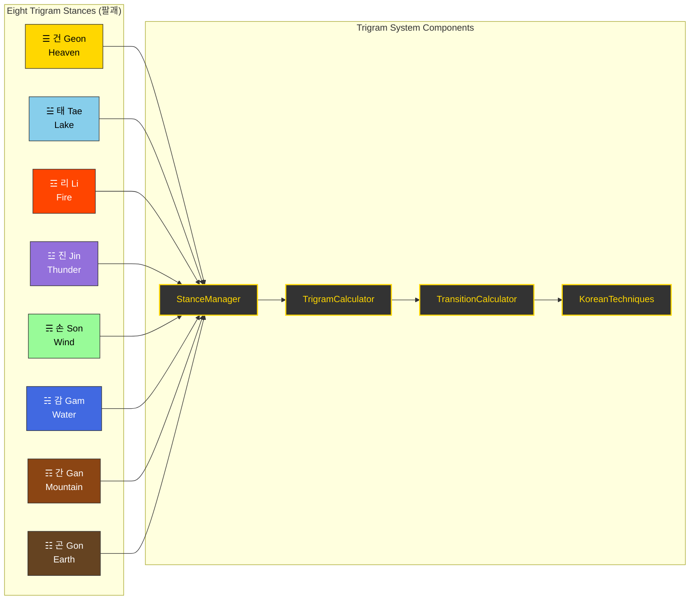
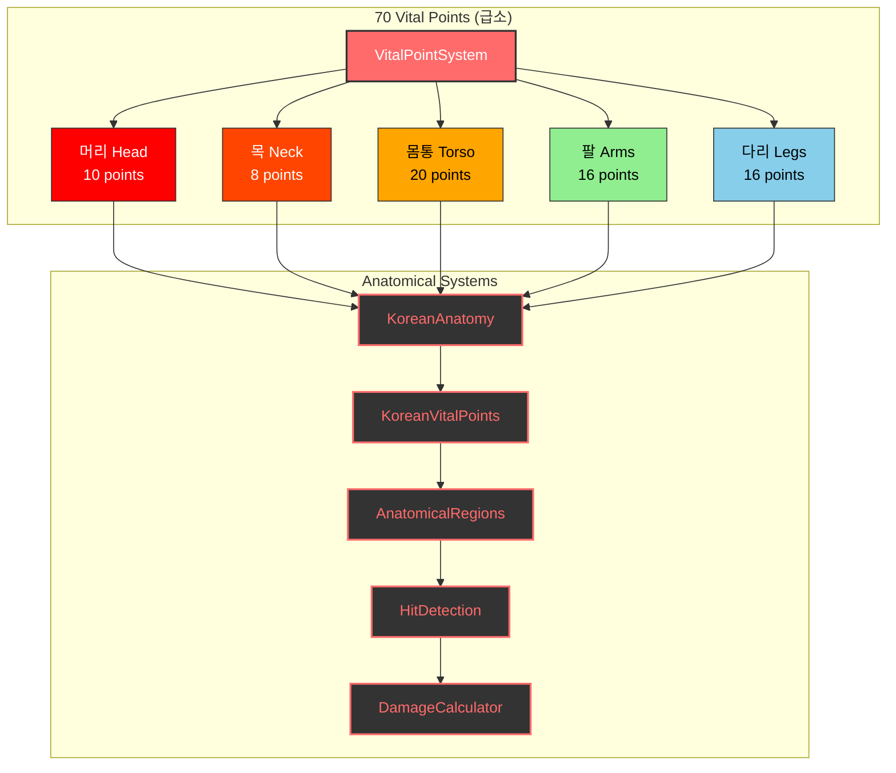
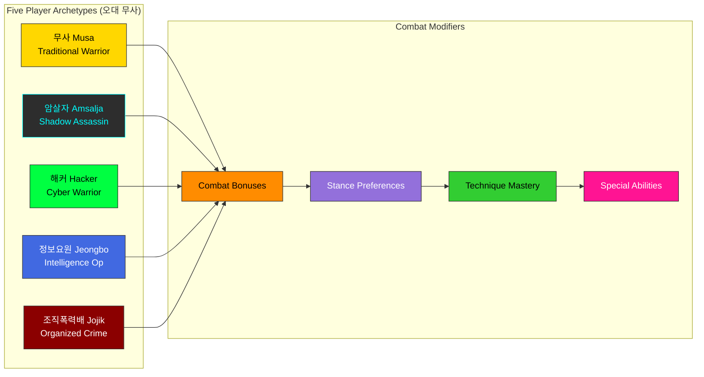
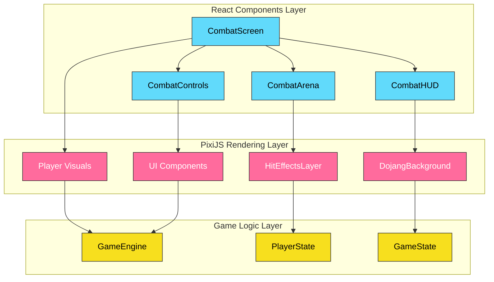
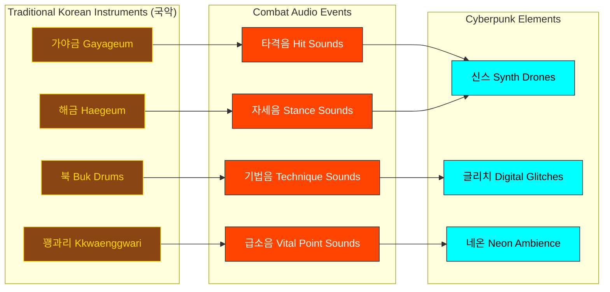
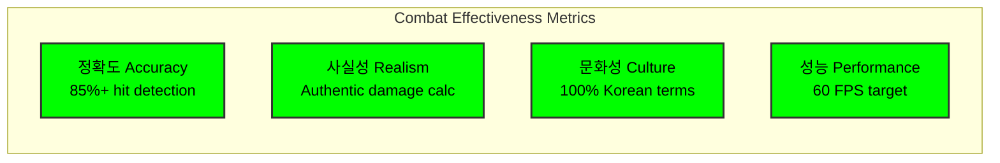

# Black Trigram (흑괘) – Combat System Architecture

**2D Realistic Precision Combat Simulator** rooted in Korean martial arts and I Ching philosophy.

- **Audio-Visual Feedback**: 국악 (traditional Korean instruments) blended with cyberpunk aesthetics for immersive combat cues.
- **Anatomical Targeting**: 70 vital points with realistic damage calculation
- **Cultural Authenticity**: Traditional Korean martial arts with modern implementation

Below, we define the Combat System's architecture in detail.

---

## 🔧 Core Combat System Architecture

```mermaid
graph TB
    subgraph "Combat System Controller (src/systems/CombatSystem.ts)"
        CSC[CombatSystemController]:::core
        CSC --> TCS[TrigramSystemFactory]:::trigram
        CSC --> VPS[VitalPointSystemFactory]:::vital
        CSC --> KTS[KoreanTechniqueSystemFactory]:::tech
        CSC --> DCS[DamageCalculationEngine]:::damage
        CSC --> AFS[AudioFeedbackSystem]:::audio
    end

    subgraph "Type System Foundation"
        TS[Type System]:::types
        TS --> CT[Combat Types]:::types
        TS --> PT[Player Types]:::types
        TS --> AT[Anatomy Types]:::types
        TS --> TT[Trigram Types]:::types
        TS --> AuT[Audio Types]:::types
    end

    subgraph "Trigram Combat Engine (src/systems/TrigramSystem.ts)"
        TCS --> SM[StanceManager]:::trigram
        TCS --> TC[TrigramCalculator]:::trigram
        TCS --> TR[TransitionCalculator]:::trigram
        TCS --> KC[KoreanCulture]:::trigram
        TCS --> KT[KoreanTechniques]:::trigram
    end

    subgraph "Vital Point System (src/systems/VitalPointSystem.ts)"
        VPS --> KA[KoreanAnatomy]:::vital
        VPS --> KVP[KoreanVitalPoints]:::vital
        VPS --> AR[AnatomicalRegions]:::vital
        VPS --> HD[HitDetection]:::vital
        VPS --> DC[DamageCalculator]:::vital
    end

    subgraph "Component Layer"
        CMP[Combat Components]:::components
        CMP --> CS[CombatScreen]:::components
        CMP --> CA[CombatArena]:::components
        CMP --> CH[CombatHUD]:::components
        CMP --> CC[CombatControls]:::components
    end

    classDef core fill:#00ffd0,stroke:#333,color:#000,stroke-width:3px
    classDef trigram fill:#ffd700,stroke:#333,color:#000,stroke-width:2px
    classDef vital fill:#ff6b6b,stroke:#333,color:#000,stroke-width:2px
    classDef tech fill:#4caf50,stroke:#333,color:#000,stroke-width:2px
    classDef damage fill:#ff8c00,stroke:#333,color:#000,stroke-width:2px
    classDef audio fill:#87CEFA,stroke:#333,color:#000,stroke-width:2px
    classDef types fill:#9370db,stroke:#333,color:#000,stroke-width:2px
    classDef components fill:#32cd32,stroke:#333,color:#000,stroke-width:2px

    CSC -.->|uses| TS
    CMP -.->|implements| CSC
```



---

## 🎯 Combat System Controller Architecture

- **CombatSystemController** (`src/systems/CombatSystem.ts`):
  - **Status**: Currently empty, needs full implementation
  - **Planned Methods**:
    - `executeKoreanTechnique(attacker, techniqueName, target)`: Execute authentic Korean martial arts techniques
    - `calculateTrigramAdvantage(attackerStance, defenderStance)`: I Ching-based stance effectiveness
    - `processVitalPointHit(targetState, hitPosition, technique)`: Anatomical damage calculation
    - `validateTechnique(playerState, techniqueName)`: Check stance compatibility and resources
    - `update(deltaTime, playerInputs)`: 60 FPS combat state advancement

---

## ☰ Trigram Combat System (팔괘 무술 체계)



### Current Implementation Status:

- **StanceManager** (`src/systems/trigram/StanceManager.ts`): ❌ Empty - needs full implementation
- **TrigramCalculator** (`src/systems/trigram/TrigramCalculator.ts`): ❌ Empty - needs stance effectiveness matrix
- **TransitionCalculator** (`src/systems/trigram/TransitionCalculator.ts`): ❌ Empty - needs Ki/Stamina cost calculation
- **KoreanTechniques** (`src/systems/trigram/KoreanTechniques.ts`): ❌ Empty - needs authentic technique database
- **KoreanCulture** (`src/systems/trigram/KoreanCulture.ts`): ❌ Empty - needs cultural context system

---

## 🎯 Vital Point Targeting System (급소 타격 체계)



### Current Implementation Status:

- **VitalPointSystem** (`src/systems/VitalPointSystem.ts`): ❌ Empty - needs core vital point logic
- **KoreanAnatomy** (`src/systems/vitalpoint/KoreanAnatomy.ts`): ❌ Empty - needs anatomical model
- **KoreanVitalPoints** (`src/systems/vitalpoint/KoreanVitalPoints.ts`): ❌ Empty - needs 70 vital points data
- **AnatomicalRegions** (`src/systems/vitalpoint/AnatomicalRegions.ts`): ❌ Empty - needs body region mapping
- **HitDetection** (`src/systems/vitalpoint/HitDetection.ts`): ❌ Empty - needs collision detection
- **DamageCalculator** (`src/systems/vitalpoint/DamageCalculator.ts`): ❌ Empty - needs realistic damage math

---

## 👤 Player Archetype Combat Specializations (무사 유형별 전투 특화)



---

## 🎮 Combat Component Architecture



---

## 🔊 Audio System Integration



---

## 📊 Type System Foundation

### Core Combat Types Structure:

```typescript
// Current Type System Implementation Status:

// ✅ COMPLETE - Well-defined interfaces
interface CombatResult {
  damage: number;
  hit: boolean;
  critical: boolean;
  vitalPointsHit: VitalPoint[];
  // ... comprehensive combat result data
}

// ✅ COMPLETE - Player archetype definitions
type PlayerArchetype =
  | "musa"
  | "amsalja"
  | "hacker"
  | "jeongbo_yowon"
  | "jojik_pokryeokbae";

// ✅ COMPLETE - Trigram stance system
type TrigramStance =
  | "geon"
  | "tae"
  | "li"
  | "jin"
  | "son"
  | "gam"
  | "gan"
  | "gon";

// ✅ COMPLETE - Vital point system
interface VitalPoint {
  id: string;
  name: KoreanText;
  category: VitalPointCategory;
  severity: VitalPointSeverity;
  // ... anatomical positioning and effects
}

// ❌ NEEDS IMPLEMENTATION - Combat techniques
interface KoreanTechnique {
  // Defined but needs population with authentic Korean martial arts data
}
```

---

## 🚀 Implementation Priority Matrix

### Phase 1: Core Combat Foundation (Current Priority)

1. **CombatSystemController** - Central orchestration logic
2. **StanceManager** - Trigram stance transitions and validation
3. **KoreanVitalPoints** - 70 authentic vital points database
4. **DamageCalculator** - Realistic anatomical damage calculation

### Phase 2: Trigram System (High Priority)

1. **TrigramCalculator** - I Ching effectiveness relationships
2. **TransitionCalculator** - Ki/Stamina cost calculation
3. **KoreanTechniques** - Authentic technique implementations
4. **KoreanCulture** - Philosophy integration

### Phase 3: Advanced Features (Medium Priority)

1. **HitDetection** - Precise anatomical collision detection
2. **AnatomicalRegions** - Body region mapping system
3. **Enhanced Audio** - Korean traditional instrument integration
4. **Combat Analytics** - Performance and effectiveness tracking

---

## 💡 Technical Specifications

### Performance Requirements:

- **Target FPS**: 60 FPS during intense combat
- **Memory Usage**: < 512MB for full combat simulation
- **Audio Latency**: < 100ms for responsive feedback
- **Input Lag**: < 16ms for precise control

### Cultural Authenticity Standards:

- **Korean Terminology**: Bilingual Korean-English throughout
- **Martial Arts Accuracy**: Traditional techniques with proper names
- **Philosophy Integration**: I Ching principles in combat mechanics
- **Respectful Representation**: Honor Korean martial arts heritage

### Combat Realism Targets:

- **Anatomical Accuracy**: 70 precise vital points
- **Damage Calculation**: Physics-based trauma simulation
- **Status Effects**: Pain, consciousness, balance, blood loss
- **Recovery Systems**: Realistic healing and regeneration

---

## 🎯 Success Metrics



**흑괘의 길을 걸어라** - _Walk the Path of the Black Trigram_

---

_This architecture document reflects the current implementation state of Black Trigram's combat system as of the latest codebase analysis. All empty system files represent planned implementations following authentic Korean martial arts principles._
