# Black Trigram (흑괘) – Combat System Architecture

> **Note:** This document focuses exclusively on the **Combat System**—its core components, data flows, and integrations—leveraging the existing project structure (all frontend, no backend). Color-coded mermaid diagrams illustrate subsystems and their interactions.

---

## 🥋 Overview

The **Black Trigram Combat System** implements an authentic Korean martial arts engine within a 2D precision combat simulator. All code runs in-browser (React + PixiJS + TypeScript), using Zustand (or React Context) for in-memory state. Assets (audio, sprites, JSON) load from CDNs; there is no persistence layer.

**Key Combat Concerns**:

* **Trigram Philosophy Integration** (팔괘): Eight stances influence technique choice and damage/accuracy modifiers.
* **Vital Point Targeting** (급소): 70 anatomical targets (head, torso, limbs) with precision-based multipliers.
* **Korean Techniques** (기법): Strikes, blocks, counters, and (future) grappling, validated by stance and player skill.
* **Real-Time Flow**: 60 FPS target, low-latency input → hit detection → damage calculation → audio/visual feedback.
* **Audio-Visual Feedback**: 국악 (traditional Korean instruments) blended with cyberpunk aesthetics for immersive combat cues.

Below, we define the Combat System’s architecture in detail.

---

## 🔧 Core Combat Components


* **CombatSystemController** (`src/systems/CombatSystem.ts`):

  * Acts as the central orchestrator for every combat frame.
  * Exposes methods:

    * `executeKoreanTechnique(attacker, techniqueName, target)`: Initiates a technique, routes through validators, hit detection, damage, and feedback.
    * `calculateTrigramAdvantage(attackerStance, defenderStance)`: Returns a multiplier based on I Ching relationships.
    * `processHit(targetState, baseDamage, hitPosition, technique)`: Determines vital point hit, applies multipliers/effects.
    * `canExecuteTechnique(playerState, techniqueName)`: Checks stance compatibility, cooldowns, Ki/Stamina availability.
    * `update(deltaTime, playerInputs)`: Advances combat state each tick (60 FPS budgeting).

* **TrigramSystemFactory** (`src/systems/trigram/TrigramSystem.ts`):

  * Provides access to:

    * `changeStance(player, newStance)`: Validates Ki/Stamina costs (`calculateResourceCost`), updates player state.
    * `getAvailableTechniques(stance)`: Returns technique list from `src/systems/trigram/KoreanTechniques.ts` and `src/types/constants/trigram.ts`.
    * `getStanceInteractionModifiers(attackerStance, defenderStance)`: Returns `{damageFactor, accuracyFactor, defenseFactor}`.
    * `calculateResourceCost(action, fromStance, toStanceOrTechnique)`: Returns `{kiCost, staminaCost}`.

* **VitalPointSystemFactory** (`src/systems/vitalpoint/VitalPointSystem.ts`):

  * Houses:

    * `vitalPoints` database (`KoreanVitalPoints.ts` and `KoreanAnatomy.ts`)—70 points categorized into head (18), neck (6), torso (32), limbs (14 arms + 20 legs).
    * `checkVitalPointHit(targetRegion, hitCoordinates, targetDimensions)`: Identifies specific vital point, returns `VitalPointHitResult` with `multiplier` (e.g., ×2.5 for critical).
    * `applyVitalPointEffects(targetState, vitalPoint, technique)`: Applies medical/traditional effects (e.g., stun from 인중 (Injung) strike).
    * `getVitalPointTargetingDifficulty(vitalPointId, attackerSkill)`: Uses `player.skill` to compute difficulty modifier.

* **KoreanTechniqueSystemFactory** (`src/systems/trigram/KoreanTechniques.ts` & `src/systems/trigram/KoreanCulture.ts`):

  * Contains:

    * **Technique Database**:

      * **Striking Techniques** (`types/constants/trigram.ts` → e.g. `정권지르기`, `천둥벽력`).
      * **Blocking/Counter Techniques** (partial implementation under `src/systems/trigram`).
      * **Grappling Techniques**: Planned for future phases.
    * **Execution Manager**: Validates resources (Ki/Stamina), technique cooldown, stance compatibility.
    * **Validation Manager**:

      * `validateTechniqueAuthenticity(techniqueName, stance, playerSkill)`: Returns cultural authenticity and validates if technique is available to that stance.

* **DamageCalculationEngine** (`src/systems/vitalpoint/DamageCalculator.ts`):

  * Combines:

    * **Base Damage** from technique data.
    * **Trigram Modifiers**: `damageFactor` from element relationships (e.g., Li ☲ > Son ☴).
    * **Vital Point Multipliers**: 2.5× for critical, 1.8× for secondary, 1.2× for standard.
    * **Player Stats**: Strength, skill, equipment modifiers (if any).

* **AudioFeedbackSystem** (`src/audio/AudioManager.ts`, `AudioAssetRegistry.ts`, `DefaultSoundGenerator.ts`, `VariantSelector.ts`):

  * Plays:

    * **Stance Change SFX**: Unique 국악 (Gayageum, Janggu) cue per stance.
    * **Technique Execution SFX**: Organize via `Technique → soundKey` mapping in `AudioAssetRegistry`.
    * **Impact SFX**: Depends on vital point’s category (e.g., bone crack, muscle thud).
    * **Miss/Whiff Sounds**: Subtle Korean percussive sounds.

---

## 🎯 Combat Calculation Pipeline

```mermaid
sequenceDiagram
    title ⚔️ Combat Calculation Pipeline – Korean Martial Arts Focus 🥋

    participant Player      as "🧑‍🤝‍🧑 Player"
    participant InputHandler as "🎮 InputHandler"
    participant CombatCtrl  as "🗡️ CombatSystemController"
    participant TrigramSys   as "🔶 TrigramSystemFactory"
    participant TechniqueVal as "💠 KoreanTechniqueSystemFactory"
    participant VitalSys     as "🎯 VitalPointSystemFactory"
    participant DamageCalc   as "🔥 DamageCalculationEngine"
    participant AudioEng     as "🎵 AudioFeedbackSystem"
    participant VFX          as "✨ VisualEffectsLayer"

    Note over Player,VFX: 한글 패러다임 통합 (Korean Martial Arts Sequence)

    Player->>InputHandler: 🥋 Press Stance Key 1–8
    InputHandler->>CombatCtrl: 🔃 requestChangeStance(playerId newStance)
    CombatCtrl->>TrigramSys: 🔄 changeStance(playerState newStance)
    TrigramSys-->>CombatCtrl: ✅ return success updatedPlayerState
    alt success
        CombatCtrl->>AudioEng: 🔊 playStanceSFX(newStance)
        CombatCtrl->>VFX: ✨ emitStanceAura(newStance)
    else failure
        CombatCtrl->>AudioEng: ❌ playInvalidActionSFX
    end

    Player->>InputHandler: ⚔️ Execute Technique (Click/Touch + Hotkey)
    InputHandler->>CombatCtrl: 🎯 requestExecuteTechnique(playerId techniqueName targetCoords)
    CombatCtrl->>TechniqueVal: 🔍 canExecuteTechnique(playerState techniqueName)
    TechniqueVal-->>CombatCtrl: ✅ return booleanOK
    alt booleanOK
        CombatCtrl->>VitalSys: 🎯 checkVitalPointHit(targetRegion hitCoords targetDimensions)
        VitalSys-->>CombatCtrl: ✅ return hitResult vitalPointData
        alt hitResult is true
            CombatCtrl->>DamageCalc: 💥 calculateDamage(baseDamage damageFactor vitalMultiplier)
            DamageCalc-->>CombatCtrl: 🔥 return finalDamage
            CombatCtrl->>AudioEng: 🎵 playImpactSFX(vitalPointData.category)
            CombatCtrl->>VFX: ✨ emitHitParticles(hitCoords vitalPointData.category)
            CombatCtrl->>CombatCtrl: 💪 applyDamageToTarget(defenderId finalDamage vitalPointData.effect)
        else hitResult is false
            CombatCtrl->>AudioEng: 💨 playMissSFX
            CombatCtrl->>VFX: 🚫 emitMissIndicator(hitCoords)
        end
    else
        CombatCtrl->>AudioEng: ❌ playInvalidActionSFX
    end

    Note over AudioEng: 국악기와 사이버펑크 융합 사운드 🎶  
    Note over VFX: 에너지 입자 🌌, 팔괘 문양 🔶, 혈흔 스플래시 🩸
```



* **InputHandler** (`src/components/combat/CombatControls.tsx` + `useGameState`) captures keyboard, mouse, touch, and maps them to combat requests.
* **CombatCtrl** coordinates subsystem calls: stance changes, technique validation, vital-point detection, damage calculation, and invokes feedback layers.
* **TechniqueVal** validates technique name, stance compatibility, cooldowns, and resource availability.
* **VitalSys** performs collision checks (bounding box + distance) using `HitDetection.ts`, then identifies precise vital point via coordinate mapping (`KoreanVitalPoints.ts`).
* **DamageCalc** applies layering:

  1. Base Damage (from technique data).
  2. Trigram Damage Factor (elemental/philosophical).
  3. Vital Point Multiplier.
  4. Additional modifiers (player stats, status effects).
* **AudioEng** uses Web Audio API to mix 국악 samples (e.g., Gayageum pluck for stance, Janggu beat for hits).
* **VFX** (PixiJS layer in `src/components/game/HitEffectsLayer.tsx`) displays energy auras, critical-hit glyphs, and dynamic particles.

---

## 🔥 Subsystem Details

### 1. **TrigramSystemFactory** (`src/systems/trigram/TrigramSystem.ts`)

```typescript
interface TrigramSystemEngine {
  // Full trigram definitions (I Ching 팔괘)
  readonly trigramData: Record<TrigramStance, {
    symbol: string;        // e.g., "☰"
    element: string;       // e.g., "Heaven"
    philosophy: string;    // e.g., "CreativeForce"
    techniques: string[];  // List of technique keys
  }>;

  // Change player stance: deduct Ki/Stamina, update state
  changeStance(
    player: PlayerState,
    newStance: TrigramStance
  ): { success: boolean; updatedPlayerState: PlayerState };

  // Get available techniques for a given stance
  getAvailableTechniques(stance: TrigramStance): KoreanTechnique[];

  // Calculate interaction modifiers based on attacker/defender stances
  getStanceInteractionModifiers(
    attackerStance: TrigramStance,
    defenderStance: TrigramStance
  ): { damageFactor: number; accuracyFactor: number; defenseFactor: number };

  // Calculate Ki/Stamina costs for stance changes or techniques
  calculateResourceCost(
    action: "stanceChange" | "technique",
    fromStance: TrigramStance,
    toStanceOrTechnique: TrigramStance | KoreanTechnique
  ): { kiCost: number; staminaCost: number };
}
```

* **`trigramData`** references `src/types/constants/trigram.ts` (contains I Ching trigram definitions and metadata).
* **Ki Flow**: When changing stances, `calculateResourceCost("stanceChange", oldStance, newStance)` returns `{kiCost, staminaCost}`; `changeStance` deducts them.
* **Technique Lookup**: `getAvailableTechniques("건")` returns an array of `KoreanTechnique` objects (loaded from `src/systems/trigram/KoreanTechniques.ts`).
* **Elemental/Philosophical Advantage**:

  * Example: Li (Fire ☲) vs. Son (Wind ☴) → `damageFactor = 1.2`, `accuracyFactor = 1.1`.
  * Values defined in `src/systems/trigram/TransitionCalculator.ts`.

---

### 2. **VitalPointSystemFactory** (`src/systems/vitalpoint/VitalPointSystem.ts`)

```typescript
interface VitalPointEngine {
  // Master list of 70 Korean vital points across body regions
  readonly vitalPoints: VitalPoint[]; 
  // E.g. { id: "injung", koreanName: "인중", region: "head", x: 0, y: -10, category: "critical" }

  // Identify if a hit coordinate strikes a vital point on the target
  checkVitalPointHit(
    targetRegion: AnatomicalRegion,
    hitCoordinates: Point,
    targetDimensions: { width: number; height: number }
  ): VitalPointHitResult;
  // Returns { hit: boolean, vitalPoint?: VitalPoint, multiplier: number }

  // Apply traditional medical/physiological effects for the given vital point
  applyVitalPointEffects(
    target: PlayerState,
    vitalPoint: VitalPoint,
    technique: KoreanTechnique
  ): { 
    updatedTargetState: PlayerState; 
    appliedEffects: StatusEffect[]; 
  };

  // Compute difficulty mod for targeting a specific vital point
  getVitalPointTargetingDifficulty(
    vitalPointId: string,
    attackerSkill: number
  ): number; // Lower means easier; influences accuracy roll
}
```

* **`vitalPoints`** loaded from `src/systems/vitalpoint/KoreanVitalPoints.ts` and `src/systems/vitalpoint/KoreanAnatomy.ts`. Each point object includes:

  * `id`: unique string (e.g., `"injung"`).
  * `koreanName`: Hangul (e.g., `"인중"`).
  * `region`: `"head" | "neck" | "torso" | "arm" | "leg"`.
  * `x, y`: relative coordinates (–1.0 to +1.0 on target sprite).
  * `category`: `"critical" | "secondary" | "standard"`.

* **Hit Detection**:

  * Uses `HitDetection.ts` to determine if attack’s hitbox rectangle overlaps target’s sprite.
  * If overlapped, `checkVitalPointHit` maps `hitCoordinates` to normalized target space and finds the closest `vitalPoint`.
  * Returns `{ hit: true, vitalPoint, multiplier }`, where multiplier = 2.5 for critical, 1.8 for secondary, 1.2 for standard.

* **Effects Application**:

  * `applyVitalPointEffects` may apply:

    * **Stun**: e.g., 인중 (Injung) yields a short stun.
    * **Bleed/Bruise**: e.g., chest shot yields ongoing damage.
    * **Knockback/Knockdown**: based on point and technique force.
  * Effects are defined in `src/systems/vitalpoint/DamageCalculator.ts` or related effect modules.

* **Difficulty Modifier**:

  * Based on `vitalPointId` and `attackerSkill` (0–100).
  * Example: targeting `"solar_plexus"` = difficulty 1.3 – (skill × 0.005).
  * Combined with `distance` and technique base accuracy to compute final hit chance.

---

### 3. **KoreanTechniqueSystemFactory** (`src/systems/trigram/KoreanTechniques.ts`)

```typescript
interface KoreanTechniqueSystem {
  // Returns true if the technique exists and is permitted in the current stance
  canExecuteTechnique(
    techniqueName: string,
    stance: TrigramStance,
    playerSkill: number
  ): boolean;

  // Retrieves base damage, Ki/Stamina cost, animation key, and cultural notes
  getTechniqueData(techniqueName: string): KoreanTechnique;

  // Apply technique-specific cooldown and resource deductions
  consumeTechniqueResources(
    playerState: PlayerState,
    technique: KoreanTechnique
  ): PlayerState;

  // Validate cultural authenticity (e.g., correct Hangul, proper name)
  validateTechniqueAuthenticity(
    techniqueName: string
  ): { valid: boolean; error?: string };
}
```

* **Technique Database**:

  * Defined in `src/types/constants/trigram.ts` as `TRIGRAM_DATA[stance].techniques`.
  * Each `KoreanTechnique` includes:

    * `name`: Hangul string (e.g., `"천둥벽력"`).
    * `baseDamage`: numeric.
    * `kiCost`: numeric.
    * `staminaCost`: numeric.
    * `animationKey`: string referring to PixiJS spritesheet frame.
    * `soundKey`: string used by `AudioAssetRegistry` (e.g., `"thunder_strike"`).
    * `cooldown`: milliseconds.
    * `culturalNotes`: optional string describing technique origin.

* **Execution Manager**:

  1. `canExecuteTechnique("천둥벽력", "건", 85)`: Checks that `"천둥벽력"` is in `TRIGRAM_DATA["건"].techniques`, player has ≥85 skill (if required), and resources available.
  2. If true, `consumeTechniqueResources` subtracts `kiCost`/`staminaCost` from `playerState`, triggers cooldown.
  3. Returns updated `PlayerState`.

* **Validation Manager**:

  * `validateTechniqueAuthenticity("정권지르기")`: Ensures Hangul spelling matches a known technique; returns `{ valid: true }` or `{ valid: false, error: "Incorrect Hangul spelling" }`.

---

### 4. **DamageCalculationEngine** (`src/systems/vitalpoint/DamageCalculator.ts`)

```typescript
interface DamageCalculationEngine {
  // Computes final damage considering base, trigram, and vital point
  calculateDamage(
    baseDamage: number,
    trigramMultiplier: number,
    vitalPointMultiplier: number,
    attackerStats: { strength: number; skill: number },
    defenderStats: { defense: number; armor: number }
  ): { finalDamage: number; statusEffects: StatusEffect[] };

  // Determine status effects to apply (e.g., stun, knockback)
  calculateStatusEffects(
    vitalPoint: VitalPoint,
    technique: KoreanTechnique,
    attackerStats: { strength: number }
  ): StatusEffect[];
}
```

* **Damage Formula**:

  ```
  rawDamage = baseDamage × trigramMultiplier × vitalPointMultiplier × (1 + attackerStrength × 0.01)
  mitigatedDamage = rawDamage – (defenderDefense × 0.5) – defenderArmor
  finalDamage = max(1, mitigatedDamage)
  ```
* **Status Effects**:

  * Example: If `vitalPoint.category === "critical"` and `technique.name === "인중찌르기"`, then `stunDuration = 500ms`.
  * Effects defined in `src/types/effects.ts`.

---

## 🎼 Audio-Visual Integration

```mermaid
graph LR
    subgraph "Korean Audio System (src/audio/*)"
        AS[AudioSystem Root]
        TM[Traditional Music Player]
        KS[Korean SFX Engine]
        AMB[Ambient & UI Sounds]
        
        AS --> TM
        AS --> KS
        AS --> AMB

        GT[Gayageum Tones]
        JG[Janggu Rhythms]
        HG[Haegeum Melodies]
        DG[Daegeum Flute Melodies]

        TM --> GT
        TM --> JG
        TM --> HG
        TM --> DG

        CombatSfx[Combat Sounds - 격투 효과음]
        MovementSfx[Movement Sounds - 동작 효과음]
        ImpactSfx[Impact Sounds - 타격 효과음]
        StanceSfx[Stance Change Sounds]

        KS --> CombatSfx
        KS --> MovementSfx
        KS --> ImpactSfx
        KS --> StanceSfx
    end

    subgraph "Visual Effects System (src/components/game/HitEffectsLayer.tsx)"
        VFX[VisualEffects Root]
        KE[Ki Energy Effects]
        HI[Hit Indicators]
        SE[Stance Auras]
        EnvFX[Background/Environmental Effects]

        VFX --> KE
        VFX --> HI
        VFX --> SE
        VFX --> EnvFX

        EP[Energy Particles - 기 입자]
        AF[Aura Field - 오라 필드]
        TG[Trigram Glyphs - 팔괘 문양]

        KE --> EP
        KE --> AF
        KE --> TG

        VPMarkers[Vital Point Markers - 급소 표시]
        DmgNumbers[Damage Numbers - 피해량 숫자]
        CritEff[Critical Hit Effects - 치명타 효과]

        HI --> VPMarkers
        HI --> DmgNumbers
        HI --> CritEff
    end

    subgraph "Korean UI Elements (src/components/ui/base)"
        UI[UI Root]
        HH[Hangul Headers & Text]
        TS[Trigram Symbols Display]
        Bars[Health/Ki/Stamina Bars]
        Menus[Menus & Prompts]

        UI --> HH
        UI --> TS
        UI --> Bars
        UI --> Menus

        KFont[Korean Typography - Noto Sans KR]
        CTerms[Cultural Terms & Descriptions]

        HH --> KFont
        HH --> CTerms

        TW[Trigram Wheel - 팔괘휠]
        SI[Stance Indicator - 자세 표시기]

        TS --> TW
        TS --> SI
    end

    CombatFeedback[Combat Feedback]

    AS --> CombatFeedback
    VFX --> CombatFeedback
    UI --> CombatFeedback

    classDef audio fill:#4caf50,stroke:#333,color:#000
    classDef vfx fill:#ff9800,stroke:#333,color:#000
    classDef ui   fill:#9c27b0,stroke:#333,color:#000

    class AS,TM,KS,AMB,GT,JG,HG,DG,CombatSfx,MovementSfx,ImpactSfx,StanceSfx audio
    class VFX,KE,HI,SE,EnvFX,EP,AF,TG,VPMarkers,DmgNumbers,CritEff vfx
    class UI,HH,TS,Bars,Menus,KFont,CTerms,TW,SI ui
```



* **AudioSystem**:

  * All audio logic lives in `src/audio/` (AudioAssetRegistry, AudioManager, AudioUtils, VariantSelector).
  * **Traditional Music Player** streams background 국악 tracks (Gayageum, Janggu, Haegeum, Daegeum) based on game phase (combat, training, menus).
  * **Korean SFX Engine**: Plays per-action effects—stances, techniques, impacts, misses—using low-latency Web Audio API.
  * **Ambient & UI Sounds**: Menu clicks, UI prompts, victory/defeat jingles.

* **VisualEffects**:

  * Defined in `HitEffectsLayer.tsx` and `PlayerVisuals.tsx` / `EnemyVisuals.tsx`.
  * **Ki Energy Effects**: Dynamic particle emitters (`ParticleContainer`) producing swirling ki orbs and aura glows around characters.
  * **Hit Indicators**: Vital point markers—flash of Hangul char for that point, damage number pop-ups in Korean numerals/hanja.
  * **Stance Auras**: Semi-transparent circular overlays indicating current stance’s trigram glyph and color.
  * **Environmental Effects**: Dojang background flicker, neon signs, dynamic lighting (all rendered via PixiJS).

* **UI Elements**:

  * **Hangul Headers & Text**: `KoreanText.tsx` ensures proper font selection (Noto Sans KR) and kerning for Hangul.
  * **Trigram Symbols**: `TrigramWheel.tsx` (circular selector) and `StanceIndicator.tsx` (glyph + color-coded border).
  * **Bars**: Health, Ki, and Stamina bars rendered in `CombatHUD.tsx` with color constants from `src/types/constants/colors.ts`.
  * **Menus & Prompts**: Intro screen, victory/defeat popups, training instructions—all localized in Korean/English.

---

## 🔄 Combat State Flow (State Machine)

```mermaid
stateDiagram-v2
    [*] --> Idle : 🟢 Initialize Combat Frame

    Idle --> StanceChange : 🥋 Press 1–8 Keys
    Idle --> TechniqueAttempt : ⚔️ Input Attack

    StanceChange --> ValidatingStance : ▶️ Begin Validation
    ValidatingStance --> TransitioningStance : ✅ Valid
    ValidatingStance --> Idle : ❌ Invalid (Insufficient Resources)
    TransitioningStance --> Idle : 🔄 Stance Transition Complete

    TechniqueAttempt --> ValidatingTechnique : ▶️ Begin Validation
    ValidatingTechnique --> ExecutingTechnique : ✅ Valid Technique
    ValidatingTechnique --> Idle : ❌ Invalid Technique

    ExecutingTechnique --> HitDetectionPhase : 🔍 Check Hit
    HitDetectionPhase --> DamageCalculationPhase : 💥 Hit Detected
    HitDetectionPhase --> RecoveryPhase : 💨 Miss

    DamageCalculationPhase --> ApplyEffectsPhase : 🎯 Compute Damage
    ApplyEffectsPhase --> RecoveryPhase : 🔄 Effects Applied

    RecoveryPhase --> CooldownActive : ⏳ Start Recovery
    CooldownActive --> Idle : ✅ Recovery/Cooldown Over

    Idle --> CombatEnd : 🏁 Opponent Health ≤ 0 or Time-Up
    CombatEnd --> [*] : 🎉 Display Results (Victory/Defeat)

    %% Color Classes
    classDef idle       fill:#a0d6b4,stroke:#333,color:#000
    classDef stance     fill:#ffd700,stroke:#333,color:#000
    classDef tech       fill:#4caf50,stroke:#333,color:#000
    classDef exec       fill:#ff6b6b,stroke:#333,color:#000
    classDef recovery   fill:#87CEFA,stroke:#333,color:#000
    classDef end        fill:#9c27b0,stroke:#333,color:#000

    %% Apply Classes
    class Idle idle
    class StanceChange,ValidatingStance,TransitioningStance stance
    class TechniqueAttempt,ValidatingTechnique tech
    class ExecutingTechnique,HitDetectionPhase,DamageCalculationPhase,ApplyEffectsPhase exec
    class RecoveryPhase,CooldownActive recovery
    class CombatEnd end
```



* **Idle → Ready**: Default waiting state; player can change stance or attempt a technique.
* **StanceChange**:

  1. **ValidatingStance**: Checks `player.ki ≥ cost.ki` and `player.stamina ≥ cost.stamina`.
  2. If **Valid**, **TransitioningStance** deducts resources, updates `player.stance`, triggers audio/visual feedback, and returns to **Idle**.
  3. If **Invalid**, play “invalid action” SFX and back to **Idle**.
* **TechniqueAttempt**:

  1. **ValidatingTechnique**: Verifies `technique` is in `currentStance.techniques`, `player.ki/stamina ≥ techniqueCost`, and no active cooldown.
  2. If **Valid**, transition to **ExecutingTechnique**; else play “invalid” SFX and return to **Idle**.
* **ExecutingTechnique**:

  1. **HitDetectionPhase**: Use `VitalPointSystem.checkVitalPointHit(...)` to determine hit or miss.
  2. If **Hit**, go to **DamageCalculationPhase**, else to **RecoveryPhase** to allow next input only after miss recovery.
* **DamageCalculationPhase**:

  * Compute final damage via `DamageCalculationEngine.calculateDamage(...)`.
  * Apply status effects (`applyVitalPointEffects`).
  * Trigger audio (`playImpactSFX`) and VFX (`emitHitParticles`).
  * Update target’s health in Zustand store (`useEnemyState`).
  * Then go to **RecoveryPhase**.
* **RecoveryPhase**:

  * Player is unable to act until recovery timer ends—ensures realistic pacing.
  * After recovery, return to **Idle**.

---

## ⚡ Performance & Memory Strategy

### Real-Time Combat Targets

```typescript
interface PerformanceTargets {
  // Rendering
  readonly targetFPS: 60;
  readonly maxFrameBudgetMs: 16.67;

  // Input → Logic
  readonly maxInputLatencyMs: 8;

  // Hit Detection
  readonly hitDetectionTimeBudgetMs: 2;

  // Audio Sync
  readonly audioVisualSyncMaxOffsetMs: 30;

  // Resource Pools
  readonly maxActiveParticles: 150;
  readonly maxConcurrentAudioSFX: 12;
  readonly textureAtlasMaxSize: "4096x4096";

  // Memory Budget
  readonly maxCombatMemoryMb: 150; // Textures, audio, particle buffers
}
```

* **60 FPS Goal**: Each frame must complete all logic + rendering within \~16 ms.
* **Input Latency**: Key/touch → state update should occur within 8 ms.
* **Hit Detection**: Use spatial partitioning or simple bounding-box checks to ensure <2 ms per check.
* **Audio/Visual Sync**: Audio cues for stances/impacts must align with VFX within 30 ms.

---



```mermaid
graph TB
    subgraph Asset_and_Object_Pooling
        AP["📦 AssetManager - src/utils/assetManager.ts"]:::pool
        TP["🖼️ Texture Pool - PixiJS Cache"]:::pool
        SP["🔊 Sound Pool - Web Audio API"]:::pool
        PP["✨ Particle Pool - PixiJS ParticleContainer"]:::pool
        ObjP["🔄 Object Pool - Projectiles & Hit Markers"]:::pool

        AP --> TP
        AP --> SP
        AP --> PP
        AP --> ObjP
    end

    subgraph Combat_Data_Caching
        CC["🗃️ CombatCache (in-memory)"]:::cache
        TechCache["📜 Technique Data Cache - JSON / TRIGRAM_DATA"]:::cache
        StanceCache["🛡️ Stance Data Cache - Current Stance & Trigram"]:::cache
        VPCache["🎯 Vital Point Data Cache - Coordinates & Multipliers"]:::cache
        AudioMetaCache["🎵 Audio Metadata Cache - Duration & Volume"]:::cache

        CC --> TechCache
        CC --> StanceCache
        CC --> VPCache
        CC --> AudioMetaCache
    end

    subgraph GC_and_Render_Optimization
        GCO["🗑️ GC & Render Optimizations"]:::gc
        OPool["🔧 Object Pooling - Minimize Allocations"]:::gc
        RS["🛠️ Immutable Data Structures - Avoid Re-renders"]:::gc
        LC["🧹 Component Lifecycle - Proper PixiJS Cleanup"]:::gc
        Debounce["⏳ Debounced State Updates - Zustand Selectors"]:::gc

        GCO --> OPool
        GCO --> RS
        GCO --> LC
        GCO --> Debounce
    end

    AP --> GamePerf["⚡ Overall Combat Performance"]
    CC --> GamePerf
    GCO --> GamePerf

    classDef pool fill:#87CEFA,stroke:#333,color:#000
    classDef cache fill:#98FB98,stroke:#333,color:#000
    classDef gc fill:#FFDAB9,stroke:#333,color:#000
```

* **AssetManager**:

  * Centralizes texture/audio loading (via `useTexture.ts`, `AudioLoader.ts`).
  * Maintains PixiJS’s `TextureCache` and Howler/Web Audio pools to avoid re-decoding.

* **Particle Pooling**:

  * Use `PIXI.ParticleContainer` with a fixed pool of particle sprites (e.g., 150).
  * Recycle hit sparks, aura particles, and ki orbs to prevent GC spikes.

* **CombatCache**:

  * Store frequently accessed data (technique definitions, vital point coordinates) in memory to avoid repeated JSON parsing.
  * Use simple objects keyed by `techniqueName` or `vitalPointId`.

* **GC Optimizations**:

  * Reuse small objects (e.g., `Point` instances) rather than creating new each frame.
  * Utilize `React.memo` on UI components (`CombatHUD`, `TrigramWheel`) to prevent unnecessary re-renders.
  * In PixiJS, call `destroy()` on sprites no longer needed and reuse `PIXI.Sprite` instances where possible.
  * Debounce state changes from rapid inputs (e.g., repeated stance switching) to avoid floods of Zustand updates.

---

## 📊 Korean Martial Arts Metrics (Gameplay Analytics)

```typescript
interface CombatMetrics {
  // Offensive Metrics
  readonly techniqueExecutionAccuracy: number;  // % of attempts that hit
  readonly vitalPointStrikeRate: number;        // % of hits landing on defined vital points
  readonly averageDamagePerHit: number;
  readonly damagePerSecond: number;

  // Defensive Metrics
  readonly DefenseBlockRate: number;            // % of incoming attacks blocked
  readonly EvasionRate: number;                  // % of attacks avoided

  // Trigram/Philosophy Metrics
  readonly stanceTransitionEfficiency: number;   // Ratio of successful transitions to attempts
  readonly kiManagementEfficiency: number;       // KiUsed / KiDamageOutput ratio
  readonly culturalAdherenceScore: number;       // Weighted by using correct techniques per stance

  // Performance & Flow
  readonly averageFrameTimeMs: number;
  readonly maxInputLagMs: number;                // Observed during runs
  readonly particleLoadTimeMs: number;            // Time to spawn hit/ki particles

  // Engagement Metrics (for future analytics)
  readonly timeInCombatSec: number;
  readonly combosPerMatch: number;                // Number of chained hits
  readonly criticalHitFrequency: number;          // % of hits that are critical (vital point category)
}
```

* These metrics can be gathered by hooking into CombatSystemController and Zustand stores.
* They inform balancing (e.g., adjust multipliers, Ki costs) and gauge player skill progression.

---

## 🧪 Testing Strategy (Combat-Focused)

### 1. Unit Tests

```typescript
describe("TrigramSystemEngine", () => {
  it("calculates correct elemental advantage (Li ☲ > Son ☴)", () => {
    const mods = TrigramSystem.getStanceInteractionModifiers("li", "son");
    expect(mods.damageFactor).toBeGreaterThan(1.0);
    expect(mods.accuracyFactor).toBeGreaterThan(1.0);
  });

  it("deducts Ki and Stamina properly on stance change", () => {
    const player = createPlayerState({ ki: 50, stamina: 40, stance: "geon" });
    const { success, updatedPlayerState } = TrigramSystem.changeStance(player, "tae");
    const cost = TrigramSystem.calculateResourceCost("stanceChange", "geon", "tae");
    if (success) {
      expect(updatedPlayerState.ki).toEqual(50 - cost.kiCost);
      expect(updatedPlayerState.stamina).toEqual(40 - cost.staminaCost);
    } else {
      expect(updatedPlayerState).toEqual(player);
    }
  });
});

describe("VitalPointEngine", () => {
  it("detects a hit on '인중' vital point when coordinates align", () => {
    const targetDims = { width: 64, height: 128 };
    const headHit = { x: 32, y: 12 }; // relative position for 인중
    const result = VitalPointSystem.checkVitalPointHit("head", headHit, targetDims);
    expect(result.hit).toBe(true);
    expect(result.vitalPoint?.koreanName).toBe("인중");
    expect(result.multiplier).toEqual(2.5);
  });

  it("applies stun effect for 인중 hit", () => {
    const playerState = createPlayerState({ health: 100 });
    const technique = getTechniqueData("finger_strike");
    const { updatedTargetState, appliedEffects } = VitalPointSystem.applyVitalPointEffects(
      playerState,
      { id: "injung", category: "critical" } as VitalPoint,
      technique
    );
    expect(appliedEffects).toContainEqual(expect.objectContaining({ type: "stun", duration: expect.any(Number) }));
    expect(updatedTargetState.health).toBeLessThan(100);
  });
});

describe("KoreanTechniqueSystem", () => {
  it("validates technique authenticity by Hangul name", () => {
    const { valid, error } = KoreanTechniqueSystem.validateTechniqueAuthenticity("천둥벽력");
    expect(valid).toBe(true);
    expect(error).toBeUndefined();
  });

  it("prevents execution of absent technique in current stance", () => {
    const playerState = createPlayerState({ stance: "geon" });
    const canExec = KoreanTechniqueSystem.canExecuteTechnique("예외기법", "geon", playerState.skill);
    expect(canExec).toBe(false);
  });

  it("computes correct damage for '화염지창'", () => {
    const technique = KoreanTechniqueSystem.getTechniqueData("화염지창");
    const dmg = DamageCalculationEngine.calculateDamage(
      technique.baseDamage,
      1.1,   // trigram multiplier
      1.8,   // vital point multiplier
      { strength: 20, skill: 80 },
      { defense: 5, armor: 2 }
    );
    expect(dmg.finalDamage).toBeGreaterThan(0);
  });
});
```

### 2. Integration Tests

```typescript
describe("CombatSystemController Integration", () => {
  it("executes full combat sequence: stance → technique → hit → damage → feedback", () => {
    // Setup: create two PlayerStates (attacker, defender) with known positions.
    // Step 1: Attacker changes to 'li' stance
    const changeResult = CombatSystemController.changeStance(attacker, "li");
    expect(changeResult.success).toBe(true);
    // Step 2: Execute '천둥벽력' at defender
    const attackResult = CombatSystemController.executeKoreanTechnique(
      changeResult.updatedPlayerState,
      "천둥벽력",
      defenderState
    );
    // Verify: defender's health decreased, effects applied
    expect(attackResult.finalDamage).toBeGreaterThan(0);
    expect(defenderState.health).toBeLessThan(initialDefenderHealth);
    // Verify: AudioFeedbackSystem and VisualEffects invoked (using mocks)
    expect(AudioFeedbackSystem.playImpactSFX).toHaveBeenCalled();
    // Recovery state kicks in
    expect(attacker.state).toBe("recovery");
  });

  it("maintains ~60FPS in an intense combat simulation (mocked loop)", async () => {
    // Simulate 1000 frames of alternating stance changes and attacks
    const frameTimes: number[] = await CombatPerformanceTester.simulateFrames(1000);
    const avgFPS = 1000 / (frameTimes.reduce((a, b) => a + b) / frameTimes.length / 1000);
    expect(avgFPS).toBeGreaterThanOrEqual(58);
  });

  it("syncs audio with hit VFX within 30ms", async () => {
    // Mock the time stamps of audio play and VFX render for a critical hit
    const { audioTime, vfxTime } = await CombatSyncTester.testAudioVisualSync("critical_hit_test");
    const offset = Math.abs(audioTime - vfxTime);
    expect(offset).toBeLessThanOrEqual(30);
  });
});
```

---

## 🏗️ File Structure References (Combat-Focused)

```
src/
├── audio/
│   ├── AudioAssetRegistry.ts
│   ├── AudioManager.ts
│   ├── AudioUtils.ts
│   ├── DefaultSoundGenerator.ts
│   └── VariantSelector.ts
├── components/
│   ├── combat/
│   │   ├── CombatScreen.tsx
│   │   ├── CombatArena.tsx
│   │   ├── CombatControls.tsx
│   │   ├── CombatHUD.tsx
│   │   ├── HitEffectsLayer.tsx
│   │   └── index.ts
│   └── ui/
│       └── base/
│           ├── BackgroundGrid.tsx
│           ├── BaseButton.tsx
│           ├── KoreanText.tsx
│           ├── KoreanHeader.tsx
│           └── PixiComponents.tsx
├── hooks/
│   ├── useTexture.ts
│   ├── useGameState.ts
│   ├── useUIState.ts
│   └── useEnemyState.ts
├── systems/
│   ├── CombatSystem.ts
│   ├── TrigramSystem.ts
│   ├── TransitionCalculator.ts
│   ├── TrigramCalculator.ts
│   └── vitalpoint/
│       ├── VitalPointSystem.ts
│       ├── HitDetection.ts
│       ├── DamageCalculator.ts
│       ├── KoreanVitalPoints.ts
│       └── KoreanAnatomy.ts
├── types/
│   ├── constants/
│   │   ├── trigram.ts
│   │   └── vital-points.ts
│   ├── anatomy.ts
│   ├── combat.ts
│   ├── game.ts
│   ├── enums.ts
│   └── effects.ts
└── utils/
    ├── playerUtils.ts
    └── colorUtils.ts
```

---

## 🎨 Color Legend

* **Combat System Controller**:  `#00ffd0`
* **Trigram System**:  `#ffd700`
* **Vital Point System**:  `#ff6b6b`
* **Korean Techniques**:  `#4caf50`
* **Damage Calculation**:  `#ff8c00`
* **Audio Feedback**:  `#87CEFA`
* **Particle & Visual Effects**:  `#ff9800`
* **UI (Korean Text & HUD)**:  `#9c27b0`
* **Asset & Object Pooling**:

  * **Asset Manager** pools:  `#87CEFA`
  * **Combat Cache**:  `#98FB98`
  * **GC & Optimization**:  `#FFDAB9`

---
