# Black Trigram (흑괘) - Combat System Architecture

## 🥋 Korean Martial Arts Combat Engine


## 🎯 Combat Calculation Pipeline

```mermaid
sequenceDiagram
    participant Player
    participant InputSystem
    participant CombatController
    participant TrigramSystem
    participant TechniqueValidator
    participant VitalPointSystem
    participant DamageCalculator
    participant AudioManager
    participant VisualEffects

    Note over Player,VisualEffects: Korean Martial Arts Combat Sequence

    Player->>InputSystem: Stance Change (1-8 Keys)
    InputSystem->>CombatController: Validate Input
    CombatController->>TrigramSystem: Check Transition Cost
    TrigramSystem->>TrigramSystem: Calculate Ki Flow (기)
    TrigramSystem-->>CombatController: Stance Transition Result
    CombatController->>AudioManager: Play Stance Sound
    AudioManager->>Player: Traditional Korean Audio

    Player->>InputSystem: Execute Technique (Click/Touch)
    InputSystem->>CombatController: Attack Command
    CombatController->>TechniqueValidator: Validate Technique
    TechniqueValidator->>TechniqueValidator: Check Stance Compatibility
    TechniqueValidator-->>CombatController: Technique Approved

    CombatController->>VitalPointSystem: Calculate Hit Detection
    VitalPointSystem->>VitalPointSystem: Check Precision & Distance
    VitalPointSystem->>VitalPointSystem: Identify Vital Point Hit
    VitalPointSystem-->>CombatController: Hit Result + Multiplier

    CombatController->>DamageCalculator: Calculate Final Damage
    DamageCalculator->>DamageCalculator: Apply Trigram Modifiers
    DamageCalculator->>DamageCalculator: Apply Vital Point Bonuses
    DamageCalculator-->>CombatController: Final Damage Value

    CombatController->>AudioManager: Play Impact Sound
    CombatController->>VisualEffects: Show Hit Effects

    Note over AudioManager: Korean Traditional Instruments
    Note over VisualEffects: Cyberpunk + Korean Aesthetics
```



## 🔧 Core Combat Components

### 1. CombatSystem.ts - Main Controller

```typescript
interface CombatSystemArchitecture {
  // Core Korean martial arts execution
  executeKoreanTechnique(
    attacker: Player,
    technique: KoreanTechnique,
    target: Point,
    stance: TrigramStance
  ): CombatResult;

  // Trigram philosophy integration
  calculateTrigramAdvantage(
    attackerStance: TrigramStance,
    defenderStance: TrigramStance
  ): number;

  // Vital point precision targeting
  processVitalPointStrike(
    position: Point,
    technique: KoreanTechnique,
    precision: number
  ): VitalPointResult;

  // Korean martial arts validation
  validateTechniqueAuthenticity(
    technique: string,
    stance: TrigramStance,
    playerSkill: number
  ): ValidationResult;

  // Combat state management
  updateCombatState(
    timeElapsed: number,
    playerActions: PlayerInput[]
  ): CombatState;
}
```

### 2. TrigramSystem.ts - Philosophy Engine

```typescript
interface TrigramPhilosophyArchitecture {
  // Eight trigrams from I Ching (주역 팔괘)
  trigrams: {
    건: { symbol: "☰"; element: "Heaven"; philosophy: CreativeForce };
    곤: { symbol: "☷"; element: "Earth"; philosophy: ReceptiveForce };
    진: { symbol: "☳"; element: "Thunder"; philosophy: ArousingPower };
    손: { symbol: "☴"; element: "Wind"; philosophy: GentlePenetration };
    감: { symbol: "☵"; element: "Water"; philosophy: AbysmalDepth };
    리: { symbol: "☲"; element: "Fire"; philosophy: ClearVision };
    간: { symbol: "☶"; element: "Mountain"; philosophy: KeepingStill };
    태: { symbol: "☱"; element: "Lake"; philosophy: JoyfulMovement };
  };

  // Korean martial arts philosophy application
  applyKoreanPhilosophy(
    stance: TrigramStance,
    technique: KoreanTechnique
  ): PhilosophyModifiers;

  // Traditional energy flow (기/氣)
  calculateKiFlow(
    fromStance: TrigramStance,
    toStance: TrigramStance,
    playerEnergy: number
  ): EnergyTransition;

  // Combat effectiveness based on traditional relationships
  calculateElementalAdvantage(
    attackElement: Element,
    defenseElement: Element
  ): number;
}
```

### 3. VitalPointSystem.ts - Precision Targeting Engine

```typescript
interface VitalPointArchitecture {
  // 70 traditional Korean vital points (급소)
  koreanVitalPoints: {
    head: KoreanVitalPoint[]; // 18 points
    neck: KoreanVitalPoint[]; // 6 points
    torso: KoreanVitalPoint[]; // 32 points
    arms: KoreanVitalPoint[]; // 14 points
    legs: KoreanVitalPoint[]; // 20 points
  };

  // Precision targeting with Korean medical knowledge
  calculateVitalPointAccuracy(
    targetPoint: Point,
    technique: KoreanTechnique,
    playerSkill: number,
    distance: number
  ): AccuracyResult;

  // Traditional Korean medicine effects
  applyVitalPointEffects(
    point: KoreanVitalPoint,
    technique: KoreanTechnique,
    precision: number
  ): MedicalEffect[];

  // Progressive difficulty based on Korean martial arts tradition
  calculateTargetingDifficulty(
    point: KoreanVitalPoint,
    playerRank: number,
    stance: TrigramStance
  ): DifficultyModifier;
}
```

## 🎼 Audio-Visual Integration Architecture


## 🔄 Combat State Flow

```mermaid
stateDiagram-v2
    [*] --> Neutral : Initialize Combat

    state Neutral {
        [*] --> Ready
        Ready --> StanceChange : Press 1-8
        Ready --> TechniquePrep : Click/Touch
    }

    state StanceChange {
        [*] --> Validating
        Validating --> Transitioning : Valid Transition
        Validating --> Neutral : Invalid Transition
        Transitioning --> Neutral : Transition Complete
    }

    state TechniquePrep {
        [*] --> TechniqueValidation
        TechniqueValidation --> Executing : Valid Technique
        TechniqueValidation --> Neutral : Invalid Technique
    }

    state Executing {
        [*] --> HitDetection
        HitDetection --> DamageCalculation : Hit Detected
        HitDetection --> Recovery : Miss
        DamageCalculation --> ApplyEffects : Damage Calculated
        ApplyEffects --> Recovery : Effects Applied
    }

    state Recovery {
        [*] --> Cooldown
        Cooldown --> Neutral : Recovery Complete
    }

    Recovery --> [*] : Combat End
```

## 🎯 Performance Optimization

### Real-Time Combat Requirements

```typescript
interface PerformanceMetrics {
  // 60 FPS targeting for smooth Korean martial arts
  readonly targetFrameRate: 60;
  readonly maxFrameTime: 16.67; // milliseconds

  // Input responsiveness for precise vital point targeting
  readonly maxInputLatency: 5; // milliseconds
  readonly hitDetectionLatency: 1; // milliseconds

  // Audio synchronization for Korean traditional sounds
  readonly audioLatencyTarget: 20; // milliseconds
  readonly audioBufferSize: 256; // samples

  // Memory optimization for combat assets
  readonly maxConcurrentSounds: 8;
  readonly texturePoolSize: 32;
  readonly particlePoolSize: 100;
}
```

### Memory Management Strategy


## 📊 Korean Martial Arts Metrics

### Combat Effectiveness Measurement

```typescript
interface KoreanMartialArtsMetrics {
  // Traditional Korean martial arts scoring
  techniqueAccuracy: number; // 0-100%
  vitalPointPrecision: number; // 0-100%
  stanceTransitionSmooth: number; // 0-100%
  kiEnergyControl: number; // 0-100%

  // Cultural authenticity measures
  philosophyAdherence: number; // Following trigram principles
  respectfulCombat: number; // Non-aggressive martial spirit
  medicalKnowledge: number; // Proper vital point understanding

  // Performance analytics
  averageReactionTime: number; // milliseconds
  combatFlowRating: number; // smoothness of combat
  culturalImmersion: number; // Korean language/culture engagement
}
```

## 🧪 Testing Strategy

### Unit Testing for Korean Combat Systems

```typescript
describe("Korean Martial Arts Combat System", () => {
  describe("Trigram Philosophy Integration", () => {
    it("should calculate correct elemental advantages", () => {
      const fireAdvantage = calculateElementalAdvantage("Fire", "Wind");
      expect(fireAdvantage).toBeGreaterThan(1.0); // Fire burns Wind
    });

    it("should respect Korean philosophical balance", () => {
      const heavenEarth = calculateTrigramRelation("건", "곤");
      expect(heavenEarth).toEqual("complementary"); // Creative/Receptive
    });
  });

  describe("Vital Point System", () => {
    it("should accurately detect 70 Korean vital points", () => {
      const vitalPoints = getKoreanVitalPoints();
      expect(vitalPoints).toHaveLength(70);
      expect(vitalPoints.every((point) => point.koreanName)).toBe(true);
    });

    it("should calculate medical effects correctly", () => {
      const effect = calculateVitalPointEffect("인중", "finger_strike", 0.95);
      expect(effect.stunDuration).toBeGreaterThan(0);
      expect(effect.damageMultiplier).toEqual(2.5);
    });
  });

  describe("Korean Technique Validation", () => {
    it("should authenticate traditional Korean techniques", () => {
      const isValid = validateKoreanTechnique("정권지르기", "건");
      expect(isValid).toBe(true); // Straight punch from Heaven stance
    });

    it("should respect stance-technique compatibility", () => {
      const compatibility = checkStanceTechniqueMatch("곤", "넘어뜨리기");
      expect(compatibility).toBeGreaterThan(0.8); // Earth stance + throwing
    });
  });
});
```

### Integration Testing

```typescript
describe("Combat System Integration", () => {
  it("should maintain 60fps during intense Korean combat", async () => {
    const combat = new IntegratedCombatTest();
    const frameRates = await combat.simulateIntenseCombat(1000); // 1 second
    const avgFrameRate = frameRates.reduce((a, b) => a + b) / frameRates.length;
    expect(avgFrameRate).toBeGreaterThanOrEqual(58); // Allow 2fps tolerance
  });

  it("should synchronize Korean audio with visual effects", async () => {
    const syncTest = new AudioVisualSyncTest();
    const latency = await syncTest.measureSyncLatency();
    expect(latency).toBeLessThanOrEqual(20); // 20ms max latency
  });
});
```

This architecture ensures authentic Korean martial arts representation while maintaining modern game performance standards and educational value through proper integration of traditional philosophy, medical knowledge, and cultural respect.
