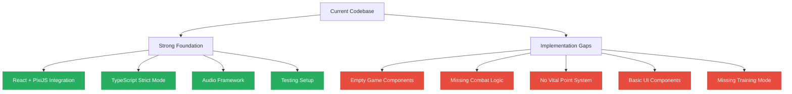
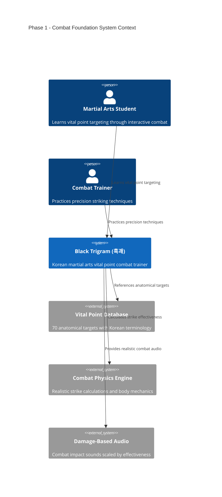
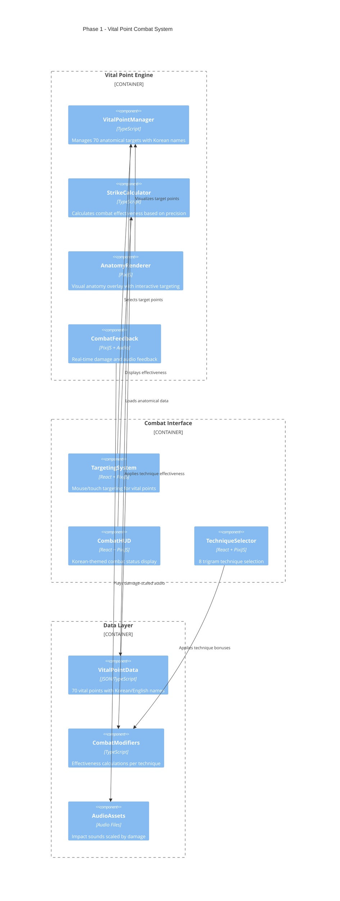
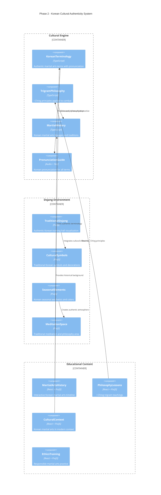
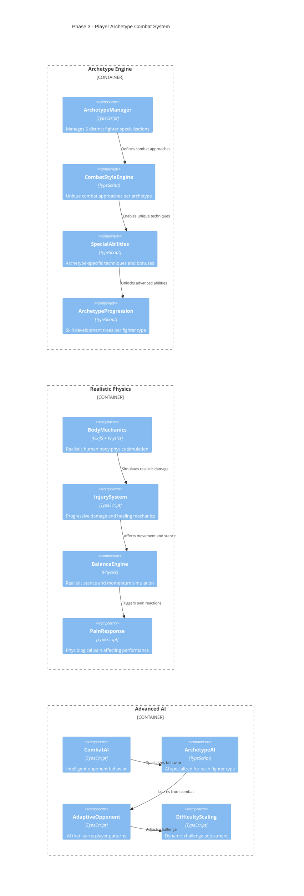
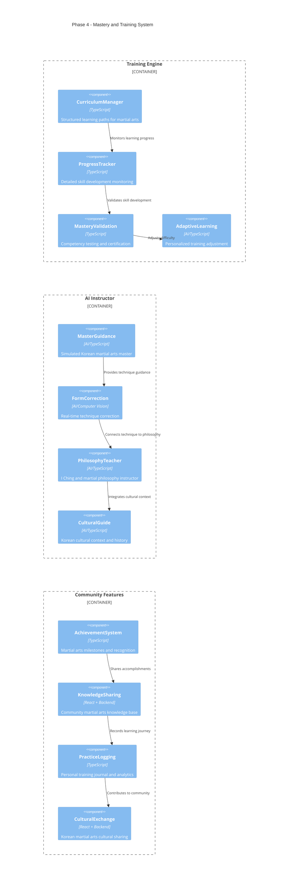
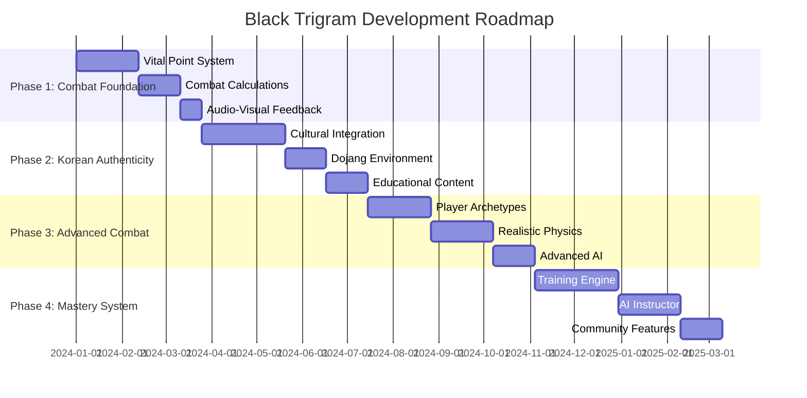
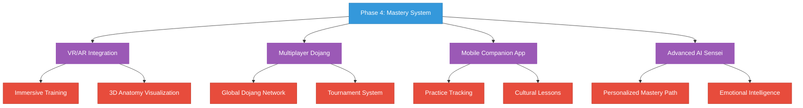

# 🚀 Black Trigram (흑괘) - Future Architecture

## Executive Summary

This document outlines the evolutionary architecture roadmap for Black Trigram, transforming it from the current foundation into a comprehensive Korean martial arts combat simulator with authentic vital point targeting, realistic physics, and cultural depth.

## 📚 Architecture Evolution Map

<div class="documentation-map">

### Current State Documentation

| Document                                      | Status      | Description                               |
| --------------------------------------------- | ----------- | ----------------------------------------- |
| **[Current Architecture](ARCHITECTURE.md)**   | ✅ Complete | C4 model of existing system structure     |
| **[Game Design](game-design.md)**            | ✅ Complete | Korean martial arts game mechanics vision |
| **[README](README.md)**                      | ✅ Complete | Project overview and combat features      |
| **[Mindmap](mindmap.md)**                    | ✅ Complete | Visual concept map of Korean martial arts |

### Future Architecture Phases

| Document                     | Status         | Description                        |
| ---------------------------- | -------------- | ---------------------------------- |
| **FUTURE_ARCHITECTURE.md**  | 📋 This Doc   | Evolutionary roadmap and planning  |
| **Phase 1: Foundation**     | 🔄 In Progress | Core combat and vital point system |
| **Phase 2: Authenticity**   | 📋 Planned     | Korean cultural integration        |
| **Phase 3: Advanced Combat** | 📋 Planned     | Realistic physics and archetypes   |
| **Phase 4: Mastery**        | 📋 Planned     | Training system and AI guidance    |

</div>

## 🔍 Current State Analysis

### Existing Foundation (As-Is)

The current codebase provides a solid foundation with:

#### ✅ Strengths
- **React 19 + PixiJS 8** integration with `@pixi/react`
- **TypeScript strict mode** for type safety
- **Audio system** with Howler.js for damage-based feedback
- **Component architecture** with Korean UI elements
- **Testing framework** with Vitest and Cypress
- **Korean font support** with Noto Sans KR

#### 🔄 Current Limitations
- **Empty components** - Most game components are placeholder files
- **Basic audio system** - Limited to simple sound effects
- **No combat mechanics** - Missing vital point targeting system
- **No player archetypes** - Fighter specializations not implemented
- **Basic UI** - Korean-themed but not interactive
- **No training system** - Educational components missing

### Technical Debt Assessment



## 🗺️ Future Architecture Roadmap

### Phase 1: Combat Foundation (Months 1-3)
**Core combat mechanics and vital point targeting**

### Phase 2: Korean Authenticity (Months 4-6)
**Cultural integration and traditional elements**

### Phase 3: Advanced Combat (Months 7-9)
**Realistic physics and player archetypes**

### Phase 4: Mastery System (Months 10-12)
**Training, AI guidance, and educational content**

---

## 🎯 Phase 1: Combat Foundation

### Architecture Goals
- Implement core vital point targeting system
- Develop realistic combat calculations
- Create interactive combat interface
- Establish audio-visual feedback loops

### System Context Evolution



### New Components - Vital Point System



### Implementation Architecture

```typescript
// Phase 1 - Core vital point system
interface VitalPoint {
  readonly id: string;
  readonly names: {
    readonly korean: string;
    readonly english: string;
    readonly romanization: string;
  };
  readonly location: {
    readonly x: number;
    readonly y: number;
    readonly bodyRegion: BodyRegion;
  };
  readonly effectiveness: {
    readonly difficulty: 1 | 2 | 3 | 4 | 5; // Precision required
    readonly damage: number; // Base damage potential
    readonly stunning: number; // Disorientation effect
    readonly incapacitation: number; // Knockout potential
  };
  readonly techniques: readonly TrigramTechnique[];
  readonly anatomicalInfo: {
    readonly type: 'nerve' | 'vessel' | 'joint' | 'pressure';
    readonly description: string;
    readonly medicalWarning: string;
  };
}

interface CombatCalculation {
  readonly strikeAccuracy: number; // 0-1 based on targeting precision
  readonly techniqueEffectiveness: number; // Trigram technique modifier
  readonly vitalPointMultiplier: number; // Target-specific effectiveness
  readonly finalDamage: number; // Calculated combat result
  readonly audioIntensity: number; // Sound effect scaling
  readonly visualEffect: CombatEffect; // Impact visualization
}
```

---

## 🇰🇷 Phase 2: Korean Authenticity

### Architecture Goals
- Integrate traditional Korean martial arts terminology
- Implement I Ching trigram philosophy in combat
- Create authentic Korean dojang environment
- Develop cultural education components

### Cultural Integration Architecture



### Traditional Korean Elements

```typescript
// Phase 2 - Korean cultural integration
interface KoreanMartialArt {
  readonly name: {
    readonly korean: string;
    readonly english: string;
    readonly hanja?: string; // Chinese characters if applicable
  };
  readonly origin: {
    readonly period: string;
    readonly region: string;
    readonly founder?: string;
  };
  readonly principles: readonly string[];
  readonly techniques: readonly TraditionalTechnique[];
  readonly philosophy: {
    readonly trigramAlignment: TrigramType;
    readonly mentalAspects: readonly string[];
    readonly spiritualElements: readonly string[];
  };
}

interface DojanEnvironment {
  readonly layout: DojanLayout;
  readonly decorations: readonly CulturalElement[];
  readonly lighting: TraditionalLighting;
  readonly sounds: readonly AmbientSound[];
  readonly seasonalTheme: SeasonType;
}
```

---

## ⚔️ Phase 3: Advanced Combat

### Architecture Goals
- Implement 5 distinct player archetypes
- Create realistic physics and body mechanics
- Develop advanced combat AI
- Build comprehensive damage system

### Player Archetype System



### Archetype Specializations

```typescript
// Phase 3 - Player archetype system
interface PlayerArchetype {
  readonly id: ArchetypeId;
  readonly names: {
    readonly korean: string;
    readonly english: string;
    readonly description: string;
  };
  readonly combatPhilosophy: CombatPhilosophy;
  readonly preferredTrigrams: readonly TrigramType[];
  readonly specializations: {
    readonly techniques: readonly SpecialTechnique[];
    readonly bonuses: readonly CombatBonus[];
    readonly abilities: readonly UniqueAbility[];
  };
  readonly progression: SkillTree;
  readonly background: ArchetypeBackground;
}

type ArchetypeId = 'musa' | 'amsalja' | 'hacker' | 'jeongbo' | 'jojik';

interface RealisticInjury {
  readonly location: BodyPart;
  readonly severity: InjurySeverity;
  readonly type: InjuryType;
  readonly healingTime: number;
  readonly functionalImpact: readonly FunctionalLimitation[];
  readonly visualEffects: readonly VisualEffect[];
  readonly audioFeedback: readonly AudioEffect[];
}
```

---

## 🎓 Phase 4: Mastery System

### Architecture Goals
- Create comprehensive training and education system
- Implement AI-guided instruction
- Develop progress tracking and mastery validation
- Build community and sharing features

### Training & Education Architecture



### Educational Progression System

```typescript
// Phase 4 - Training and mastery system
interface TrainingCurriculum {
  readonly modules: readonly LearningModule[];
  readonly prerequisites: readonly Prerequisite[];
  readonly assessments: readonly SkillAssessment[];
  readonly culturalComponents: readonly CulturalLesson[];
}

interface LearningModule {
  readonly id: string;
  readonly names: {
    readonly korean: string;
    readonly english: string;
  };
  readonly objectives: readonly LearningObjective[];
  readonly content: readonly LessonContent[];
  readonly practiceExercises: readonly TrainingExercise[];
  readonly culturalContext: CulturalContext;
  readonly masteryCriteria: MasteryCriteria;
}

interface AIInstructor {
  readonly personality: InstructorPersonality;
  readonly expertise: readonly ExpertiseArea[];
  readonly teachingStyle: TeachingApproach;
  readonly culturalAuthenticity: AuthenticityLevel;
  readonly adaptiveCapabilities: readonly AdaptiveFeature[];
}
```

---

## 🏗️ Implementation Strategy

### Development Phases Timeline



### Priority Implementation Order

#### High Priority (Phase 1)
1. **VitalPointManager** - Core targeting system
2. **StrikeCalculator** - Combat effectiveness engine  
3. **AnatomyRenderer** - Visual targeting interface
4. **CombatFeedback** - Audio-visual damage system

#### Medium Priority (Phase 2)
5. **KoreanTerminology** - Cultural authenticity
6. **TrigramPhilosophy** - Traditional knowledge integration
7. **TraditionalDojang** - Authentic environment
8. **EducationalContent** - Cultural learning components

#### Future Priority (Phase 3-4)
9. **PlayerArchetypes** - 5 fighter specializations
10. **RealisticPhysics** - Advanced body mechanics
11. **AIInstructor** - Guided learning system
12. **CommunityFeatures** - Social learning platform

### Technical Migration Strategy

```typescript
// Migration from current to future architecture
interface ArchitectureMigration {
  readonly currentState: {
    readonly react: "19.x";
    readonly pixijs: "8.x"; 
    readonly typescript: "strict";
    readonly audio: "howler.js";
    readonly testing: "vitest + cypress";
  };
  
  readonly futureAdditions: {
    readonly vitalPointEngine: "custom TypeScript";
    readonly combatPhysics: "matter.js + custom";
    readonly aiSystem: "tensorflow.js";
    readonly culturalData: "JSON + i18n";
    readonly communityBackend: "express + mongodb";
  };
  
  readonly migrationSteps: readonly MigrationStep[];
}
```

---

## 🎯 Success Metrics & KPIs

### Technical Metrics

| Metric | Current | Phase 1 Target | Phase 4 Target |
|--------|---------|----------------|-----------------|
| **Performance** | 60fps | 60fps steady | 60fps + physics |
| **Code Coverage** | Basic | 90%+ | 95%+ |
| **Load Time** | <3s | <3s | <5s |
| **Memory Usage** | <100MB | <150MB | <200MB |

### Educational Metrics

| Learning Outcome | Phase 1 | Phase 2 | Phase 3 | Phase 4 |
|------------------|---------|---------|---------|---------|
| **Vital Point Knowledge** | 20 points | 70 points | Mastery | Teaching |
| **Korean Terms** | Basic | 50 terms | 200 terms | Fluent |
| **Combat Techniques** | 3 trigrams | 8 trigrams | All archetypes | Innovation |
| **Cultural Understanding** | None | Basic | Intermediate | Advanced |

### User Engagement Metrics

| Feature | Phase 1 | Phase 2 | Phase 3 | Phase 4 |
|---------|---------|---------|---------|---------|
| **Session Length** | 10 min | 20 min | 45 min | 90 min |
| **Return Rate** | 30% | 60% | 80% | 90% |
| **Skill Progression** | Linear | Guided | Adaptive | Mastery |
| **Community Engagement** | None | None | Basic | Active |

---

## 🚨 Risk Assessment & Mitigation

### Technical Risks

| Risk | Probability | Impact | Mitigation Strategy |
|------|-------------|--------|-------------------|
| **Performance Degradation** | Medium | High | Incremental optimization, physics LOD |
| **Cultural Inaccuracy** | High | Critical | Native Korean consultant validation |
| **Complexity Overload** | High | Medium | Phased implementation, MVP approach |
| **Browser Compatibility** | Low | Medium | Progressive enhancement, fallbacks |

### Cultural Risks

| Risk | Probability | Impact | Mitigation Strategy |
|------|-------------|--------|-------------------|
| **Misrepresentation** | Medium | Critical | Cultural advisory board |
| **Inappropriate Content** | Low | Critical | Educational focus, warnings |
| **Oversimplification** | High | Medium | Depth over breadth approach |

---

## 🎓 Educational Standards

### Learning Objectives

#### Phase 1: Foundation Knowledge
- Identify 20 primary vital points with Korean names
- Understand basic strike effectiveness calculations
- Recognize audio-visual combat feedback cues
- Practice precision targeting techniques

#### Phase 2: Cultural Integration  
- Pronounce 50 Korean martial arts terms correctly
- Understand I Ching trigram principles in combat
- Recognize traditional Korean dojang elements
- Appreciate Korean martial arts philosophy

#### Phase 3: Advanced Application
- Master all 5 player archetype specializations
- Apply realistic physics in combat scenarios
- Adapt to AI opponent behavioral patterns
- Demonstrate ethical combat knowledge

#### Phase 4: Teaching and Mastery
- Teach vital point locations to other students
- Guide cultural understanding and respect
- Create personal training curricula  
- Contribute to martial arts knowledge community

---

## 🔮 Future Vision (Beyond Phase 4)

### Long-term Architecture Evolution



### Ultimate Goals

- **Global Korean Martial Arts Education Platform**
- **VR/AR Immersive Training Environments**  
- **AI-Powered Personal Martial Arts Masters**
- **International Cultural Exchange Network**
- **Advanced Biomechanical Research Integration**
- **Professional Training Certification System**

---

## 📋 Implementation Checklist

### Phase 1: Combat Foundation ✅
- [ ] VitalPointManager implementation
- [ ] StrikeCalculator combat engine
- [ ] AnatomyRenderer visual system
- [ ] CombatFeedback audio-visual
- [ ] Interactive targeting interface
- [ ] Korean terminology integration
- [ ] Audio scaling by damage
- [ ] Performance optimization

### Phase 2: Korean Authenticity 📋
- [ ] Cultural terminology system
- [ ] I Ching trigram philosophy
- [ ] Traditional dojang environment
- [ ] Korean pronunciation guide
- [ ] Educational content modules
- [ ] Cultural validation review
- [ ] Seasonal aesthetic themes
- [ ] Meditation space integration

### Phase 3: Advanced Combat 📋
- [ ] 5 player archetype system
- [ ] Realistic body physics
- [ ] Progressive injury system
- [ ] Advanced combat AI
- [ ] Archetype specializations
- [ ] Difficulty scaling system
- [ ] Mastery progression trees
- [ ] Combat ethics training

### Phase 4: Mastery System 📋
- [ ] AI instructor implementation
- [ ] Adaptive learning engine
- [ ] Progress tracking system
- [ ] Community features
- [ ] Achievement system
- [ ] Cultural exchange platform
- [ ] Personal training journal
- [ ] Mastery certification

---

<div align="center">

## 🥋 Architecture Evolution Summary

**From Foundation to Mastery: Building the Ultimate Korean Martial Arts Experience**

| Current State | → | Future Vision |
|---------------|---|---------------|
| Empty Components | → | Rich Interactive Systems |
| Basic Audio | → | Immersive Combat Feedback |
| Simple UI | → | Cultural Learning Platform |
| No Combat Logic | → | Realistic Combat Simulation |
| Testing Framework | → | Comprehensive Validation |
| Korean Fonts | → | Complete Cultural Integration |

### 🎯 **"어둠에서 빛으로, 기초에서 완성으로"**
### _"From darkness to light, from foundation to mastery"_

</div>
