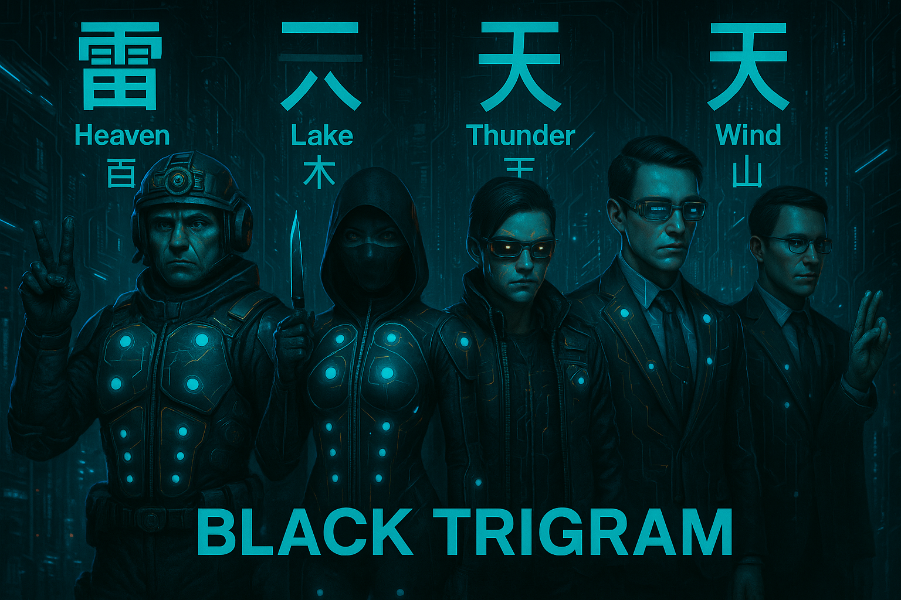
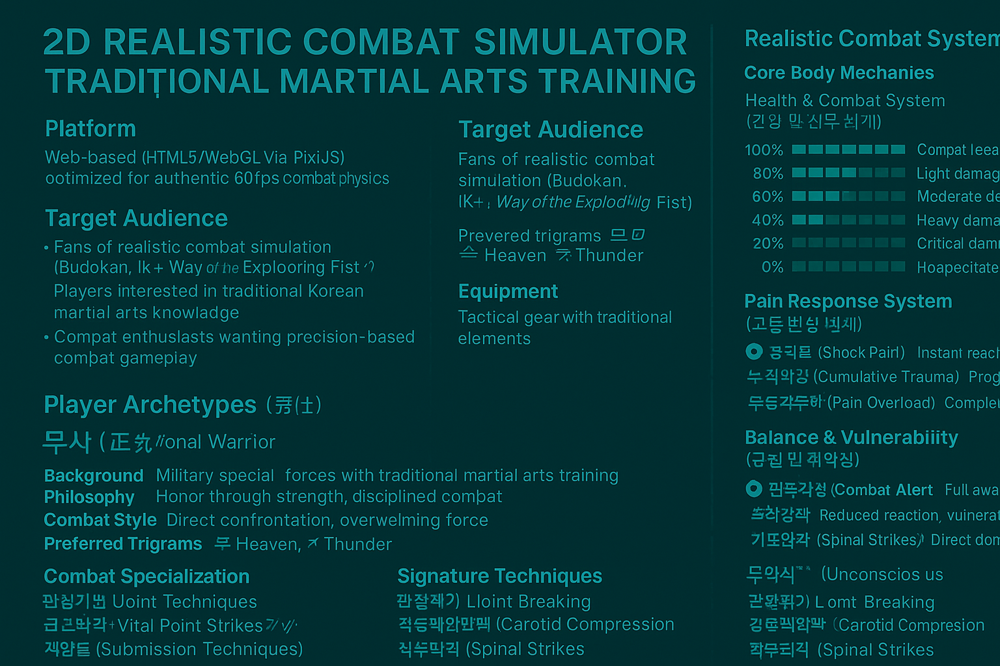

<div align="center">

# 🥋 Black Trigram (흑괘)

### _어둠의 무예로 완벽한 일격을 추구하라_

_"Master the dark arts through the pursuit of the perfect strike"_
**[🎮 Enter the Dojang](https://blacktrigram.com/)**


[](https://github.com/Hack23/blacktrigram/releases)
[](https://github.com/Hack23/blacktrigram/raw/master/LICENSE.md)
[](https://scorecard.dev/viewer/?uri=github.com/Hack23/blacktrigram)
[](https://github.com/Hack23/blacktrigram/attestations)
[](https://github.com/Hack23/blacktrigram/actions/workflows/scorecards.yml)
[](https://github.com/Hack23/blacktrigram/actions/workflows/test-and-report.yml)

_A realistic 2D precision combat game inspired by Korean martial arts philosophy and the I Ching_

</div>

---

## ⚡ Combat Mastery

**Black Trigram** is a **realistic combat simulator** that teaches authentic Korean martial arts through precise anatomical targeting. Master traditional vital-point techniques via modern 2D combat mechanics across 5 distinct fighter archetypes.

### 🎯 Combat Disciplines

<table>
<tr>
<td align="center" width="25%">

**🎯 정격자**
_Jeonggyeokja_
**Precision Striker**

_Every strike targets anatomical weak points_

</td>
<td align="center" width="25%">

**⚔️ 비수**
_Bisu_
**Lethal Technique**

_Decisive unarmed combat methods_

</td>
<td align="center" width="25%">

**🥷 암살자**
_Amsalja_
**Shadow Assassin**

_Silent takedown techniques_

</td>
<td align="center" width="25%">

**💀 급소격**
_Geupsogyeok_
**Vital Point Strike**

_70 anatomical targets for incapacitation_

</td>
</tr>
</table>

---

## 📸 Concept

<div align="center">






</div>

---

## 🌟 Authentic Combat Features

### 🥋 Player Archetypes

Master combat through 5 distinct fighting philosophies:

<div align="center">

| Archetype |                           Name                            |        Combat Philosophy        |                   Special Focus                   |
| :-------: | :-------------------------------------------------------: | :-----------------------------: | :-----------------------------------------------: |
|    🏯     |         **무사 (Musa)**<br/>_Traditional Warrior_         |     Honor through strength      |      Military discipline, overwhelming force      |
|    🥷     |        **암살자 (Amsalja)**<br/>_Shadow Assassin_         | Efficiency through invisibility |       Stealth approaches, instant takedowns       |
|    💻     |           **해커 (Hacker)**<br/>_Cyber Warrior_           |      Information as power       | Environmental manipulation, tech-assisted strikes |
|    🕵️     | **정보요원 (Jeongbo Yowon)**<br/>_Intelligence Operative_ |  Knowledge through observation  |    Psychological manipulation, precise timing     |
|    ⚡     | **조직폭력배 (Jojik Pokryeokbae)**<br/>_Organized Crime_  |  Survival through ruthlessness  |        Dirty fighting, improvised weapons         |

</div>

### 🎯 Anatomical Targeting System

Master **70 authentic vital points** for combat effectiveness:

<div align="center">

| Trigram |           Name            |      Combat Focus      |        Combat Effects         |
| :-----: | :-----------------------: | :--------------------: | :---------------------------: |
|    ☰    | **건 (Geon)** – _Heaven_  |  Bone-striking force   | Fractures, structural damage  |
|    ☱    |   **태 (Tae)** – _Lake_   |   Joint manipulation   |  Dislocations, mobility loss  |
|    ☲    |   **리 (Li)** – _Fire_    | Precise nerve strikes  | Temporary paralysis, numbness |
|    ☳    | **진 (Jin)** – _Thunder_  |  Stunning techniques   |   Disorientation, knockouts   |
|    ☴    |   **손 (Son)** – _Wind_   |  Continuous pressure   |    Gradual incapacitation     |
|    ☵    |  **감 (Gam)** – _Water_   | Blood flow restriction |    Circulation disruption     |
|    ☶    | **간 (Gan)** – _Mountain_ |   Defensive counters   |    Counter-attacks, blocks    |
|    ☷    |  **곤 (Gon)** – _Earth_   |   Ground techniques    |       Throws, takedowns       |

</div>

### 💪 Realistic Body Mechanics

- **🩸 Authentic Trauma** – Realistic injury visualization and blood
- **🦴 Bone Impact Audio** – Genuine bone contact and fracture sounds
- **🫁 Breathing Disruption** – Respiratory system targeting
- **⚖️ Balance System** – Realistic stance and momentum physics
- **🧠 Consciousness States** – Progressive awareness impairment
- **😵 Pain Response** – Physiological pain affecting performance

### 🎯 Combat Specializations

- **🎯 Anatomical Precision** – 70 target points for tactical advantage
- **🇰🇷 Traditional Korean Arts** – Authentic techniques from 태권도, 합기도, 택견
- **⚫ Advanced Techniques** – Professional combat methods from 5 distinct archetypes
- **🥋 Combat Application** – Real martial arts effectiveness

---

## 🚀 Technical Excellence

Built for **combat realism** and **authentic simulation**:

<div align="center">

### 🎮 Combat Physics Engine


### ⚡ Performance Optimized


### 🎨 Visual Effects


</div>

### 🎯 Combat Components

- **VitalPointTargeter** – Interactive anatomical targeting system
- **CombatTracker** – Real-time damage and status monitoring
- **TechniqueCalculator** – Precise combat effectiveness calculations
- **CombatAnalyzer** – Post-match technique analysis

---

## 🎮 Combat Controls

### ⌨️ Combat Input System

- **🏃 Movement**: `WASD` or `Arrow Keys` – Tactical positioning and footwork
- **⚔️ Techniques**: `1–8` (Trigram-based combat techniques)
- **🛡️ Guard**: `Spacebar` – Defensive positioning and blocks
- **🎯 Vital Strike**: `Mouse` – Targeted vital-point attacks
- **🔄 Archetype Switch**: `Tab` – Change between 5 fighter types

### 🩸 Combat Feedback

- **💥 Impact Effects**: Bone contact sounds and visual trauma
- **🩸 Injury System**: Realistic bleeding and damage progression
- **😵 Incapacitation**: Visual indicators of combat effectiveness
- **⚖️ Balance**: Physical stance and vulnerability windows

---

## 🎭 Training Modules

### 🎯 해부학 연구 (Anatomical Study)

- **📚 급소학습 (Vital Point Study)** – 70 anatomical target points
- **🎯 정밀타격 (Precision Striking)** – Accurate targeting techniques
- **⚫ 고급기법 (Advanced Techniques)** – Professional combat methods
- **🥋 실전응용 (Practical Application)** – Combat effectiveness training

### ⚔️ 무술 기법 (Martial Techniques)

- **🥋 기본기 (Fundamentals)** – Basic striking and positioning
- **🔢 팔괘술 (Eight Trigram Arts)** – Traditional Korean combat philosophy
- **🔗 연계기법 (Combination Techniques)** – Flowing technique sequences
- **🎯 정밀술 (Precision Arts)** – Exact targeting and timing

### 🥊 실전 훈련 (Combat Training)

- **👤 일대일 (One-on-One)** – Single opponent combat simulation
- **🏢 환경전투 (Environmental Combat)** – Using surroundings tactically
- **🧘 정신수양 (Mental Cultivation)** – Psychological combat preparation
- **🏃 연속대전 (Continuous Combat)** – Multiple opponent scenarios

### 🎭 원형 특화 (Archetype Mastery)

- **🏯 무사도 (Warrior's Way)** – Traditional warrior discipline training
- **🥷 암영술 (Shadow Arts)** – Stealth and assassination techniques
- **💻 사이버전 (Cyber Warfare)** – Tech-enhanced combat methods
- **🕵️ 정보전 (Intelligence Warfare)** – Psychological and strategic combat
- **⚡ 거리술 (Street Arts)** – Underground survival combat

---

## 🔧 Development Features

### 🎯 Anatomical Data Integration

```typescript
// Authentic vital point data with combat applications
interface VitalPoint {
  name: { korean: string; english: string; technique: string };
  location: AnatomicalPosition;
  effectiveness: CombatEffectiveness;
  difficulty: PrecisionRequired;
  method: CombatTechnique[];
  archetypeBonus: ArchetypeModifier[]; // Special bonuses for different fighter types
}
```

### 🩸 Combat Mechanics System

```typescript
// Realistic body mechanics for authentic combat
interface CombatState {
  health: number; // Physical condition remaining
  consciousness: number; // Awareness and responsiveness
  pain: number; // Pain levels affecting performance
  balance: CombatStability; // Physical stability in combat
  stamina: number; // Energy and endurance
  technique: number; // Skill and precision level
  archetype: PlayerArchetype; // Current fighter specialization
}

// Player archetype system
type PlayerArchetype = "musa" | "amsalja" | "hacker" | "jeongbo" | "jojik";
```

---

## 🚀 Quick Start

### 🌐 Enter the Dojang

**[🎮 Begin Combat Training](https://hack23.github.io/blacktrigram/)**

### 🔧 Local Development

```bash
# Clone repository
git clone https://github.com/Hack23/blacktrigram.git
cd blacktrigram

# Install dependencies
npm install

# Start combat simulation
npm run dev

# Build for deployment
npm run build

# Run combat testing
npm run test
npm run test:combat
```

---

## 📚 Documentation & Further Reading

Game/frontend will be open source with commercial backend supporting multiplayer functionality, rankings and subscriptions to fund development and runtime of backend. Will enable progressions and persistent state of game.


🔗 **Architecture & Design**

- [📐 ARCHITECTURE.md](https://github.com/Hack23/blacktrigram/blob/main/ARCHITECTURE.md)
  _High-level C4 models, container/component views, and system context._
- [📈 FUTURE_ARCHITECTURE.md](https://github.com/Hack23/blacktrigram/blob/main/FUTURE_ARCHITECTURE.md)
  _Vision for upcoming architectural enhancements and PWA integration._

🔗 **Combat & Mechanics**

- [🥋 COMBAT_ARCHITECTURE.md](https://github.com/Hack23/blacktrigram/blob/main/COMBAT_ARCHITECTURE.md)
  _In-depth battleflow, trigram integration, vital-point targeting, and damage pipeline._
- [🗺️ game-design.md](https://github.com/Hack23/blacktrigram/blob/main/game-design.md)
  _Overall game mechanics, archetype breakdowns, and design decisions._
- [📊 game-status.md](https://github.com/Hack23/blacktrigram/blob/main/game-status.md)
  _Current progress, feature roadmap, and milestone tracking._

🔗 **Assets & Media**

- [🖼️ ART_ASSETS.md](https://github.com/Hack23/blacktrigram/blob/main/ART_ASSETS.md)
  _Guidelines for sprite sheets, particle textures, color palettes, and UI icons._
- [🎵 AUDIO.ASSETS.md](https://github.com/Hack23/blacktrigram/blob/main/AUDIO.ASSETS.md)
  _List of traditional Korean instrument loops, impact SFX, and mixing notes._

---

## 🎯 Combat Philosophy

> **"어둠 속에서 완벽한 일격을 찾아라"** > _"In darkness, seek the perfect strike"_

Each technique focuses on:

- **정확한 타격 (Precise Targeting)** – Exact anatomical vulnerable points
- **최대 효과 (Maximum Effectiveness)** – One-strike incapacitation
- **전투 심리 (Combat Psychology)** – Mental preparation for combat
- **전통 지식 (Traditional Knowledge)** – Authentic Korean martial arts
- **원형 특화 (Archetype Specialization)** – Unique approach per fighter type

---

## 🏆 Combat Achievements

### 🎯 Combat Mastery

- **🎓 급소대가 (Vital Point Master)** – Master all 70 vital-point targets
- **🩸 전투전문가 (Combat Expert)** – Execute optimal combat techniques
- **⚫ 고수 (Advanced Practitioner)** – Complete advanced technique training
- **🔪 완벽한 무사 (Perfect Warrior)** – Achieve flawless combat records

### 🥋 Martial Proficiency

- **🎯 정밀타격사 (Precision Striker)** – Perfect vital-point targeting accuracy
- **⚖️ 균형대사 (Balance Master)** – Master all stance & footwork patterns
- **🧘 정신수양사 (Mental Cultivator)** – Complete psychological combat training
- **🇰🇷 무도학자 (Martial Scholar)** – Understand Korean martial arts philosophy

### 🎭 Archetype Mastery

- **🏯 무사완성 (Warrior Perfection)** – Master traditional warrior discipline
- **🥷 그림자대사 (Shadow Master)** – Perfect stealth & assassination arts
- **💻 사이버무사 (Cyber Warrior)** – Tech-enhanced combat mastery
- **🕵️ 정보대가 (Intelligence Master)** – Psychological warfare expertise
- **⚡ 거리왕 (Street King)** – Underground combat supremacy

---

<div align="center">

## 🌟 Ready to Master Korean Martial Arts?

**[🎮 Enter the Dojang](https://hack23.github.io/blacktrigram/)**

_Experience authentic Korean combat techniques with anatomical precision across 5 unique fighting archetypes_

---

### Built with 🎯 Combat Precision and 🇰🇷 Traditional Authenticity

**🥋 무도의 길을 걸어라 (Walk the Path of Martial Arts) 🥋**

</div>
