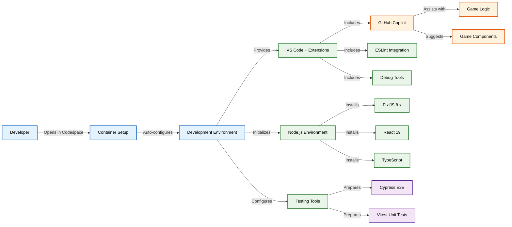
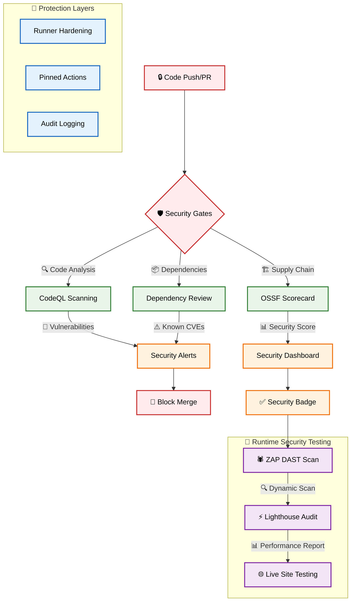
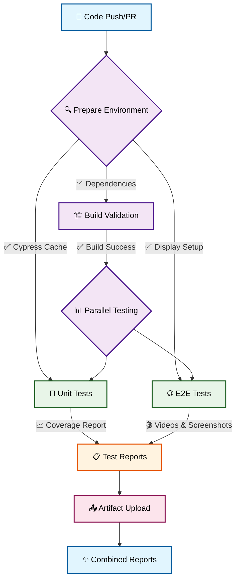
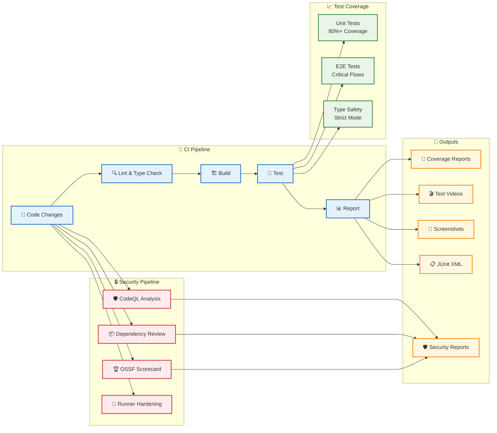
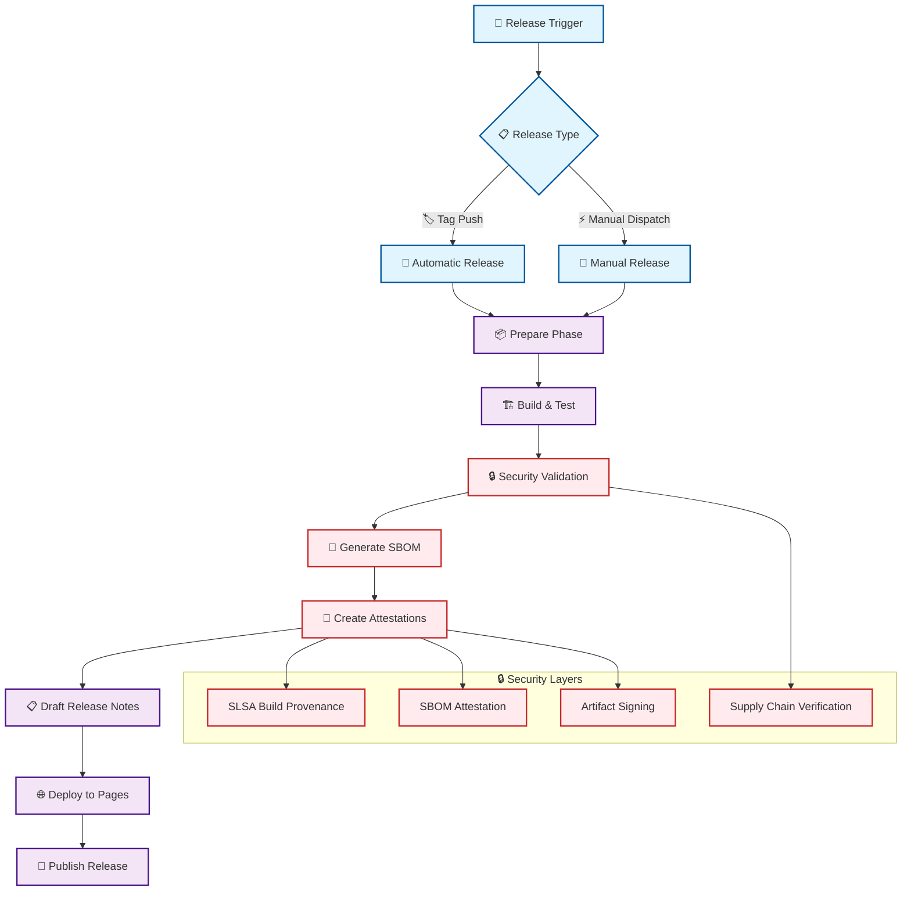
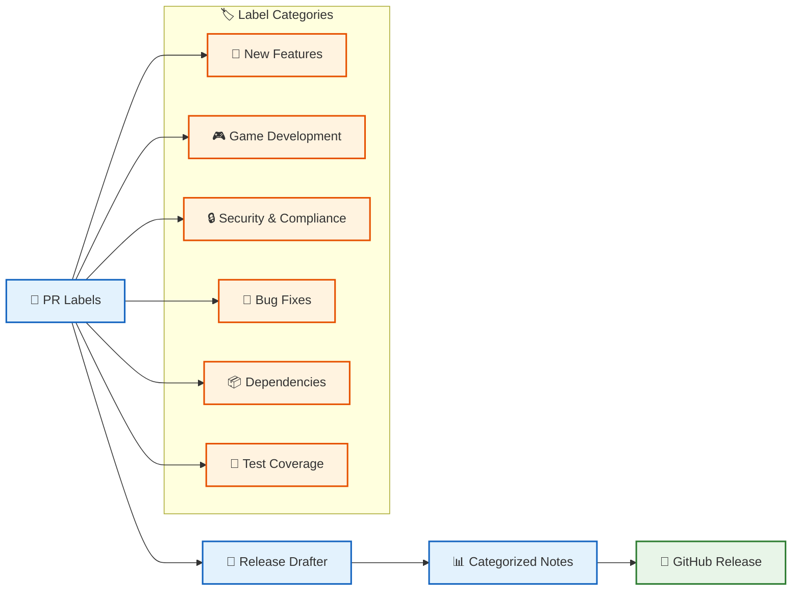
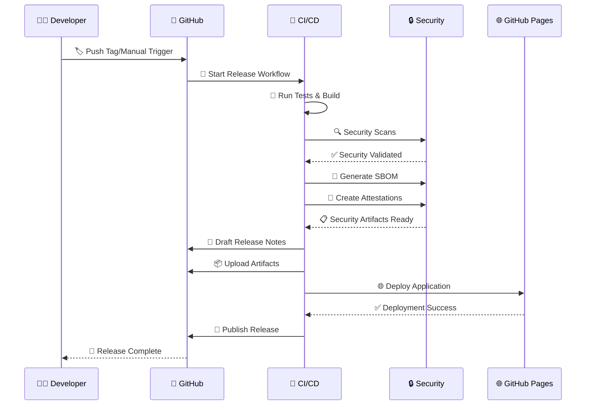

# Black Trigram

2D action-combat game. Focus 정격자 = "Precision Attacker" , 비수 = "Dagger", 암살자 = "Assassin",급소격 = "Vital Point Strike"


## Badges

[](https://github.com/Hack23/blacktrigram/raw/master/LICENSE.md)
[](https://scorecard.dev/viewer/?uri=github.com/Hack23/blacktrigram)

## 🔒 Security Features

This template implements comprehensive security measures:

- **🛡️ Supply Chain Security** - OSSF Scorecard analysis and dependency review
- **🔍 Static Analysis** - CodeQL scanning for vulnerabilities
- **📦 Dependency Protection** - Automated dependency vulnerability checks
- **🔐 Runner Hardening** - All CI/CD runners are hardened with audit logging
- **📋 Security Policies** - GitHub security advisories and vulnerability reporting
- **🏷️ Pinned Dependencies** - All GitHub Actions pinned to specific SHA hashes
- **📄 SBOM Generation** - Software Bill of Materials for transparency
- **🔏 Build Attestations** - Cryptographic proof of build integrity
- **🏆 Artifact Verification** - SLSA-compliant build provenance
- **🕷️ ZAP Security Scanning** - OWASP ZAP dynamic application security testing
- **⚡ Lighthouse Performance** - Automated performance and accessibility audits

## Features

- ⚡ **Vite** - Fast build tool and dev server
- ⚛️ **React 19** - Modern React with hooks
- 🔷 **TypeScript** - Strict typing with latest standards
- 🧪 **Vitest** - Fast unit testing with coverage
- 🌲 **Cypress** - Reliable E2E testing
- 📦 **ESLint** - Code linting with TypeScript rules
- 🔄 **GitHub Actions** - Automated testing and reporting
- 🎮 **PixiJS 8.x** - High-performance WebGL renderer for 2D games
- 🎵 **Howler.js** - Audio library for games

## Development Environment

This template includes a fully configured development environment:

- **🚀 GitHub Codespaces** - Zero-configuration development environment
- **🤖 GitHub Copilot** - AI-assisted development with code suggestions
- **💬 Copilot Chat** - In-editor AI assistance for debugging and explanations
- **🔧 VS Code Extensions** - Pre-configured extensions for game development
- **🔒 Secure Container** - Hardened development container with security features

### 🚀 Codespaces Setup

This repository is fully configured for GitHub Codespaces, providing:

- **One-click setup** - Start coding immediately with zero configuration
- **Pre-installed dependencies** - All tools and libraries ready to use
- **Configured test environment** - Cypress and Vitest ready to run
- **GitHub Copilot integration** - AI-powered code assistance
- **Optimized performance** - Container configured for game development



## Security Workflows



## Test & Report Workflow



## Quick Start

```bash
# Using GitHub Codespaces
# Click "Code" button on repository and select "Open with Codespaces"

# Or local development:
# Install dependencies
npm install

# Start development server
npm run dev

# Build for production
npm run build

# Run unit tests
npm run test

# Run E2E tests
npm run test:e2e
```

## PixiJS 8.x Integration

This template uses PixiJS 8.x for high-performance 2D game rendering:

- Modern WebGL-based rendering
- Optimized sprite batching
- Integrated with React via @pixi/react
- Sound support via @pixi/sound and Howler.js
- Responsive game canvas
- Touch and mouse input handling

Example game component:

```tsx
import { Stage, Sprite, useTick } from "@pixi/react";
import { useState } from "react";

export function Game() {
  const [position, setPosition] = useState({ x: 100, y: 100 });

  useTick((delta) => {
    // Game logic here
    setPosition((prev) => ({
      x: prev.x + delta,
      y: prev.y,
    }));
  });

  return (
    <Stage width={800} height={600} options={{ backgroundColor: 0x1d2230 }}>
      <Sprite
        image="/assets/character.png"
        x={position.x}
        y={position.y}
        anchor={{ x: 0.5, y: 0.5 }}
      />
    </Stage>
  );
}
```

## Testing

### Unit Tests

- Uses Vitest with jsdom environment
- Configured for React Testing Library
- Coverage reports generated automatically
- Run with: `npm run test`

### E2E Tests

- Uses Cypress for end-to-end testing
- Starts dev server automatically
- Screenshots and videos on failure
- Run with: `npm run test:e2e`

### CI/CD Pipeline



### Security Workflows

- **CodeQL Analysis**: Automated vulnerability scanning on push/PR
- **Dependency Review**: Checks for known vulnerabilities in dependencies
- **OSSF Scorecard**: Supply chain security assessment with public scoring
- **Runner Hardening**: All CI/CD runners use hardened security policies

## 🚀 Release Management

This template includes a comprehensive, security-first release workflow with automated versioning, security attestations, and deployment.

### Release Flow



### 🏷️ Release Types

#### Automatic Releases (Tag-based)

```bash
# Create and push a tag to trigger automatic release
git tag v1.0.0
git push origin v1.0.0
```

#### Manual Releases (Workflow Dispatch)

- Navigate to **Actions** → **Build, Attest and Release**
- Click **Run workflow**
- Specify version (e.g., `v1.0.1`) and pre-release status
- The workflow handles version bumping and tagging automatically

### 📋 Automated Release Notes

Release notes are automatically generated using semantic labeling:



#### Release Note Categories

- **🚀 New Features** - Major feature additions
- **🎮 Game Development** - Game logic, graphics, audio improvements
- **🎨 UI/UX Improvements** - Interface and design updates
- **🏗️ Infrastructure & Performance** - Build and performance optimizations
- **🔄 Code Quality & Refactoring** - Code improvements and testing
- **🔒 Security & Compliance** - Security updates and fixes
- **📝 Documentation** - Documentation improvements
- **📦 Dependencies** - Dependency updates
- **🐛 Bug Fixes** - Bug fixes and patches

### 🔒 Security Attestations & SBOM

#### Software Bill of Materials (SBOM)

Every release includes a comprehensive SBOM in SPDX format:

```json
{
  "SPDXID": "SPDXRef-DOCUMENT",
  "name": "game-v1.0.0",
  "packages": [
    {
      "SPDXID": "SPDXRef-Package-react",
      "name": "react",
      "versionInfo": "19.1.0",
      "licenseConcluded": "MIT"
    }
  ]
}
```

#### Build Provenance Attestations

SLSA-compliant build attestations provide cryptographic proof:

```json
{
  "_type": "https://in-toto.io/Statement/v0.1",
  "predicateType": "https://slsa.dev/provenance/v0.2",
  "subject": [
    {
      "name": "game-v1.0.0.zip",
      "digest": {
        "sha256": "abc123..."
      }
    }
  ],
  "predicate": {
    "builder": {
      "id": "https://github.com/actions/runner"
    },
    "buildType": "https://github.com/actions/workflow@v1"
  }
}
```

#### Verification Commands

```bash
# Verify build provenance
gh attestation verify game-v1.0.0.zip \
  --owner Hack23 --repo game

# Verify SBOM attestation
gh attestation verify game-v1.0.0.zip \
  --owner Hack23 --repo game \
  --predicate-type https://spdx.dev/Document
```

### 📦 Release Artifacts

Each release includes multiple artifacts with full traceability:

```
📦 Release v1.0.0
├── 🎮 game-v1.0.0.zip                    # Built application
├── 📄 game-v1.0.0.spdx.json             # Software Bill of Materials
├── 🔏 game-v1.0.0.zip.intoto.jsonl      # Build provenance attestation
└── 📋 game-v1.0.0.spdx.json.intoto.jsonl # SBOM attestation
```

### 🌐 Deployment Pipeline



### 🔐 Security Compliance

#### OSSF Scorecard Integration

- **Automated scoring** of supply chain security practices
- **Public transparency** with security badge
- **Continuous monitoring** of security posture

#### Supply Chain Protection

- **Pinned dependencies** - All GitHub Actions pinned to SHA hashes
- **Dependency scanning** - Automated vulnerability detection
- **SLSA compliance** - Build integrity and provenance
- **Signed artifacts** - Cryptographic verification of releases

### 📊 Release Metrics

Track release quality and security with built-in metrics:

- **🔒 Security Score** - OSSF Scorecard rating
- **📈 Test Coverage** - Unit and E2E test coverage
- **🏷️ Vulnerability Count** - Known security issues
- **📦 Dependency Health** - Outdated/vulnerable dependencies
- **🚀 Build Success Rate** - CI/CD pipeline reliability

## Building Your Game

This template provides a **secure foundation** for game development:

1. Replace the counter example with your game logic
2. Add game-specific components in `src/components/`
3. Create game state management (Context API, Zustand, etc.)
4. Add unit tests for game logic
5. Create E2E tests for game flows
6. **Create releases** using the automated workflow
7. **Monitor security** through OSSF Scorecard and attestations
8. Deploy using the included **security-hardened** GitHub Actions

All security workflows will automatically protect your game from common vulnerabilities and supply chain attacks, while providing full transparency through SBOM and attestations.

Happy gaming! 🎮🔒
