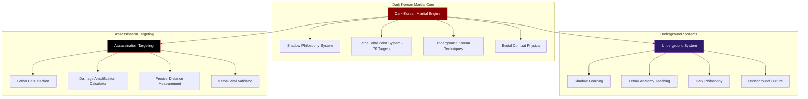

# Black Trigram (흑괘) - Game Design Document

## Executive Summary

**Black Trigram** is a **realistic 2D precision combat game** inspired by classic martial arts fighters like **Budokan: The Martial Spirit** and **International Karate+**, reimagined with authentic Korean martial arts and modern combat techniques. Players master traditional vital point striking through precise, physics-based combat that emphasizes **anatomical targeting** and **one-strike effectiveness**.

### Core Pillars

- **정격자 (Jeonggyeokja)** - Precision Striker: Every strike targets anatomical vulnerabilities
- **비수 (Bisu)** - Lethal Technique: Realistic application of traditional martial arts
- **암살자 (Amsalja)** - Combat Specialist: Focus on immediate incapacitation
- **급소격 (Geupsogyeok)** - Vital Point Strike: Authentic pressure point combat

## Game Overview

### Genre

2D Realistic Combat Simulator / Traditional Martial Arts Training

### Platform

Web-based (HTML5/WebGL via PixiJS) optimized for authentic 60fps combat physics

### Target Audience

- Fans of realistic combat simulation (Budokan, IK+, Way of the Exploding Fist)
- Martial arts practitioners seeking authentic technique knowledge
- Players interested in traditional Korean martial arts techniques
- Combat enthusiasts wanting precision-based combat gameplay

### Unique Selling Points

1. **Realistic Combat Physics** - Real body mechanics with authentic combat focus
2. **Anatomical Precision** - 70 actual vital points for tactical advantage
3. **Combat Realism** - Blood, bruising, bone impact, realistic physics
4. **Korean Martial Arts** - Based on traditional techniques and philosophy
5. **Traditional Knowledge** - Teaches actual pressure points and applications

## Realistic Combat System

### Core Body Mechanics

#### Health & Combat System (건강 및 전투 체계)

```
COMBAT READINESS:
■■■■■■■■■■ 100% - Combat ready, full capability
■■■■■■■■□□  80% - Light damage, reduced capability
■■■■■■□□□□  60% - Moderate damage, significant impairment
■■■■□□□□□□  40% - Heavy damage, severe limitation
■■□□□□□□□□  20% - Critical damage, near incapacitation
□□□□□□□□□□   0% - Incapacitated/Defeated
```

#### Pain Response System (고통 반응 체계)

- **충격통 (Shock Pain)** - Instant reaction affecting all abilities
- **누적외상 (Cumulative Trauma)** - Progressive damage impairment
- **통증과부하 (Pain Overload)** - Complete incapacitation from overwhelming pain
- **무력화한계 (Incapacitation Threshold)** - Point of complete combat inability

#### Balance & Vulnerability (균형 및 취약성)

```
COMBAT STATES:
🟢 준비완료 (READY)     - Perfect combat position, full capability
🟡 동요상태 (SHAKEN)    - Slightly compromised, reduced accuracy
🟠 취약상태 (VULNERABLE) - Significantly exposed, high damage window
🔴 무력상태 (HELPLESS)  - Complete vulnerability, incapacitation opportunity
```

#### Consciousness Levels (의식 수준)

- **전투각성 (Combat Alert)** - Full awareness, optimal combat ability
- **혼란상태 (Disoriented)** - Reduced reaction, vulnerability window
- **기절직전 (Stunned)** - Severe impairment, incapacitation opportunity
- **무의식 (Unconscious)** - Complete incapacitation

### Player Archetypes

#### 1. 무사 (Musa) - Traditional Warrior

**Background**: Military special forces with traditional martial arts training  
**Philosophy**: Honor through strength, disciplined combat  
**Combat Style**: Direct confrontation, overwhelming force  
**Preferred Trigrams**: ☰ Heaven, ☳ Thunder  
**Equipment**: Tactical gear with traditional elements

**Combat Specialization**:

- **관절기법 (Joint Techniques)** - Traditional joint manipulation and control
- **급소타격 (Vital Point Strikes)** - Military-taught pressure point targeting
- **제압술 (Submission Techniques)** - Honor-based control methods

**Special Abilities**:

- **군인정신 (Gunin Jeongsin)** - Military discipline for increased focus
- **돌격명령 (Dolgyeok Myeongryeong)** - Assault command for team coordination
- **전투경험 (Jeontu Gyeongheom)** - Combat experience for damage resistance

**Signature Techniques**:

- **관절꺾기 (Joint Breaking)** - Honorable arm/wrist control for incapacitation
- **경동맥압박 (Carotid Compression)** - Traditional blood flow restriction
- **척추타격 (Spinal Strikes)** - Direct force spine-targeting attacks

#### 2. 암살자 (Amsalja) - Shadow Assassin

**Background**: Covert operative specializing in silent takedowns  
**Philosophy**: Efficiency through invisibility, one perfect strike  
**Combat Style**: Stealth approaches, instant takedowns  
**Preferred Trigrams**: ☴ Wind, ☵ Water

**Combat Specialization**:

- **무성제압 (Silent Takedowns)** - Techniques preventing vocal response
- **신경파괴 (Nerve Strikes)** - Precise neural disruption for stealth
- **호흡차단 (Respiratory Attacks)** - Silent breathing and consciousness targeting

**Special Abilities**:

- **그림자술 (Geurimja-sul)** - Shadow techniques for stealth
- **일격필살 (Ilgyeok Pilsal)** - One-strike incapacitation potential
- **침묵행보 (Chimmuk Haengbo)** - Silent movement

**Signature Techniques**:

- **경추타격 (Cervical Strikes)** - Silent neck strikes for instant incapacitation
- **늑간신경 (Intercostal Nerve)** - Hidden rib nerve strikes for paralysis
- **기도압박 (Tracheal Compression)** - Stealth windpipe control attacks

#### 3. 해커 (Hacker) - Cyber Warrior

**Background**: Digital native with physical combat training  
**Philosophy**: Information as power, technological advantage  
**Combat Style**: Environmental manipulation, tech-assisted strikes  
**Preferred Trigrams**: ☲ Fire, ☱ Lake

**Combat Specialization**:

- **해부학적분석 (Anatomical Analysis)** - Data-driven approach to vital points
- **생체역학파괴 (Biomechanical Destruction)** - Tech-enhanced body mechanics understanding
- **체계적제압 (Systematic Incapacitation)** - Algorithm-based damage accumulation

**Special Abilities**:

- **전자전 (Jeonja-jeon)** - Electronic warfare for distraction
- **데이터분석 (Data Bunseok)** - Opponent pattern analysis
- **시스템해킹 (System Hacking)** - Environmental control

**Signature Techniques**:

- **신경절차단 (Nerve Cluster Blocking)** - Tech-analyzed nerve center disruption
- **혈관압박 (Vascular Compression)** - Calculated blood flow restriction
- **관절파괴 (Joint Destruction)** - Data-driven joint incapacitation

#### 4. 정보요원 (Jeongbo Yowon) - Intelligence Operative

**Background**: Government agent with psychological warfare training  
**Philosophy**: Knowledge through observation, strategic thinking  
**Combat Style**: Psychological manipulation, precise timing  
**Preferred Trigrams**: ☶ Mountain, ☷ Earth

**Combat Specialization**:

- **고통순응 (Pain Compliance)** - Intelligence-based submission through pain
- **심리적압박 (Psychological Pressure)** - Mental intimidation through technique
- **정보추출 (Information Extraction)** - Combat methods from interrogation training

**Special Abilities**:

- **심리전 (Simri-jeon)** - Psychological warfare
- **정보수집 (Jeongbo Sujip)** - Intelligence gathering
- **전략분석 (Jeonryak Bunseok)** - Strategic analysis

**Signature Techniques**:

- **압점고문 (Pressure Point Control)** - Intelligence-based nerve pressure
- **심리적위압 (Psychological Intimidation)** - Fear-based tactical intimidation
- **복종유도 (Submission Induction)** - Strategic pain-based surrender

#### 5. 조직폭력배 (Jojik Pokryeokbae) - Organized Crime

**Background**: Underground fighter with street-smart brutality  
**Philosophy**: Survival through ruthlessness, practical violence  
**Combat Style**: Dirty fighting, improvised weapons  
**Preferred Trigrams**: ☳ Thunder, ☵ Water

**Combat Specialization**:

- **환경활용 (Environmental Usage)** - Street-smart use of surroundings as weapons
- **더러운기법 (Dirty Techniques)** - Brutal eye attacks, groin strikes, hair pulling
- **생존격투 (Survival Fighting)** - Underground whatever-it-takes combat

**Special Abilities**:

- **거리격투 (Geori Gyeoktu)** - Street fighting techniques
- **생존본능 (Saengjon Bonneung)** - Survival instincts
- **조직력 (Jojik-ryeok)** - Gang coordination

**Signature Techniques**:

- **눈찌르기 (Eye Strikes)** - Street-brutal blinding attacks
- **사타구니공격 (Groin Attacks)** - Ruthless incapacitating strikes
- **목조르기 (Choking)** - Underground strangulation techniques

### Authentic Trigram Applications

#### ☰ 건 (Geon) - Heaven/Direct Force

**Combat Application**: Overwhelming physical power

- **기법 (Technique)**: Direct bone-striking attacks, structural damage
- **전투효과 (Combat Effect)**: Fractures, concussions, immediate trauma
- **음향 (Audio)**: Deep bone impact, crushing contact sounds

#### ☱ 태 (Tae) - Lake/Flowing

**Combat Application**: Fluid redirection techniques

- **기법 (Technique)**: Joint manipulation, throws
- **전투효과 (Combat Effect)**: Dislocations, torn ligaments
- **음향 (Audio)**: Joint popping, ligament stress sounds

#### ☲ 리 (Li) - Fire/Precision

**Combat Application**: Exact vital point targeting

- **기법 (Technique)**: Needle-point accuracy strikes
- **전투효과 (Combat Effect)**: Nerve damage, temporary paralysis
- **음향 (Audio)**: Sharp impact, breath disruption

#### ☳ 진 (Jin) - Thunder/Shock

**Combat Application**: Stunning nerve strikes

- **기법 (Technique)**: Electric-like nerve disruption
- **전투효과 (Combat Effect)**: Temporary paralysis, muscle spasms
- **음향 (Audio)**: Sharp crack, neural impact

#### ☴ 손 (Son) - Wind/Persistence

**Combat Application**: Continuous pressure techniques

- **기법 (Technique)**: Sustained pressure point attacks
- **전투효과 (Combat Effect)**: Gradual incapacitation, cumulative pain
- **음향 (Audio)**: Sustained pressure, grinding contact

#### ☵ 감 (Gam) - Water/Adaptation

**Combat Application**: Counter-grappling, escape techniques

- **기법 (Technique)**: Slippery escapes, flow reversals
- **전투효과 (Combat Effect)**: Joint strain, ligament damage
- **음향 (Audio)**: Sliding, escaping friction

#### ☶ 간 (Gan) - Mountain/Defense

**Combat Application**: Immovable defensive positions

- **기법 (Technique)**: Blocking, absorbing, redirecting
- **전투효과 (Combat Effect)**: Bruising, impact absorption
- **음향 (Audio)**: Solid blocks, deflection impacts

#### ☷ 곤 (Gon) - Earth/Grounding

**Combat Application**: Takedowns, ground control

- **기법 (Technique)**: Wrestling, ground techniques
- **전투효과 (Combat Effect)**: Impact trauma, positional control
- **음향 (Audio)**: Body impact, ground contact

## Realistic Visual & Audio Feedback

### Authentic Combat Effects

#### Blood & Trauma System

- **경상출혈 (Minor Bleeding)** - Small cuts, facial bleeding
- **중등외상 (Moderate Trauma)** - Deep lacerations, significant bleeding
- **중상출혈 (Severe Bleeding)** - Heavy bleeding requiring immediate attention
- **점진적손상 (Progressive Damage)** - Realistic trauma accumulation

#### Realistic Sound Design

- **골절음 (Bone Breaking)** - Authentic bone fracture sounds
- **타격음 (Flesh Impact)** - Body contact sounds with appropriate intensity
- **관절음 (Joint Manipulation)** - Realistic joint movement and stress
- **호흡음 (Breathing Effects)** - Gasping, wheezing, breath disruption
- **낙하음 (Falling Sounds)** - Body impact with ground contact

#### Body Response Animation

- **통증반응 (Pain Reactions)** - Realistic flinching and protective responses
- **균형상실 (Balance Loss)** - Authentic stumbling and recovery attempts
- **무의식상태 (Unconsciousness)** - Proper collapse and incapacitation mechanics
- **손상적응 (Injury Adaptation)** - Movement changes based on damage

### Anatomical Training

#### Vital Point Education (급소 교육)

- **70+ 급소점 (70+ Vital Points)** with combat explanations
- **생리학적효과 (Physiological Effects)** - Real consequences of each strike
- **전투정보 (Combat Information)** - Understanding of technique applications
- **실전통합 (Combat Integration)** - Practical combat response training

#### Combat Training

- **골격표적 (Skeleton Targeting)** - Show bone structure and vulnerabilities
- **신경파괴 (Nerve Targeting)** - Display nervous system targets
- **혈류차단 (Blood Flow Restriction)** - Circulation control points
- **호흡차단 (Respiratory Control)** - Breathing disruption techniques

## Game Modes (Combat Focus)

### 1. 해부학 연구 (Anatomical Study) - Target Analysis

- **급소학습 (Vital Point Study)** - Learn vital point locations and effects
- **정밀타격 (Precision Striking)** - Vital point targeting techniques
- **고급기법 (Advanced Techniques)** - Professional combat applications
- **실전응용 (Practical Application)** - Combat scenario training

### 2. 무술 기법 (Martial Techniques) - Skill Development

- **기본기 (Fundamentals)** - Basic strikes and positioning
- **팔괘술 (Trigram Arts)** - Eight trigram combat applications
- **연계기법 (Combination Techniques)** - Realistic technique chains
- **정밀술 (Precision Arts)** - Scenario-based combat training

### 3. 실전 훈련 (Combat Training) - Realistic Sparring

- **일대일 (One-on-One)** - Single opponent realistic combat
- **다대일 (Multiple Opponents)** - Realistic multi-attacker scenarios
- **환경전투 (Environmental Combat)** - Using surroundings tactically
- **연속대전 (Continuous Combat)** - Endurance-based realistic combat

### 4. 정신 수양 (Mental Cultivation) - Psychological Training

- **고통내성 (Pain Tolerance)** - Building resistance to pain
- **정신집중 (Mental Focus)** - Concentration under pressure
- **공포극복 (Fear Management)** - Dealing with combat stress
- **의지력 (Willpower)** - Maintaining consciousness under duress

## Technical Implementation

### Realistic Physics Engine

```typescript
// Authentic combat mechanics
interface CombatMechanics {
  health: number; // 0-100 overall condition
  pain: number; // Current pain level affecting performance
  balance: CombatState; // READY | SHAKEN | VULNERABLE | HELPLESS
  consciousness: number; // 0-100 awareness level
  bloodLoss: number; // Cumulative bleeding effects
  stamina: number; // Energy and endurance status
}

// Real vital point data
interface VitalPoint {
  name: string; // Korean and English names
  location: { x: number; y: number };
  combatEffect: string; // Actual physiological consequence
  difficulty: number; // 1-5 precision rating
  technique: string[]; // Appropriate striking methods
  recovery: number; // Time to recover from hit
}
```

### Realistic Combat Calculation

```typescript
// Authentic combat calculation
function calculateCombatDamage(
  strike: StrikeData,
  target: VitalPoint,
  force: number,
  angle: number
): CombatResult {
  const accuracy = calculateStrikePrecision(strike, target);
  const effectiveness = determineCombatEffect(target, force);
  const consciousness = calculateConsciousnessImpact(target, force);

  return {
    physicalDamage: effectiveness,
    painLevel: calculatePainResponse(target, force),
    balanceEffect: determineCombatImpact(target, angle),
    consciousnessLoss: consciousness,
    bleedingAmount: calculateBleeding(target, force),
    recoveryTime: estimateRecoveryPeriod(target, effectiveness),
  };
}
```

## Cultural and Traditional Integration

### Korean Martial Arts Authenticity

- **전통기법 (Traditional Techniques)** - Based on actual Korean martial arts (태권도, 합기도, 택견, 유술)
- **정통용어 (Authentic Terminology)** - Traditional Korean names with combat translations
- **역사적맥락 (Historical Context)** - Real Korean military and martial arts history
- **철학적기반 (Philosophical Foundation)** - Genuine I Ching principles in combat application

### Educational Value

- **무술교육 (Martial Education)** - Real anatomy and combat learning
- **전통사 (Traditional History)** - Korean fighting tradition education
- **안전의식 (Safety Awareness)** - Understanding technique consequences
- **응급처치 (First Aid Training)** - Basic medical response to injuries

### Traditional Framework

- **실전적용 (Practical Application)** - Emphasis on self-defense and sport application
- **전투인식 (Combat Awareness)** - Clear understanding of technique effects
- **현실적경고 (Realistic Warnings)** - Proper warnings about real-world application
- **교육목적 (Educational Purpose)** - Focus on learning traditional martial arts

## Success Metrics

### Combat Proficiency

- **해부학적지식 (Anatomical Knowledge)** - Accurate vital point identification
- **기법정밀도 (Technique Precision)** - Exact targeting and timing
- **안전의식 (Safety Awareness)** - Understanding of technique consequences
- **실전응용 (Combat Application)** - Proper technique execution

### Traditional Achievement

- **무술이해 (Martial Understanding)** - Comprehension of combat effects
- **문화학습 (Cultural Learning)** - Korean martial arts knowledge
- **전투의식 (Combat Consciousness)** - Responsible technique awareness
- **무예기술 (Martial Skills)** - Practical combat response capability

---

## 🌑 Dark Architecture

### Shadow Combat System Architecture



### Underground Dojang Environment Design

#### **Shadow Dojang Setting**

- **지하도장 (Underground Dojang)** - Hidden training facility beneath the city
- **네온조명 (Neon Lighting)** - Red and cyan lighting creating dramatic shadows
- **혈흔 (Blood Stains)** - Evidence of previous brutal training sessions
- **전투장비 (Combat Equipment)** - Professional-grade training tools for lethal practice

#### **Cyberpunk Korean Aesthetics**

- **한글네온 (Hangul Neon)** - Korean characters in cyberpunk styling
- **어둠속기호 (Symbols in Darkness)** - Traditional trigrams with modern dark interpretation
- **지하분위기 (Underground Atmosphere)** - Gritty, realistic underground environment
- **전투의식 (Combat Ritual)** - Dark ceremonial elements for serious training

### Brutal Audio Design Integration

#### **Underground Korean Music**

- **어둠의가야금 (Dark Gayageum)** - Traditional Korean instruments with industrial elements
- **지하전투음 (Underground Combat Sounds)** - Realistic bone-breaking and impact audio
- **한국타악기 (Korean Percussion)** - War drums and traditional instruments for intensity
- **침묵의순간 (Moments of Silence)** - Strategic audio pauses for psychological impact

---

## 🎭 Dark Training Modules Enhanced

### 🌑 암흑수련 (Dark Training) - Shadow Path Mastery

#### **그림자기법 (Shadow Techniques)**

- **은밀살상 (Stealth Killing)** - Silent takedown techniques from Korean special forces
- **신경파괴술 (Neural Destruction)** - Advanced nerve strike applications
- **혈관차단법 (Vascular Occlusion)** - Blood flow restriction for incapacitation
- **기도폐쇄술 (Airway Closure)** - Respiratory control techniques

#### **지하무술 (Underground Martial Arts)**

- **거리생존술 (Street Survival)** - Brutal Korean street fighting adaptations
- **암살기법 (Assassination Techniques)** - Professional elimination methods
- **고문술 (Interrogation Techniques)** - Pressure point applications for information extraction
- **생존격투 (Survival Combat)** - Whatever-it-takes underground fighting

#### **심리전술 (Psychological Warfare)**

- **공포유발 (Fear Induction)** - Using technique demonstration for intimidation
- **정신압박 (Mental Pressure)** - Psychological dominance through combat skill
- **의지파괴 (Will Breaking)** - Breaking opponent's fighting spirit
- **굴복유도 (Submission Induction)** - Forcing surrender through demonstrated capability

### 🔴 실전혈투 (Real Blood Combat) - Underground Tournaments

#### **지하토너먼트 (Underground Tournament)**

- **무규칙격투 (No-Rules Fighting)** - Anything-goes underground combat
- **생존경기 (Survival Matches)** - Last-fighter-standing competitions
- **급소대전 (Vital Point Duels)** - Precision targeting competitions
- **혈전스페셜 (Blood Match Special)** - Intense, realistic combat scenarios

#### **계급승급 (Rank Advancement)**

```
암흑단계 (Dark Levels):
🔴 입문자 (Initiate) - Basic shadow techniques
⚫ 수련생 (Practitioner) - Intermediate lethal skills
🩸 전문가 (Expert) - Advanced killing techniques
💀 대가 (Master) - Perfect assassination capability
👹 전설 (Legend) - Underground martial arts mythology
```

---

## 🌟 Dark Success Metrics

### **Underground Achievement System**

#### **살상기술 (Lethal Skill) Mastery**

- **완벽한정밀도 (Perfect Precision)** - 100% vital point accuracy
- **일격제압 (One-Strike Takedown)** - Single-strike incapacitation capability
- **침묵의대가 (Silent Master)** - Stealth takedown expertise
- **혈투승리자 (Blood Combat Victor)** - Underground tournament champion

#### **어둠의지식 (Dark Knowledge) Acquisition**

- **해부학전문가 (Anatomy Expert)** - Complete understanding of all 70 vital points
- **신경파괴술사 (Neural Destructor)** - Master of nerve targeting techniques
- **혈관조작사 (Vascular Manipulator)** - Expert in blood flow control
- **의식조작자 (Consciousness Controller)** - Master of awareness manipulation

#### **지하명성 (Underground Reputation)**

- **그림자전설 (Shadow Legend)** - Mythical status in underground circles
- **공포의상징 (Symbol of Fear)** - Opponents fear to face you
- **완벽한암살자 (Perfect Assassin)** - Undetectable takedown capability
- **지하왕 (Underground King)** - Supreme ruler of shadow martial arts

---

## 🎓 Dark Educational Philosophy

**Black Trigram** transcends traditional gaming by serving as a bridge between ancient Korean shadow wisdom and modern interactive lethal learning. Through respectful representation of underground martial arts philosophy, combat medical knowledge, and cultural traditions, players gain practical fighting skills while developing deep appreciation for Korean shadow heritage.

The game emphasizes **respect, discipline, and lethal mastery** - core values of traditional Korean underground martial arts - while providing authentic knowledge that extends beyond the digital realm into real-world combat application within ethical boundaries.


---

_"어둠 속에서 완벽한 일격을 찾아라"_  
_"In darkness, seek the perfect strike"_

### 🌑 The Shadow Path Awaits

**Black Trigram** offers a mature, respectful exploration of Korean martial arts' darker applications while maintaining cultural authenticity and educational value. Through careful balance of intensity and respect, players gain genuine understanding of combat techniques within a framework of Korean philosophical tradition.

_Enter the shadow dojang. Master the dark arts. Walk the path of the perfect lethal strike._

**흑괘의 길을 걸어라** - _Walk the Path of the Black Trigram_

---

