# 🧠 Black Trigram (흑괘) Concept Map

## 📚 Related Documentation

| Document                            | Focus       | Description                        |
| ----------------------------------- | ----------- | ---------------------------------- |
| **[Architecture](ARCHITECTURE.md)** | 🏗️ C4 Model | C4 model showing system structure  |
| **[Game Design](game-design.md)**   | 🎮 Design   | Korean martial arts game mechanics |
| **[README](README.md)**             | 📖 Overview | Project overview and setup guide   |

## Korean Martial Arts Core Concepts

```mermaid
mindmap
  root((흑괘 Black Trigram))
    Korean Philosophy
      I Ching Principles
        8 Trigrams
        Traditional Wisdom
        Combat Application
      Martial Arts Heritage
        태권도 Taekwondo
        합기도 Hapkido
        택견 Taekkyeon
        유술 Yusul
      Cultural Values
        Honor
        Discipline
        Precision
        Respect
    Combat Principles
      정격자 Precision Striker
        Anatomical Targeting
        70 Vital Points
        One-Strike Effectiveness
      비수 Lethal Technique
        Traditional Applications
        Modern Combat
        Realistic Physics
      암살자 Shadow Methods
        Silent Takedowns
        Stealth Techniques
        Instant Incapacitation
      급소격 Vital Point Strike
        Pressure Points
        Nerve Disruption
        Blood Flow Control
```

## Player Archetypes & Combat Styles

```mermaid
mindmap
  root((Fighter Archetypes))
    무사 Musa
      Traditional Warrior
        Military Background
        Honor Code
        Direct Confrontation
      Preferred Trigrams
        건 Heaven
        진 Thunder
      Techniques
        관절기법 Joint Control
        급소타격 Vital Strikes
        제압술 Submission
    암살자 Amsalja
      Shadow Assassin
        Covert Operations
        Silent Methods
        One Perfect Strike
      Preferred Trigrams
        손 Wind
        감 Water
      Techniques
        무성제압 Silent Takedown
        신경파괴 Nerve Strike
        호흡차단 Respiratory Attack
    해커 Hacker
      Cyber Warrior
        Tech Enhancement
        Data Analysis
        Environmental Control
      Preferred Trigrams
        리 Fire
        태 Lake
      Techniques
        해부학적분석 Anatomical Analysis
        생체역학파괴 Biomech Destruction
        체계적제압 Systematic Control
    정보요원 Intelligence
      Government Agent
        Psychological Warfare
        Strategic Thinking
        Information Control
      Preferred Trigrams
        간 Mountain
        곤 Earth
      Techniques
        고통순응 Pain Compliance
        심리적압박 Psychological Pressure
        정보추출 Information Extraction
    조직폭력배 Crime
      Underground Fighter
        Street Smart
        Brutal Methods
        Survival Instinct
      Preferred Trigrams
        진 Thunder
        감 Water
      Techniques
        환경활용 Environmental Usage
        더러운기법 Dirty Fighting
        생존격투 Survival Combat
```

## Eight Trigram Combat System

```mermaid
mindmap
  root((Trigram Combat))
    Heaven 건 ☰
      Direct Force
        Bone Striking
        Structural Damage
        Overwhelming Power
      Combat Effects
        Fractures
        Concussions
        Immediate Trauma
      Audio Design
        Deep Impact
        Crushing Contact
        Bone Resonance
    Lake 태 ☱
      Flowing Techniques
        Joint Manipulation
        Redirection
        Fluid Movement
      Combat Effects
        Dislocations
        Torn Ligaments
        Mobility Loss
      Audio Design
        Joint Popping
        Ligament Stress
        Flow Sounds
    Fire 리 ☲
      Precision Strikes
        Exact Targeting
        Vital Point Focus
        Needle Accuracy
      Combat Effects
        Nerve Damage
        Temporary Paralysis
        Precise Trauma
      Audio Design
        Sharp Impact
        Breath Disruption
        Precision Contact
    Thunder 진 ☳
      Shocking Techniques
        Nerve Disruption
        Electric-like Impact
        Stunning Force
      Combat Effects
        Paralysis
        Muscle Spasms
        Disorientation
      Audio Design
        Sharp Crack
        Neural Impact
        Thunder Resonance
    Wind 손 ☴
      Persistent Pressure
        Continuous Attack
        Gradual Effect
        Sustained Force
      Combat Effects
        Cumulative Pain
        Progressive Damage
        Gradual Incapacitation
      Audio Design
        Sustained Pressure
        Grinding Contact
        Wind Whistle
    Water 감 ☵
      Adaptive Flow
        Counter Techniques
        Escape Methods
        Flow Reversal
      Combat Effects
        Joint Strain
        Ligament Damage
        Position Control
      Audio Design
        Sliding Contact
        Friction Escape
        Water Flow
    Mountain 간 ☶
      Defensive Stance
        Immovable Defense
        Impact Absorption
        Solid Blocking
      Combat Effects
        Bruising
        Deflection
        Protective Control
      Audio Design
        Solid Blocks
        Deflection Impact
        Mountain Echo
    Earth 곤 ☷
      Grounding Techniques
        Takedowns
        Ground Control
        Wrestling Methods
      Combat Effects
        Impact Trauma
        Positional Control
        Ground Dominance
      Audio Design
        Body Impact
        Ground Contact
        Earth Rumble
```

## Realistic Combat Mechanics

```mermaid
mindmap
  root((Combat Realism))
    Health System
      Combat Readiness
        100% Full Capability
        80% Light Damage
        60% Moderate Impairment
        40% Heavy Limitation
        20% Critical State
        0% Incapacitated
      Pain Response
        충격통 Shock Pain
        누적외상 Cumulative Trauma
        통증과부하 Pain Overload
        무력화한계 Incapacitation
      Balance States
        준비완료 Ready
        동요상태 Shaken
        취약상태 Vulnerable
        무력상태 Helpless
      Consciousness
        전투각성 Combat Alert
        혼란상태 Disoriented
        기절직전 Stunned
        무의식 Unconscious
    Vital Point System
      70 Target Points
        Anatomical Accuracy
        Traditional Knowledge
        Combat Application
      Point Categories
        Nerve Centers
        Blood Vessels
        Joint Vulnerabilities
        Pressure Points
      Effects
        Temporary Paralysis
        Blood Flow Disruption
        Joint Incapacitation
        Consciousness Loss
    Visual Feedback
      Blood System
        경상출혈 Minor Bleeding
        중등외상 Moderate Trauma
        중상출혈 Severe Bleeding
        점진적손상 Progressive Damage
      Body Response
        통증반응 Pain Reactions
        균형상실 Balance Loss
        무의식상태 Unconsciousness
        손상적응 Injury Adaptation
      Combat Effects
        Realistic Bruising
        Impact Visualization
        Trauma Accumulation
        Recovery Animation
```

## Technical Architecture Mapping

## Game Modes & Learning Path

```mermaid
mindmap
  root((Game Modes))
    해부학 연구 Anatomical Study
      Vital Point Learning
        70 Point System
        Location Training
        Effect Understanding
      Precision Training
        Targeting Practice
        Accuracy Development
        Timing Mastery
      Advanced Techniques
        Professional Methods
        Combat Applications
        Realistic Scenarios
    무술 기법 Martial Techniques
      Basic Fundamentals
        Stance Training
        Strike Practice
        Movement Patterns
      Trigram Arts
        8 Traditional Styles
        Philosophy Integration
        Combat Application
      Combination Training
        Technique Chains
        Flow Development
        Advanced Sequences
    실전 훈련 Combat Training
      One-on-One Combat
        Single Opponent
        Realistic Physics
        Full Contact Simulation
      Environmental Combat
        Tactical Positioning
        Surroundings Usage
        Adaptive Strategy
      Multiple Opponents
        Multi-Attacker Scenarios
        Survival Techniques
        Endurance Training
    정신 수양 Mental Cultivation
      Pain Tolerance
        Resistance Building
        Endurance Training
        Mental Fortitude
      Combat Focus
        Concentration Practice
        Pressure Handling
        Awareness Training
      Traditional Philosophy
        I Ching Principles
        Korean Heritage
        Martial Arts Ethics
```

## Cultural Authenticity Framework

## Development & Quality Assurance

This mindmap provides a comprehensive overview of the Black Trigram project, covering Korean martial arts philosophy, combat mechanics, player archetypes, technical architecture, and cultural authenticity requirements. It serves as a visual guide for understanding the interconnected concepts that make up this authentic Korean martial arts combat simulator.
